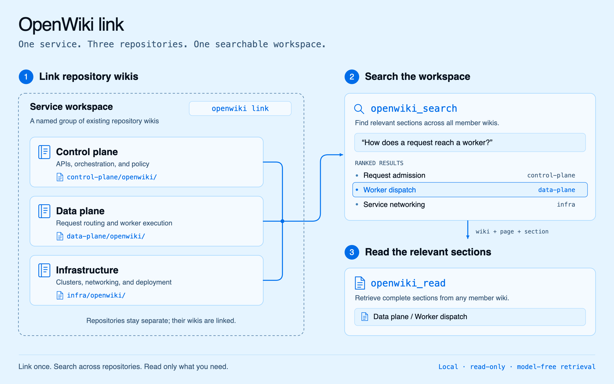

<!-- markdownlint-disable MD033 MD041 -->

<div align="center">


### A living wiki for your code, your agents, and you.

[](https://www.npmjs.com/package/openwiki)
[](https://www.npmjs.com/package/openwiki)
[](https://nodejs.org)
[](./LICENSE)
[](https://github.com/langchain-ai/deepagentsjs)

<a href="https://trendshift.io/repositories/70339?utm_source=trendshift-badge&amp;utm_medium=badge&amp;utm_campaign=badge-trendshift-70339" target="_blank" rel="noopener noreferrer"></a>

</div>

OpenWiki turns your codebase and knowledge sources into a linked Markdown wiki that you own. Your coding agent can use it to understand a repository, answer questions, and find context across related projects. You can read the same pages or explore them as an interactive graph.

For repository wikis, OpenWiki tracks facts back to source evidence so updates can focus on what changed. Start inside your coding agent, or use the standalone CLI for repository docs, personal knowledge, and scheduled updates.

[Get started](#quick-start) · [Search and link wikis](#search-your-wiki) · [Explore](#explore-your-wiki) · [Standalone CLI](#run-openwiki-directly) · [Command reference](#command-reference)

## 🎉 What's new

- **Linked wiki workspaces:** group related repositories with `openwiki link`, search across their wikis, and read relevant sections through MCP. [See how it works →](#create-wiki-workspaces)
- **More coding-agent integrations:** Oh My Pi, Antigravity, IBM Bob / Bob Shell, and Kiro join Codex, Claude Code, OpenCode, and Cursor. [Connect your agent →](#coding-agent-integrations)
- **Parallel page workers:** native CLI runs can now document multiple pages concurrently while saving progress page by page and adapting to provider rate limits. [Configure concurrency →](#parallel-page-workers)
- **Resumable updates and grounded Claims:** completed pages survive interruptions, and versioned source evidence identifies facts that need attention. [Explore the architecture →](#how-it-works)

Portable [OKF v0.2 output](#open-knowledge-format-okf-v02) and [publishable visualizers](#explore-your-wiki) are also available.

## Quick start

The easiest way to get started is inside the coding agent you already use. OpenWiki uses that agent's authenticated model session and repository tools, so there is no separate model provider to configure.

### 1. Install OpenWiki

You'll need [Node.js 22.22.0 or newer](https://nodejs.org).

```sh
npm install -g openwiki
```

<a id="coding-agent-integrations"></a>

### 2. Connect your coding agent

Choose the integration for your agent:

| Coding agent        | Install                                     |
| ------------------- | ------------------------------------------- |
| Codex               | `openwiki integrations install codex`       |
| Claude Code         | `openwiki integrations install claude`      |
| OpenCode            | `openwiki integrations install opencode`    |
| Cursor              | `openwiki integrations install cursor`      |
| IBM Bob / Bob Shell | `openwiki integrations install bob`         |
| Kiro                | `openwiki integrations install kiro`        |
| Oh My Pi            | `openwiki integrations install omp`         |
| Antigravity         | `openwiki integrations install antigravity` |

### 3. Create your wiki

Restart your coding agent, open a repository, and ask:

```text
Initialize this repository's OpenWiki from the current source and tests.
```

Your agent researches the repository and writes a linked wiki in `openwiki/`. OpenWiki tracks its source evidence and saves progress as each page completes.

<div align="center">
  
</div>

Once your wiki is ready, [ask questions](#search-your-wiki), [link related repositories](#create-wiki-workspaces), or [explore it visually](#explore-your-wiki).

<details>
<summary><b>Installation scope, host-specific paths, and removal</b></summary>

All integrations install at user level by default, so one installation works from any Git repository. Use `openwiki integrations list` to inspect installation status or `openwiki integrations uninstall <host>` to remove an integration safely. Add `--project [path]` to `list`, `install`, or `uninstall` for repository-scoped state; project paths resolve to their Git repository root.

Host-specific locations and notes:

- OpenCode uses `~/.config/opencode`.
- IBM Bob / Bob Shell uses `~/.agents/skills` and `~/.bob/mcp.json`.
- Kiro uses `~/.kiro/skills` and `~/.kiro/settings/mcp.json`.
- Oh My Pi uses `~/.omp/agent` at user scope (the default profile). Use `--project` for named profiles or a relocated `PI_CODING_AGENT_DIR`. This is Oh My Pi (`omp`); see [the upstream Pi integration notes](docs/pi-integration-notes.md).
- Antigravity uses `~/.gemini/antigravity-cli/skills` and `~/.gemini/config/mcp_config.json`.

On Windows, install with a Node.js package manager (`npm install -g openwiki` or `pnpm add -g openwiki`). Installing with `bun` can fall back to compiling the `better-sqlite3` native dependency, which needs Visual Studio Build Tools with the Desktop development with C++ workload.

</details>

<details>
<summary><b>What the coding-agent integration supports</b></summary>

Host-driven runs currently support repository code wikis, not personal brains. They use repository source and tests; connector-sourced context, including LangSmith, is not yet supported.

The coding agent investigates the repository, plans the wiki, and writes each assigned page sequentially with its native repository tools. OpenWiki owns the durable queue, Claims validation and persistence, source-drift handling, and deterministic finalization of Claims, indexes, provenance, setup files, and metadata.

The MCP generation lifecycle is `openwiki_begin → openwiki_submit_plan → openwiki_next_page → openwiki_submit_page → … → openwiki_finish`, with optional on-demand `openwiki_inspect_page_claims`. The host submits only sparse Claim decisions for each page: OpenWiki retains current unaffected Claims, applies explicit confirmations, revisions, additions, or retractions, and refuses to finish until the final state is durable.

Contributors adding another coding agent should follow [Adding a coding-agent integration](CONTRIBUTING.md#adding-a-coding-agent-integration).

</details>

## Search your wiki

Ask your agent to look up a question in the wiki:

```text
Search this repository's OpenWiki for how retry handling works, then read the
relevant sections.
```

`openwiki_search` finds compact, ranked results; `openwiki_read` retrieves the complete sections your agent selects. Agents are guided to use retrieval for concrete questions, read relevant sections, and stop once grounded. It is optional context, not a routine step at the start of every task.

These tools are local, read-only, and model-free: they do not start a generation run or make their own model calls. `openwiki_list_workspaces` and `openwiki_list_wikis` provide discovery when repositories are linked.

## Create wiki workspaces

A service often spans several repositories: a control plane, a data plane, and infrastructure. Use `openwiki link` to group their existing wikis into a named workspace. Your agent can then search across the whole service and read relevant sections from any member wiki.

<div align="center">
  
</div>

Start the workspace manager from a directory such as `~/dev`:

```sh
cd ~/dev
openwiki link
```

Create a workspace such as `Payments`, then select the repositories to include. They keep their own wikis, can belong to more than one workspace, and do not need to share a parent directory.

<details>
<summary><b>Finding repositories and choosing a search workspace</b></summary>

The finder streams Git repositories below the editable path, starting at the launch directory. Extend the path to narrow results, or Backspace toward `~` to broaden and rescan from the nearest existing directory. Each repository appears once by path: `○` marks an available OpenWiki repository and becomes `●` when selected. Repositories without OpenWiki documentation are dimmed. Selections remain pinned above the changing results and also remain in the finder.

From an OpenWiki source checkout, run the manager with `pnpm run dev link ~/dev`. The registry is stored privately under `~/.openwiki` (or `OPENWIKI_CONFIG_DIR`).

Search chooses its scope as follows:

1. A wiki in no workspace searches itself.
2. A wiki in one workspace searches that workspace automatically.
3. A wiki in multiple workspaces uses its active workspace.
4. If it belongs to multiple workspaces without an active selection, search returns `workspace_required` and the agent asks which workspace to use.

Set, inspect, or clear a repository's persistent active workspace from anywhere inside that repository:

```sh
openwiki workspace use payments
openwiki workspace current
openwiki workspace clear
```

Agents can call `openwiki_list_workspaces` to discover the current or another wiki's memberships and `openwiki_list_wikis` to inspect a workspace. Workspace search results identify their supplying `wiki`; pass that ID to `openwiki_read` with the result's page and section anchors.

</details>

## Explore your wiki

Turn any wiki into an interactive node graph with a live, side-by-side Markdown reader:

```sh
openwiki visualize
```

<div align="center">
  
</div>

The graph updates as you edit your wiki.

<details>
<summary><b>Local server options and publishing a static visualizer</b></summary>

This serves `./openwiki` on a local loopback address (`127.0.0.1`, never exposed on the network) and opens your browser to the graph. Edits to the wiki files are picked up automatically while the server runs. Pass a path to visualize a different directory, `--port <port>` to choose the port (it increments on conflict; default `4321`), and `--no-open` to leave the browser alone:

```sh
openwiki visualize openwiki --port 4400 --no-open
```

To publish the visualizer beside generated documentation, export a static directory instead of starting the server:

```sh
openwiki visualize openwiki --export docs/openwiki-visualizer
```

The export contains `index.html`, `client.js`, `client-lib.js`, `styles.css`, and `graph.json`. Its client reads the sibling graph file and does not use live reload, so the directory can be hosted by GitHub Pages, MkDocs, or any other static host. `--export` cannot be combined with `--port` or `--no-open`.

> [!NOTE]
> The page loads its graph, Markdown, and diagram libraries from a public CDN, so an internet connection is required for both local and static viewers.

</details>

## Keep your wiki current

After changing your code, ask your coding agent:

```text
Update this repository's OpenWiki for changes since its last successful run.
```

OpenWiki checks repository changes and the evidence behind existing Claims to decide what needs updating. Clean updates skip model work and leave the wiki content untouched.

### Scheduled updates

Keep it current automatically by adding a scheduled CI job that opens a docs PR whenever the wiki changes:

- **GitHub Actions:** copy [`openwiki-update.yml`](./examples/openwiki-update.yml) into `.github/workflows/openwiki-update.yml`.
- **GitHub Actions with auto-merge:** copy [`openwiki-update-auto-merge.yml`](./examples/openwiki-update-auto-merge.yml) instead, then follow the setup details below.
- **GitLab CI:** copy [`openwiki-update.gitlab-ci.yml`](./examples/openwiki-update.gitlab-ci.yml) into `.gitlab-ci.yml` or include it from your pipeline.
- **Bitbucket Pipelines:** copy [`openwiki-update.bitbucket-pipelines.yml`](./examples/openwiki-update.bitbucket-pipelines.yml) into `bitbucket-pipelines.yml`, then schedule the `openwiki-update` pipeline.

<details>
<summary><b>Auto-merge OpenWiki PRs</b></summary>

<br>

Auto-merge is repository infrastructure rather than an OpenWiki runtime feature. The GitHub Actions example creates a docs-only PR and enables GitHub auto-merge only after OpenWiki finishes successfully; required branch checks and reviews still control when the PR merges. Failed runs can preserve partial documentation in the PR and explicitly disable any pending auto-merge.

Before using the example:

1. Enable **Allow auto-merge** in the repository's pull request settings.
2. Add branch protection or a ruleset for the default branch. Require the checks that should gate generated docs, and decide whether OpenWiki PRs still require human review.
3. Create a fine-grained personal access token or GitHub App token with access only to the target repository and permissions for **Contents: read and write** and **Pull requests: read and write**. Save it as the `OPENWIKI_PR_TOKEN` Actions secret.
4. Copy the example to `.github/workflows/openwiki-update.yml`, choose a pinned OpenWiki version and provider, and add the provider secret.

The dedicated token is intentional: pull requests created with the default `GITHUB_TOKEN` do not start most `pull_request` workflows, so required PR checks may never run. Organization policies may require a GitHub App token instead of a personal access token. Keep the workflow's `add-paths` restricted to generated documentation, pin every action and package version, and do not auto-merge changes to executable workflow files.

</details>

## Run OpenWiki directly

You can also use OpenWiki's own [Deep Agents](https://github.com/langchain-ai/deepagentsjs) documentation agent, including for scheduled runs and personal wikis. After [installing the CLI](#1-install-openwiki), initialize a repository wiki:

```sh
openwiki --init
```

The first run walks you through choosing a provider, credentials, and model, then writes docs to `openwiki/`. OpenWiki supports [thirteen model providers](#model-providers), including hosted models and local OpenAI-compatible endpoints.

Update an existing wiki from repository changes since its last successful run and any stale Claims:

```sh
openwiki --update
```

<details>
<summary><b>Reinitializing a wiki and resuming interrupted runs</b></summary>

Running `openwiki --init` again replaces the existing generated repository wiki and Claims with a brand-new generation while preserving the user-authored `openwiki/INSTRUCTIONS.md` brief. On a persistent checkout, OpenWiki records in-progress repository generation in `openwiki/.run.json`, so rerunning the same command after an interruption resumes the durable page queue. Ephemeral CI runners start fresh after failure unless their workspace is preserved. A setup failure before the new run state is durable restores the previous wiki.

</details>

### Two modes

OpenWiki runs in one of two modes. Bare `openwiki`, `openwiki --init`, and `openwiki --update` default to **code** mode; add the `personal` positional (or `--mode personal`) for the personal brain.

| Mode                 | Documents              | Writes to               | Get started                |
| -------------------- | ---------------------- | ----------------------- | -------------------------- |
| **Code** _(default)_ | The current repository | `openwiki/` in the repo | `openwiki --init`          |
| **Personal**         | Your connected sources | `~/.openwiki/wiki`      | `openwiki personal --init` |

By default the CLI stays open after a run so you can send follow-up messages. Add `-p` / `--print` for a one-shot, non-interactive run that prints the final output and exits. `--init` and `--update` auto-exit on success in an interactive terminal, so the same command works one-shot or interactively.

### Parallel page workers

Native repository `init` and `update` runs can document several pages at once:

```sh
OPENWIKI_PAGE_CONCURRENCY=4 openwiki --update
```

Concurrency defaults to `1` and accepts values from `1` to `8`. Start at `2` to `4` and watch your provider's rate limits. Coding-agent integrations use their host's sequential page lifecycle; this setting controls the native CLI's workers.

<details>
<summary><b>Worker ordering, rate limits, and retries</b></summary>

Each worker owns exactly one page, and completed pages remain durable resume units. The quickstart page is written last so it can link to the pages it routes to. A worker that fails on a provider rate limit lowers the run's concurrency by one for the rest of the run; the page it was writing is restored and picked up by the next update.

LangChain handles transient provider errors. Retry attempts default to `3`, or `5` when `OPENWIKI_PAGE_CONCURRENCY` is above `1`. Override with `OPENWIKI_PROVIDER_RETRY_ATTEMPTS=3` (a positive integer).

</details>

<a id="local-state-directory"></a>

<details>
<summary><b>Local state directory</b></summary>

OpenWiki stores local credentials, the personal wiki, connector data, conversation history, and skills under `~/.openwiki` by default. Set `OPENWIKI_CONFIG_DIR` before starting OpenWiki to use a different writable directory, such as a mounted container volume:

```sh
OPENWIKI_CONFIG_DIR=/data/openwiki openwiki personal --init
```

The override selects a separate state directory; OpenWiki does not move or delete an existing `~/.openwiki` directory. Copy any state you want to preserve yourself, and point the variable at a dedicated directory because OpenWiki restricts its permissions for the current user.

</details>

## How it stays yours

Your wiki stays in the repository as plain Markdown you own, with OpenWiki-managed grounding and run metadata versioned alongside it.

- **Agents read it as context.** On each `code` run, OpenWiki maintains an `AGENTS.md` and `CLAUDE.md` at the repo root. Their managed instructions use selective, progressive `openwiki_search`/`openwiki_read` retrieval for concrete questions when available and use `openwiki/quickstart.md` as the fallback. OpenWiki only rewrites its own `<!-- OPENWIKI:START -->…<!-- OPENWIKI:END -->` block and leaves the rest of each file untouched.
- **Grounding stays with the wiki.** Versioned claim sidecars under `openwiki/.claims/` travel with the Markdown, so the evidence needed to maintain factual pages is inspectable and reviewable.
- **You set the brief.** Repository-specific instructions live in `openwiki/INSTRUCTIONS.md`, a user-authored file OpenWiki reads for scope and priorities but never rewrites during normal runs.
- **No-op runs do not churn docs.** A clean update skips model work and leaves wiki content untouched while refreshing `.last-update.json` to record that the check ran.
- **Local, private config.** Provider choice, keys, and optional LangSmith tracing are saved to `~/.openwiki/.env` on your machine.

## Ignoring paths

Create a `.openwikiignore` file in the repository root to keep generated docs from reading or describing private, generated, or irrelevant paths. The syntax supports comments, blank lines, `*` and `**` globs, directory rules, and `!` negation:

```gitignore
secrets/
*.log
!logs/keep.log
```

When `.openwikiignore` has active rules, OpenWiki filters filesystem discovery and restricts shell execute so ignored paths stay out of the run. This is a read boundary: ignored paths are never read, scanned, or reproduced in the docs. It does not guarantee a topic is never mentioned, since the agent may still infer an ignored area from other allowed evidence such as tests, the README, or commit messages.

## How it works

OpenWiki separates repository research and writing from the bookkeeping that keeps a wiki consistent. Repository pages carry their source evidence, and completed work is saved for future updates.

### OpenWiki architecture

Repository generation follows an ordered queue of independently durable page jobs. Native CLI runs can process eligible pages concurrently; coding-agent integrations consume the queue sequentially. `openwiki/.run.json` checkpoints the active run and its progress. A page advances only after its Markdown, Claims, verification, and `openwiki/.page-manifest.json` entry are durable, preserving completed work and page-specific source baselines across interruptions and future runs.

<div align="center">
  
</div>

### Grounded Claims

OpenWiki tracks the facts behind each repository page as **Grounded Claims**. Each Claim points to versioned source evidence, such as `repo://src/server.ts#L40-L82`. When that evidence changes or disappears, OpenWiki identifies which facts need to be confirmed, rewritten, or retired.

<div align="center">
  
</div>

<details>
<summary><b>How Claims are reconciled and persisted</b></summary>

Claims cover the truths future agents rely on: behavior, responsibilities, architecture, data flow, invariants, failure semantics, configuration, and security boundaries. Each records the evidence version observed when the claim was established, rather than relying only on when a Markdown file was last generated.

Before an update, OpenWiki checks every persisted evidence version, before even deciding whether the repository is a no-op. A stale or unresolved Claim requires work for its owning page even if the planner omits it. The page worker receives only Claims requiring attention; current issue-free Claims are retained deterministically without being repeated through every model turn. The worker explicitly confirms rechecked issue Claims, submits only revisions and additions, and names retractions. Complete current Claims remain available through on-demand inspection for broad rewrites. The Markdown stays clean; structured Claim state lives alongside it under `openwiki/.claims/`.

Page completion is a durability boundary. OpenWiki persists the reconciled Claims, projects verification, synchronizes the sidecar's page version, and proves the complete result before marking that page's job complete. Finalization repeats the whole-run proof before deleting `openwiki/.run.json`.

</details>

Grounded Claims currently apply to repository code wikis and repository evidence. Connector-derived facts, including LangSmith-only observations, are not claimed.

### Open Knowledge Format (OKF v0.2)

OpenWiki emits [Google Open Knowledge Format (OKF) v0.2](https://github.com/GoogleCloudPlatform/knowledge-catalog/blob/main/okf/SPEC.md) bundles in both modes, so your wiki is portable to any OKF-aware tool.

<details>
<summary><b>Front matter, provenance, and verification metadata</b></summary>

- Every concept document carries YAML front matter with a non-empty `type`; all other standard fields are optional.
- New and freshly initialized pages receive `generated: {by, at}`. During updates, any body change, including whitespace, advances the stamp; an unchanged body retains its prior event, and front-matter-only changes do not advance it. The producer is stamped as `openwiki/<version>` (or the coding-agent host), making provenance explicit. The legacy v0.1 `timestamp` field is still tolerated on existing pages.
- Repository pages project their grounded Claims evidence into `sources`; OpenWiki reconciles its deterministically identified entries while preserving independently authored sources.
- Repository pages receive `verified: {by: openwiki/<version>, at: ...}` only after a successful page submission reconciles a non-empty complete Claims set, passes the final evidence recheck, and persists the Claims sidecar. Clean preflight alone never creates or advances verification; human and other process events are preserved.
- The optional v0.2 provenance, trust, and lifecycle families (`sources`, `verified`, `status`, `stale_after`) are validated when present.
- Standard Markdown links between concept documents express their relationships.
- `index.md` and `log.md` are reserved documents rather than concepts. The root index declares `okf_version: "0.2"`.
- Producer-defined extension fields are preserved across updates and migrations.

</details>

### Diagrams

OpenWiki embeds **Mermaid** diagrams wherever they make a concept clearer than prose: sequence diagrams for runtime flows, ER diagrams for data models, state diagrams for lifecycles, and flowcharts for control flow. Diagrams are grounded in the inspected source, added where they add signal, and kept in sync on `--update`. No configuration is required.

<details>
<summary><b>Diagram validation and repair</b></summary>

After each run, OpenWiki validates every `mermaid` fence. A diagram that fails validation is converted in place to a plain `text` fence with a short comment explaining why, so it degrades to readable text instead of a broken block. The next `--update` finds that comment and repairs the diagram, so quality recovers over successive runs.

> [!TIP]
> By default OpenWiki runs a lightweight, zero-dependency check that catches common breakages. For authoritative validation that matches exactly what GitHub renders, install the Mermaid parser wherever you run OpenWiki (for example in your scheduled workflow), and no broken diagram will ship:
>
> ```sh
> npm install mermaid jsdom
> ```

</details>

## Connect your sources

Beyond repository docs, OpenWiki has nine built-in connectors. In `personal` mode, OpenWiki ingests knowledge from the tools you already use, synthesizing them into your local wiki. First-run onboarding offers setup for **Custom MCP, local git repositories, Notion, Gmail, X/Twitter, Web Search, and Hacker News**. Slack is also available with its OAuth app and HTTPS callback configured.

Start a personal wiki with `openwiki personal --init`, then authenticate and ingest sources as needed:

```sh
openwiki auth notion        # run a local browser OAuth flow for a provider
openwiki ingest all         # run every configured source
openwiki ingest web-search  # run one connector's sources
```

<details>
<summary><b>Connector details and OAuth</b></summary>

During an ingestion run, deterministic connector tools write raw data and manifests under `~/.openwiki/connectors/<connector>/raw/`, then source-specific agent runs synthesize the wiki under `~/.openwiki/wiki/`. You can configure the same connector more than once (for example one Web Search source for AI research and another for NBA news); OpenWiki stores them as separate instances like `web-search-1` and `web-search-2`.

- `git-repo` reads configured local repository paths and writes compact manifests.
- `custom-mcp` connects to any configured HTTP or stdio MCP server and permits only explicitly safe, read-only tools.
- `x` uses the X API directly with OAuth user-context credentials for home timeline, user posts, mentions, bookmarks, and list posts.
- `notion` targets the hosted Notion MCP server, so authenticate through Notion OAuth rather than pasting a token.
- `google` uses the Gmail API directly with OAuth user credentials to fetch recent mail.
- `slack` uses Slack's Web API with OAuth user and bot tokens to ingest scoped conversations and search results.
- `web-search` uses Tavily through LangChain and requires `TAVILY_API_KEY`.
- `hackernews` uses the public Hacker News feed and search APIs, with no credentials required.

`openwiki auth <provider>` runs a local browser OAuth flow, saves returned tokens into `~/.openwiki/.env`, creates connector config when possible, and discovers MCP tools for MCP-backed providers. Slack and Gmail require app client credentials to already be set in that file; Notion uses dynamic client registration for hosted MCP; X uses OAuth 2.0 with PKCE. `openwiki auth configure <provider>` and `openwiki auth tools <provider>` are advanced retry commands.

Connector secrets are referenced by env var name and stored in `~/.openwiki/.env`; connector config files never contain raw secret values.

**Slack OAuth tunnel.** `openwiki ngrok start` starts an ngrok tunnel with a random HTTPS forwarding URL, reads ngrok's local inspection API, appends `/callback`, and saves `OPENWIKI_HTTPS_OAUTH_REDIRECT_URI` automatically. Register the printed callback URL in Slack. With a fixed domain, run `openwiki ngrok start https://<your-ngrok-domain>`.

</details>

### LangSmith connector (code mode)

The connectors above feed a `personal` wiki. The **LangSmith** connector instead enriches a `code` wiki: it pulls recent LangSmith traces (tool calls, outcomes, and latency) for the projects you choose through the official LangSmith SDK, so a repository's docs reflect how its code actually behaves at runtime, not just what the source says.

<details>
<summary><b>Configure LangSmith projects, regions, and credentials</b></summary>

Configure it during `openwiki --init` in `code` mode. From the source menu, add LangSmith, pick your workspace region (US, EU, or APAC), and list the projects to document. OpenWiki writes a committed `openwiki/.langsmith.json` that names the workspaces and projects (never the key itself), so every teammate and CI run documents the same set. The API key is read from the environment:

```sh
OPENWIKI_LANGSMITH_API_KEY="<your-langsmith-key>"
```

Locally the setup wizard saves this to `~/.openwiki/.env`. In CI, set it as a repository secret and export it for the run.

> [!NOTE]
> A LangSmith key is workspace- and region-bound. To document projects across more than one workspace, add an entry per workspace, each with its own key named `OPENWIKI_LANGSMITH_API_KEY_2`, `OPENWIKI_LANGSMITH_API_KEY_3`, and so on. The connector only talks to the official US (`api.smith.langchain.com`), EU (`eu.api.smith.langchain.com`), and APAC (`apac.api.smith.langchain.com`) hosts.

</details>

## Model providers

These settings apply when running OpenWiki directly. Coding-agent integrations use the host's authenticated model session.

OpenWiki supports thirteen providers. The onboarding default is OpenAI with `gpt-5.6-terra`. Choose from preset models where available or supply a custom model ID. Provider credentials are stored in `~/.openwiki/.env`.

| Provider                                                     | Credential                              |
| ------------------------------------------------------------ | --------------------------------------- |
| **OpenAI** _(default)_                                       | `OPENAI_API_KEY`                        |
| **OpenAI (ChatGPT login)**                                   | Browser sign-in, uses your ChatGPT plan |
| **Anthropic**                                                | `ANTHROPIC_API_KEY`                     |
| **Gemini** (AI Studio)                                       | `GEMINI_API_KEY`                        |
| **Gemini Enterprise** (Vertex AI)                            | Google ADC, keyless                     |
| **AWS Bedrock**                                              | IAM credentials                         |
| **GitHub Copilot**                                           | GitHub CLI session                      |
| **OpenRouter**                                               | `OPENROUTER_API_KEY`                    |
| **Nebius / Fireworks / Baseten / NVIDIA NIM**                | Provider API key                        |
| **OpenAI-compatible** (LiteLLM, Ollama, LM Studio, gateways) | Base URL + key                          |

<details>
<summary><b>GitHub Copilot</b></summary>

<br/>

The GitHub Copilot provider routes inference through the OpenAI-compatible Copilot API (`https://api.githubcopilot.com`), so teams can reuse an existing Copilot subscription instead of provisioning a separate inference key.

1. Select `GitHub Copilot` during `openwiki --init`. If you have an active [GitHub CLI](https://cli.github.com) session, OpenWiki detects it and offers to reuse it. Otherwise, press <kbd>Tab</kbd> at the credential prompt to run `gh auth login` and sign in.
2. Choose a model (for example `gpt-5.5`).

OpenWiki leaves the token in the GitHub CLI's own credential store. For CI or another headless environment, set `COPILOT_API_KEY` to a GitHub **OAuth token**. Personal Access Tokens are rejected by the Copilot API for third-party integrations. The local config can stay token-free:

```env
OPENWIKI_PROVIDER="copilot"
OPENWIKI_MODEL_ID="gpt-5.5"
```

In CI, set the `COPILOT_API_KEY` repository secret and export `OPENWIKI_PROVIDER=copilot`.

</details>

<details>
<summary><b>AWS Bedrock</b></summary>

<br/>

The `bedrock` provider calls foundation models on AWS Bedrock using IAM credentials rather than a single vendor key:

```bash
OPENWIKI_PROVIDER=bedrock
BEDROCK_AWS_ACCESS_KEY_ID=your-access-key-id
BEDROCK_AWS_SECRET_ACCESS_KEY=your-secret-access-key
BEDROCK_AWS_REGION=us-east-1
OPENWIKI_MODEL_ID=anthropic.claude-sonnet-5
```

When explicit Bedrock credentials are not set, OpenWiki uses the AWS SDK default credential provider chain (OIDC/web identity, IAM roles, AWS profiles, ECS/EC2). The region resolves from `BEDROCK_AWS_REGION`, `AWS_REGION`, or `AWS_DEFAULT_REGION`. Available model IDs depend on which foundation models you have enabled in your account and region, so there is no preset list; paste the Bedrock model ID directly.

Some newer models only accept on-demand invocation through a cross-region inference profile. If you see `ValidationException: Invocation of model ID ... with on-demand throughput isn't supported`, prefix the model ID with the profile's region code, for example `us.anthropic.claude-sonnet-5`. Your IAM policy then also needs `bedrock:InvokeModel` / `InvokeModelWithResponseStream` on both the `foundation-model` and `inference-profile` resource types.

</details>

<details>
<summary><b>Gemini (AI Studio) and Gemini Enterprise (Vertex AI)</b></summary>

<br/>

**Gemini (AI Studio)** runs Google's Gemini models with a single API key:

```bash
OPENWIKI_PROVIDER=gemini
GEMINI_API_KEY=your-ai-studio-key
```

**Gemini Enterprise** runs models from the Gemini Enterprise Model Garden (formerly Vertex AI): Google's Gemini/Gemma, Anthropic's Claude, and partner/open-weight models (Llama, Mistral, DeepSeek, Qwen). It routes each model ID to the right API surface automatically and uses no API key. Authentication happens with Google Application Default Credentials (ADC):

- a service account key file via `GOOGLE_APPLICATION_CREDENTIALS=/path/to/key.json`,
- user credentials from `gcloud auth application-default login`, or
- workload identity when running on Google Cloud or in CI.

```bash
OPENWIKI_PROVIDER=gemini-enterprise
GOOGLE_CLOUD_PROJECT=your-gcp-project
GOOGLE_CLOUD_LOCATION=global   # optional, defaults to global
```

Set `OPENWIKI_MODEL_ID` to any Model Garden model. Gemini and Claude ship as presets; partner models are reached by pasting their ID (for example `publishers/meta/models/llama-3.3-70b-instruct-maas`). The credentials need Vertex AI access (`roles/aiplatform.user`), and the models must be enabled in the Model Garden. The `global` endpoint serves Gemini and Claude with the best availability; set `GOOGLE_CLOUD_LOCATION` to a regional endpoint for data residency, and always set it explicitly for region-specific partner (MaaS) models.

For CI, authenticate before the update job runs (for example with [`google-github-actions/auth`](https://github.com/google-github-actions/auth)) and set `OPENWIKI_PROVIDER=gemini-enterprise` and `GOOGLE_CLOUD_PROJECT` in the job environment.

</details>

<details>
<summary><b>OpenAI (ChatGPT login)</b></summary>

<br/>

The `openai-chatgpt` provider calls OpenAI's Codex backend using your ChatGPT subscription instead of a metered API key, drawing on your Plus/Pro/Team plan's included Codex usage. It serves the same model list as the `openai` provider.

```bash
OPENWIKI_PROVIDER=openai-chatgpt openwiki code --init
# or
OPENWIKI_PROVIDER=openai-chatgpt openwiki personal --init
```

The wizard opens `https://auth.openai.com` in your browser (and prints the URL for headless/SSH use). After you sign in, OpenWiki captures the OAuth callback, shows the signed-in email and plan, and continues to model selection. It stores the access token, refresh token, expiry, account id, email, and plan in `~/.openwiki/.env`. These are managed for you and the access token is refreshed automatically, so you normally never edit them by hand. Treat the refresh token like a password.

</details>

<details>
<summary><b>OpenAI-compatible endpoints (LiteLLM, Ollama, LM Studio, gateways)</b></summary>

<br/>

The `openai-compatible` provider targets any OpenAI-compatible chat-completions endpoint via a required base URL. Set the model ID to whatever the endpoint exposes.

```bash
# Hosted gateway (for example Requesty, which fronts many upstream providers)
OPENWIKI_PROVIDER=openai-compatible
OPENAI_COMPATIBLE_API_KEY=your-gateway-key
OPENAI_COMPATIBLE_BASE_URL=https://router.requesty.ai/v1
OPENWIKI_MODEL_ID=openai/gpt-5.5
```

```bash
# Ollama, after `ollama serve` and `ollama pull llama3.2`
OPENWIKI_PROVIDER=openai-compatible
OPENAI_COMPATIBLE_API_KEY=ollama
OPENAI_COMPATIBLE_BASE_URL=http://localhost:11434/v1
OPENWIKI_MODEL_ID=llama3.2
```

```bash
# LM Studio, after starting the local server from the Developer tab
OPENWIKI_PROVIDER=openai-compatible
OPENAI_COMPATIBLE_API_KEY=lm-studio
OPENAI_COMPATIBLE_BASE_URL=http://localhost:1234/v1
OPENWIKI_MODEL_ID=your-loaded-model-id
```

Some local servers ignore the API key value, but OpenWiki still requires `OPENAI_COMPATIBLE_API_KEY` because the client expects one.

**Streaming-only gateways.** Some gateways serve only the streaming transport: a non-streaming request is either rejected outright (`Stream must be set to true`) or answered with HTTP 200 and empty content, which leaves you with a blank wiki and no error. OpenWiki issues non-streaming requests internally, so force the streaming transport for those endpoints:

```bash
OPENWIKI_OPENAI_COMPATIBLE_STREAMING=true
```

It stays off by default because this provider points at arbitrary third-party endpoints, where SSE is not guaranteed to survive proxies and load balancers. Enabling it also makes the client report estimated rather than server-reported token counts.

**Reasoning-capable gateways.** OpenAI-compatible endpoints are user-supplied, so OpenWiki does not assume that an arbitrary model supports reasoning controls. If your gateway accepts OpenAI-style reasoning effort, opt in explicitly before setting `OPENWIKI_REASONING_EFFORT`:

```bash
OPENWIKI_OPENAI_COMPATIBLE_REASONING_EFFORT_SUPPORTED=true
OPENWIKI_REASONING_EFFORT=high
```

When `OPENWIKI_OPENAI_COMPATIBLE_USE_RESPONSES_API=true` is also set, the effort is sent through the Responses API reasoning field. Otherwise it is sent as the chat-completions `reasoning_effort` model argument.

</details>

<details>
<summary><b>Alternative base URLs, OpenRouter pinning, and retries</b></summary>

<br/>

**Alternative base URLs.** Route a provider at a self-hosted or proxied gateway by setting its base URL alongside its key: `ANTHROPIC_BASE_URL`, `OPENAI_BASE_URL`, `BASETEN_BASE_URL`, `FIREWORKS_BASE_URL`, `NVIDIA_BASE_URL`, or `COPILOT_BASE_URL`. The `openai` provider routes tool calls through the Responses API (`/v1/responses`), which is useful for gateways that expose it.

```bash
OPENWIKI_PROVIDER=anthropic
ANTHROPIC_API_KEY=your-key
ANTHROPIC_BASE_URL=https://your-gateway.example.com/anthropic
```

**OpenRouter provider pinning.** When OpenRouter serves a model through multiple upstreams, restrict routing with a provider or comma-separated allowlist:

```bash
OPENWIKI_PROVIDER=openrouter
OPENROUTER_API_KEY=your-key
OPENWIKI_OPENROUTER_PROVIDER_ONLY=Novita
```

**Output-token limit.** OpenWiki uses a 16,384-token per-request default for modern Claude 4/5 models because older LangChain model metadata otherwise limits newer Claude aliases to 4,096 tokens. Set a provider-neutral limit for the currently selected model with:

```bash
OPENWIKI_MAX_OUTPUT_TOKENS=16384
```

OpenWiki maps this setting to the selected provider's request shape. Custom models otherwise retain their provider or SDK default, since their supported output windows are not known to OpenWiki.

**OpenRouter output-token cap.** By default no `max_tokens` is sent, so OpenRouter's credit pre-check budgets for the model's full advertised output ceiling — on a low credit balance every request can fail with a 402 error. Existing installations can keep an OpenRouter-specific cap with:

```bash
OPENWIKI_OPENROUTER_MAX_TOKENS=8192
```

The OpenRouter-specific setting takes precedence over `OPENWIKI_MAX_OUTPUT_TOKENS` for OpenRouter runs. A cap trades those hard 402 failures for possible truncation when a long wiki generation genuinely needs more output tokens, so prefer the largest value your balance allows.

For native worker concurrency and provider retry settings, see [Parallel page workers](#parallel-page-workers).

**Bedrock stream idle timeout.** For the Bedrock provider, set `OPENWIKI_STREAM_IDLE_TIMEOUT` to control how long the client waits for the first or next streamed response chunk, for example `OPENWIKI_STREAM_IDLE_TIMEOUT=300000`. The value is milliseconds and must be an integer from `0` to `2147483647`. Set it to `0` to disable the watchdog. If unset, OpenWiki preserves the `@langchain/aws` provider default. Prefer a sufficiently long finite timeout over disabling the watchdog so a stalled stream cannot hang forever.

**Reasoning effort.** Set `OPENWIKI_REASONING_EFFORT` to configure reasoning for a supported provider and model. OpenAI GPT-5.6 models use the Responses API values `none`, `low`, `medium`, `high`, `xhigh`, and `max`. Gemini 3.6 Flash maps `low`, `medium`, and `high` to Gemini's thinking level. NVIDIA NIM's Nemotron 3 Super supports `none`, `low`, and `high`. In an interactive chat, use `/effort` to choose an available value or `/effort default` to restore the provider default. Leave the variable unset to preserve the provider default; invalid provider, model, or effort combinations fail before a request is sent.

</details>

> [!NOTE]
> If there is an inference provider or model you would like to see added, please open a PR.

## Command reference

```sh
openwiki                         # interactive chat, code mode, current repo
openwiki personal                # interactive chat, personal brain
openwiki "generate docs"         # start with an initial request
openwiki -p "what can you do?"   # one-shot, print, and exit
openwiki --init                  # initialize code docs (personal: openwiki personal --init)
openwiki --update                # update code docs (personal: openwiki personal --update)
openwiki visualize               # interactive graph + live reader
openwiki visualize openwiki --export docs/openwiki-visualizer  # static graph + reader
openwiki link [directory]         # create and manage named wiki workspaces
openwiki workspace use <name>     # set the current repository's active workspace
openwiki workspace current|clear  # inspect or clear the active workspace
openwiki auth <provider>         # authenticate a connector (slack, gmail, x, notion)
openwiki ingest <source>         # run connector ingestion (all, or a connector/instance)
openwiki integrations list       # show installed coding-agent integrations
openwiki integrations install <bob|codex|claude|opencode|cursor|kiro|omp|antigravity> [--project [path]]
openwiki integrations uninstall <bob|codex|claude|opencode|cursor|kiro|omp|antigravity> [--project [path]]
openwiki --help                  # full help
```

In chat, `/api-key` updates the current provider key and `/langsmith-key` updates or clears LangSmith tracing credentials, both with masked prompts.

## Telemetry

OpenWiki collects anonymous, aggregate usage data to understand how the tool is used and improve it. Telemetry is on by default and easy to turn off.

**Collected** on a single `openwiki_run` event, keyed by a random install ID in `~/.openwiki/install-id`: the command (init / update), the outcome (success / failure / no-op) with a coarse error category on failure (never the message), and at setup only, the brain mode, model provider, and configured connector names.

**Never collected:** file contents, repository data or names, credentials, prompts, model output, connector payloads, error messages, file paths, URLs, model IDs, run duration, or your IP address. Interactive chat, `auth`, and `ingest` are not recorded. Scheduled/CI runs are tagged as anonymous reliability data under a shared CI identifier and never counted as installs.

Opt out with either environment variable, or add the first line to `~/.openwiki/.env` to disable permanently:

```sh
export OPENWIKI_TELEMETRY_DISABLED=1
export DO_NOT_TRACK=1   # cross-tool standard
```

To see exactly what a run would send, add `--telemetry-file=<path>` to any run.

## Contributing

Contributions are welcome. Please read [CONTRIBUTING.md](./CONTRIBUTING.md) before opening a PR. We intentionally keep PRs tightly scoped to one change each, and PRs that bundle unrelated changes may be closed with a request to split them.

## License

[MIT](./LICENSE)
