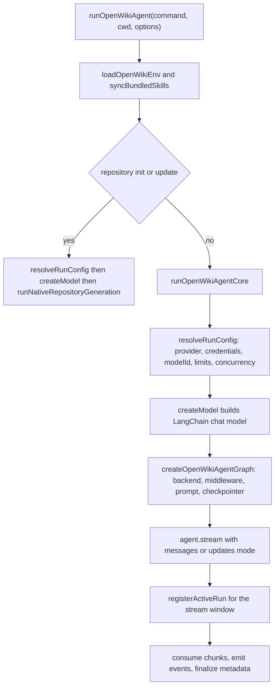
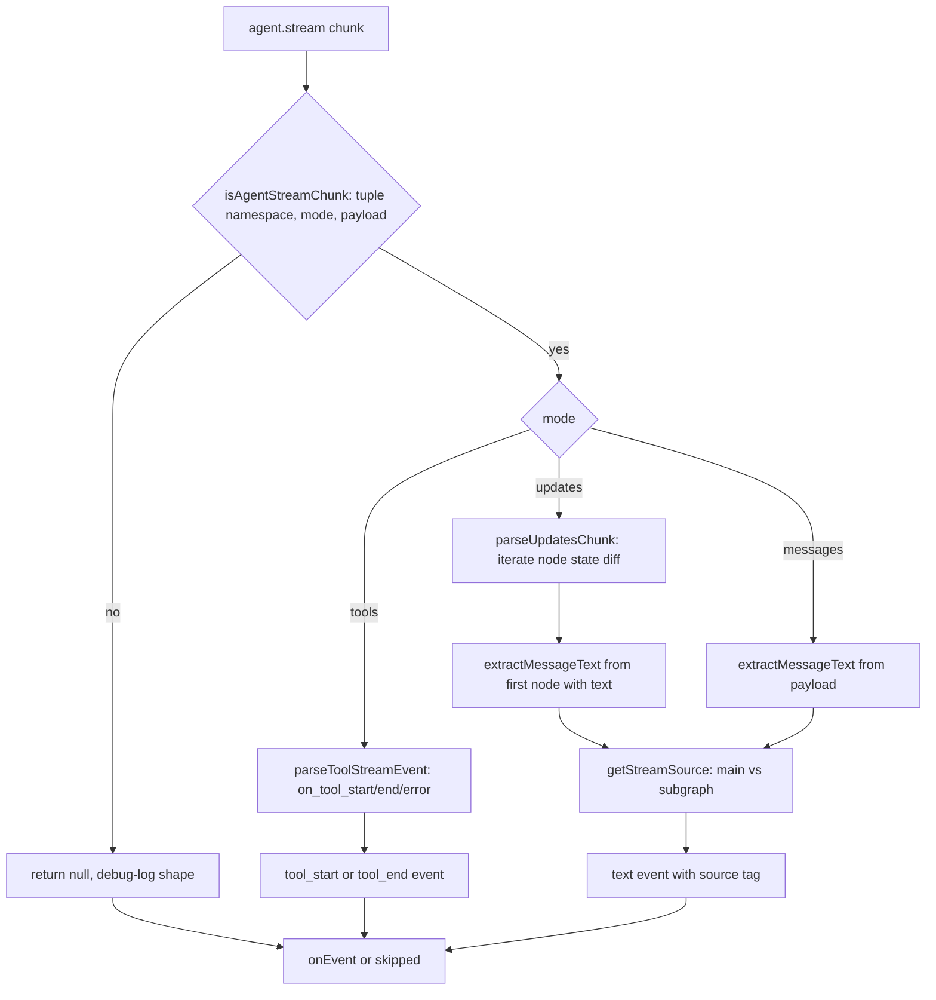
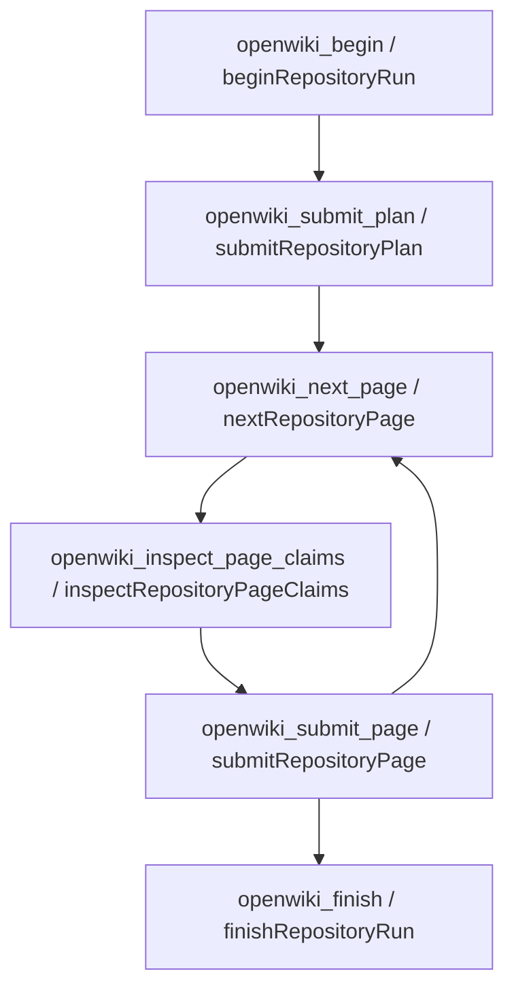

# Agent Runtime, Models, and Middleware

OpenWiki drives documentation generation through a [DeepAgents](https://github.com/langchain-ai/deepagents) agent graph built on LangChain chat models. The runtime is responsible for turning a user command into a configured agent: it resolves which provider and model to use, instantiates the correct LangChain client for that provider, wraps the filesystem in a sandboxed docs-only backend, and mounts the middleware that keeps the wiki OKF-conformant and (on updates) in the right language. A separate crash guard records and stamps runs that die outside every normal `catch`.

`runOpenWikiAgent` is the top-level entrypoint for a run. It loads persisted environment, resolves the run configuration, builds the model and agent, opens the graph stream, and consumes it while a run record is registered with the crash guard.

For provider setup and credentials see [Model Providers](/openwiki/concepts/model-providers.md) and [Configuration](/openwiki/operations/configuration.md); for the repository init/update flow that bypasses the shared agent graph see [Repository Generation](/openwiki/workflows/repository-generation.md).

## Two execution paths

`runOpenWikiAgent` splits on output mode and command. Repository `init`/`update` runs are recognized as "repository generation" and delegated to `runNativeRepositoryGeneration` (the OpenWiki page-job runner), which builds the model directly and never constructs the shared DeepAgent graph. Everything else — chat in any mode, and personal/local-wiki commands — runs through `runOpenWikiAgentCore`, which builds and streams the DeepAgent graph described on this page.

The shared graph factory `createOpenWikiAgentGraph` refuses to build for repository `init`/`update`, and the prompt builders throw for that combination too, so those commands are structurally forced down the native page-job path rather than the agent-graph path.

Control flow from the entrypoint to either the native page-job runner or the shared DeepAgent graph stream.

## Resolving the run configuration

`resolveRunConfig` performs all pre-build resolution and tags any throw with the `config` stage for failure telemetry. It resolves the provider first and reports it immediately through `onProviderResolved`, so a failure later in resolution is still attributed to the right provider.

Provider selection is `resolveConfiguredProvider`: an explicit `OPENWIKI_PROVIDER` wins, otherwise the provider is inferred from whichever provider API-key (or Bedrock AWS credential) environment variable is present, in a fixed precedence order, falling back to a default provider. After the provider is known, resolution loads any external-CLI credential, validates and ensures the provider's credentials, base URL, secret key, and region, and — for `openai-chatgpt` — refreshes the ChatGPT OAuth tokens before the model is built so `createModel` can stay synchronous.

The model id comes from `resolveModelId`: it prefers an explicit option or `OPENWIKI_MODEL_ID`, else the provider's default; a provider with no built-in model options requires the id to be set. The id is normalized and validated, and if it is a known model of a different provider a non-fatal mismatch warning is emitted (the run still proceeds, since a custom gateway may serve it). Resolution also queries `getSelectedModelAvailability`, which aborts the run when a model is provably `unavailable`, but treats an `unknown` result as fine — a catalogue lookup failure is not proof a model cannot be invoked, and only the direct `openai` provider (with an API key and no custom base URL) is actually checked.

After model resolution, `resolveRunConfig` resolves four provider-neutral operational settings that flow into `createModel` (and, for the native runner, into the page-worker pool): the page-worker concurrency (`resolvePageConcurrency`, `OPENWIKI_PAGE_CONCURRENCY`, an integer from 1 to `MAX_PAGE_CONCURRENCY` = 8, defaulting to 1), the retry count (`OPENWIKI_PROVIDER_RETRY_ATTEMPTS`, which itself defaults to `PARALLEL_PROVIDER_RETRY_ATTEMPTS` = 5 when more than one worker shares a provider key, versus `DEFAULT_PROVIDER_RETRY_ATTEMPTS` = 3 for a single worker), the per-request output-token cap via `resolveConfiguredMaxOutputTokens` (`OPENWIKI_MAX_OUTPUT_TOKENS` translated to each SDK's field name, with Bedrock falling back to a 16,000-token default when the neutral setting is unset), and — for `bedrock` only — the stream idle-timeout watchdog (`OPENWIKI_STREAM_IDLE_TIMEOUT`). These are reported through the debug log so a run's effective limits are observable.

## The provider matrix and model instantiation

`createModel` maps the resolved provider and model id onto a concrete LangChain chat model. The provider enum spans direct API-key providers (`anthropic`, `openai`, `gemini`, the IBM `bob` inference gateway, plus OpenAI-compatible gateways `baseten`/`fireworks`/`nebius`/`nvidia`/`openai-compatible`), OAuth (`openai-chatgpt`, `copilot`), AWS-SDK (`bedrock`), a routing gateway (`openrouter`), and Google Vertex (`gemini-enterprise`).

Each branch constructs a purpose-built client:

- **Anthropic** builds `ChatAnthropic`, applying a modern-Claude default output-token limit (raised above LangChain's 4,096 fallback only for known Claude 4/5 families) unless an explicit provider-neutral limit is set.
- **Gemini (AI Studio)** builds `ChatGoogle` with `platformType: "gai"`, disabling streaming and pinning `outputVersion: "v0"` so Gemini 3.x thought-signatures round-trip correctly across tool-calling turns; when `gemini-3.6-flash` declares a reasoning capability, the resolved effort is passed as `ChatGoogle`'s `thinkingLevel` option.
- **Gemini Enterprise (Vertex)** delegates to `createGeminiEnterpriseModel`, which picks the client from the model family: Claude via the Anthropic Vertex SDK, partner/open-weight models over Vertex's OpenAI-compatible MaaS surface, and Gemini/Gemma over native `generateContent`. Auth is uniform ADC + project + region; only the transport differs.
- **ChatGPT OAuth** reuses `ChatOpenAI` against the Codex Responses backend with `useResponsesApi`, `zdrEnabled` (forcing `store: false`), forced streaming, and the account/originator/beta headers the Codex backend requires.
- **OpenRouter** builds `ChatOpenRouter` against the OpenRouter base URL, optionally pinning an upstream provider allowlist; a legacy OpenRouter-specific output cap still takes precedence there over the provider-neutral cap.
- **Bedrock** builds `ChatBedrockConverse` with the resolved AWS region, the resolved output-token cap (now always threaded as `maxTokensOptions` because Bedrock falls back to a default of 16,000 tokens rather than letting the Converse API cap at 4,096), and, when `OPENWIKI_STREAM_IDLE_TIMEOUT` is set, a stream idle-timeout watchdog that aborts a generation stalled waiting for its first or next chunk (0 disables it).
- **Copilot** shares the `ChatOpenAI` fallthrough below, but `providerUsesStreaming` forces the streaming HTTP transport for every Copilot model: non-GPT-5 models (Claude, Gemini) are served over chat completions and reject or return empty responses for non-streaming requests, so without `streaming: true` a repository worker can exit without calling `submit_plan`/`submit_page`. The flag is redundant but harmless for GPT-5 models that use the Responses API, matching the `openai-chatgpt` pattern.
- **IBM Bob** is a ChatOpenAI-over-chat-completions client against the Bob inference endpoint. Bob declares a single fixed model (`premium`) that `resolveModelId` returns unconditionally via `getProviderFixedModel`, so no model id is ever configured for it. Because Bob authenticates with an `Apikey` scheme and requires a registered User-Agent, the branch passes a placeholder API key to satisfy `ChatOpenAI`'s constructor and injects the real key per request through a `createBobFetch` fetch adapter that rewrites the `Authorization` header to `Apikey <key>` (read from the environment at call time) and sets `User-Agent: ibm-bob-openwiki-provider`, which Bob's Cloudflare WAF requires.
- **OpenAI and all OpenAI-compatible gateways** fall through to a shared `ChatOpenAI` branch that honors a per-provider base URL, chooses the Responses API when the provider config asks for it, and forces the streaming HTTP transport for gateways that only serve SSE.

The provider-neutral output limit is the single `OPENWIKI_MAX_OUTPUT_TOKENS` setting: because a run constructs only one model, one value is mapped to each SDK's field name (`maxTokens` for OpenAI/Anthropic/MaaS/Bedrock, `maxOutputTokens` for Gemini), with OpenRouter's older `OPENWIKI_OPENROUTER_MAX_TOKENS` cap retained for backward compatibility and taking precedence on OpenRouter runs. When unset the limit is omitted so the provider default applies — except for Bedrock, where `resolveConfiguredMaxOutputTokens` falls back to `resolveBedrockMaxTokens` (default `BEDROCK_DEFAULT_MAX_TOKENS` = 16,000, overridable via `OPENWIKI_BEDROCK_MAX_TOKENS`) so the Converse API no longer truncates at its built-in 4,096-token ceiling; Anthropic's modern-Claude default is a separate, Anthropic-only behavior.

`createModel` also threads a resolved reasoning config: `OPENWIKI_REASONING_EFFORT` is applied only to models that declare a reasoning capability, and it is dispatched by the model's declared transport — a Responses-API `reasoning.effort` payload for `responses-reasoning`, a chat-completions `reasoning_effort` kwarg for `chat-completions-reasoning-effort`, and `ChatGoogle`'s `thinkingLevel` for `gemini-thinking-level`; an unsupported provider/model or an invalid effort value throws.

### Reasoning capability table and transports

`resolveReasoningConfig` returns a `ResolvedReasoningConfig` whose `transport` is one of three values, each mapped to the SDK field the model's provider accepts. The `REASONING_CAPABILITIES` table declares which (provider, model id) pairs expose a capability and which effort values each accepts:

| Provider | Model id | Transport | Accepted effort values |
| --- | --- | --- | --- |
| `openai` / `openai-chatgpt` | `gpt-5.6-terra` / `gpt-5.6-luna` / `gpt-5.6-sol` | `responses-reasoning` | `none` / `low` / `medium` / `high` / `xhigh` / `max` |
| `nvidia` | `nvidia/nemotron-3-super-120b-a12b` | `chat-completions-reasoning-effort` | `none` / `low` / `high` |
| `gemini` | `gemini-3.6-flash` | `gemini-thinking-level` | `low` / `medium` / `high` |

The `openai-compatible` provider has no static entry: its capability is gated by `OPENWIKI_OPENAI_COMPATIBLE_REASONING_EFFORT_SUPPORTED`. When that opt-in is set, `getOpenAiCompatibleReasoningCapability` returns a capability whose transport depends on `useResponsesApi` — `responses-reasoning` when the provider is configured to use the Responses API, `chat-completions-reasoning-effort` otherwise — and accepts the full effort range including `max`. Without the opt-in the capability is `undefined`, so any `OPENWIKI_REASONING_EFFORT` value throws "not supported" for `openai-compatible` (mirroring the behavior for any other provider/model pair that declares no capability).

### Vertex surface routing

For `gemini-enterprise`, the API surface is a function of the model id, not the provider: `resolveVertexSurface` classifies an id as `anthropic`, `openai-maas`, or (default) `gemini`. IDs matching the Anthropic pattern (`anthropic`/`claude` family, whether bare or publisher-pathed) route to the Anthropic Vertex surface; IDs matching the MaaS pattern — including the `xai`/`grok` family in addition to `ai21`, `codellama`, `codestral`, `deepseek`, `jamba`, `llama`/`meta`, `mistral`, and `qwen` — route to the OpenAI-compatible MaaS surface; everything else defaults to native Gemini/Gemma. The Claude-on-Vertex bridge neutralizes any ambient `ANTHROPIC_API_KEY`/`ANTHROPIC_AUTH_TOKEN` around the synchronous `AnthropicVertex` constructor so a stray native Anthropic key cannot clobber the Google OAuth token, and the MaaS surface injects a fresh ADC bearer token per request via a `fetch` wrapper so long sessions survive token expiry while `createModel` stays synchronous.

## Building the agent graph

`createOpenWikiAgentGraph` constructs the DeepAgent from the initialized model. It creates an `OpenWikiLocalShellBackend` rooted at the run cwd (with `docsOnly` enabled for every command except chat), wraps it in a composite backend that adds fixed virtual mounts, and passes the middleware pipeline, connector tools, filesystem permissions, and command-specific system prompt to `createDeepAgent`.

The composite backend (`createAgentBackend`) mounts two additional read-only virtual filesystems alongside the wiki backend: `/conversation_history/` for DeepAgents' history offload and `/skills/` for the bundled skills. A shared filesystem permission set additionally denies writes under both `/skills/**` and the conversation-history mount, and the composite backend converts a known upstream broad-glob recursion overflow into a bounded, model-facing "narrow your search" error instead of crashing the run.

The agent is streamed with `subgraphs: true`. Stream mode is normally `messages` + `tools`, but the `openai-compatible` provider defaults to the safer `updates` + `tools` mode because arbitrary endpoints (e.g. GLM emitting reasoning deltas before the first assistant delta) can aggregate to a chunk the agent loop rejects; a known-good endpoint can opt back into `messages` mode with `OPENWIKI_OPENAI_COMPATIBLE_STREAM_MESSAGES`. Regardless of mode, every raw LangGraph chunk emitted by `agent.stream` is reduced to a display event by the stream parsing pipeline described next.

## Stream parsing pipeline

The stream-consumption loop iterates `agent.stream` and hands each chunk to `parseAgentStreamChunk`, which returns an `OpenWikiRunEvent` (forwarded to the caller's `onEvent`) or `null` (logged as an unhandled chunk shape in debug, capped at three samples so a noisy provider cannot flood the log). Three runtime event types are produced: `text` (assistant prose), `tool_start`/`tool_end` (tool lifecycle), and `debug`.

`parseAgentStreamChunk` first validates the chunk is a three-tuple `[namespace, mode, payload]` where `namespace` is a string array and `mode` is one of `messages`, `tools`, or `updates`; anything else is rejected as `null`. It then dispatches on mode:

- **`tools`** delegates to `parseToolStreamEvent`, which normalizes the LangGraph tool lifecycle events `on_tool_start`, `on_tool_end`, and `on_tool_error` into `tool_start` and `tool_end` events. The tool-call display string is built from the tool name and sanitized input (`execute` is renamed `Execute`), and a tool-end carries a `finished` or `error` status keyed by the tool call id.
- **`updates`** delegates to `parseUpdatesChunk`. This is the default mode for `openai-compatible` providers. LangGraph `updates` chunks carry a per-node state diff (`{ nodeName: { messages: [...] }, ... }`) rather than raw message tokens, so `parseUpdatesChunk` iterates the node outputs and returns the first non-empty assistant text extracted from any node's messages via `extractMessageText`. Without this handler, plain-text replies from openai-compatible endpoints are silently dropped and the TUI shows no assistant output.
- **`messages`** (the default for every provider except `openai-compatible`) extracts assistant text directly from the message content blocks via `extractMessageText`.

Both `messages` and `updates` paths tag the resulting `text` event with a `source` computed by `getStreamSource(namespace)`. DeepAgents wraps the primary model call in a single top-level `model_request:` namespace; a namespace that is exactly one element starting with `model_request:` is classified `main` (the assistant output that belongs in the transcript). A deeper namespace — a nested `task`/subgraph namespace — is classified `subgraph` (prose that should stay hidden from the main transcript), and an empty namespace falls back to `main`. This is how assistant text emitted from a top-level model-request stream is rendered as the main conversation while nested subgraph output is kept out of it.

`extractMessageText` is a recursive, cycle-guarded walker that extracts text from the many shapes LangChain/LangGraph payloads can take: message tuples `[message, metadata]`, `chunk`/`message` wrappers, serialized message records (`kwargs`/`lc_kwargs`/`generations`), and content arrays. It only reads records whose role is `ai`/`assistant` (or untyped), skipping `human`/`system`/`tool` messages so user input and tool results are never echoed as assistant text.

The content-block redaction layer is `extractContentBlockText`. Before returning any text from a content block, it checks the block's `type`: a type whose string includes `tool`, `reasoning`, `file`, or `image` is suppressed (returns an empty string). This ensures base64 `file`, `input_file`, `image`, and `image_url` payloads never reach the terminal, while adjacent `text` blocks in the same chunk stream through normally. A block that survives the type check yields text from its `text`/`content`/`output_text` field, recursing into `fields` (block deltas) and `delta` (content deltas such as `text-delta` and `block-delta`) as needed.

Stream-chunk classification by mode and namespace, reducing each raw LangGraph chunk to a display event or null.

## The native repository runner

Repository `init`/`update` runs do not use the shared DeepAgent graph. `runOpenWikiAgent` builds the model directly from `resolveRunConfig` and hands it to `runNativeRepositoryGeneration`, which drives the durable repository lifecycle with its own planner and page workers. The model is built once and reused across every worker, but no repository-generation checkpointer or worker state survives beyond the durable core — each worker is a fresh, bounded agent.

`runNativeRepositoryGeneration` begins (or reconstructs) the durable run via `beginRepositoryRun`. A strict preflight that proves an update needs no work returns `{ skipped: true }` before any model is invoked. Otherwise the run proceeds in order: a planning phase (only when the run is in `planning`), then `runPendingPageAgents` drains the persisted page queue, then `finishRepositoryRun` finalizes. If the repository source changed while OpenWiki was running, the wiki is finalized without advancing its source checkpoint and the user is told to run `--update` to reconcile.

### The planner worker

When the run is in the `planning` phase, `runPlanningAgent` builds one fresh, read-only DeepAgent whose sole completion action is `submit_plan`. The planner's filesystem surface is the small `PLANNER_FILESYSTEM_TOOLS` set — `read_file`, `ls`, `glob`, `grep` — exposed via `createFilesystemMiddleware`, and its `OpenWikiLocalShellBackend` is constructed with an empty `writableWikiPages` allowlist so it cannot write anything. Its middleware is `createFilesystemMiddleware` plus `NO_DELEGATION_MIDDLEWARE`.

`submit_plan` validates the model's plan against `PlanSchema` (an array of page specs each with `path`/`title`/`purpose` plus optional `seedPaths`/`relatedPages`/`instructions`, and an optional `deletePages` list) and persists it durably through `submitRepositoryPlan`. A rejected `invalid_input` submission is turned into a correctable `ToolMessage` so the worker can correct and retry rather than failing the run; any other throw propagates. The planner is streamed with the single instruction `"Plan this repository wiki now."`, and if it exits without having called `submit_plan` the runner throws — planning cannot complete by narration.

### The page-worker pool

Each page is documented by its own fresh agent via `runPendingPageAgents`, which runs up to `pageConcurrency` workers at a time over the persisted page-job queue. The pool is process-local bookkeeping (not durable): a `claimed` set of job ids, a serialized `acquiring` promise so two loops never select the same job, an `inFlight` list of pages being written, a live `size` that can shrink, a single `fatal` slot, and a `skipped` snapshot list.

Every page except `/openwiki/quickstart.md` is documented first. With a single worker the queue order already places quickstart last; with several workers quickstart is explicitly held back until every other page has finished, so its task-routing map links to pages that already exist. A fatal submission error stops new work, lets in-flight workers submit or skip, and is rethrown before `finish` so the run never finalizes with pending jobs.

Each worker loop waits a per-slot `workerStartStaggerMs` (default 1,000 ms, ignored for a single worker) before its first job so the opening model requests of concurrent workers do not hit the provider at the same instant. A worker that skips a page on a provider rate limit lowers the live `size` by one, never below 1, and reports the reduction to the user; `isRateLimitError` recognizes HTTP 429 and rate-limit messages along `cause` chains. When the first pass ends with no fatal error and a held-back quickstart remains, a final single-worker pass documents it.

### Page workers

`runPageAgent` builds one fresh worker bounded to its assigned page job. Its backend is scoped with `writableWikiPages: [job.path]`, so the worker can write only its own page. Its tool surface is `PAGE_FILESYSTEM_TOOLS` — the planner's four read tools plus `write_file` and `edit_file` — plus three completion tools:

- `submit_page` completes the page after it is written. It accepts sparse Claim reconciliation (`confirmedClaimIds`, `claims`, `retractedClaimIds`) against `ClaimReconciliationSchema` and forwards them to `submitRepositoryPage`; other current Claims are retained automatically. An `invalid_input` rejection becomes a correctable `ToolMessage`; any other throw marks the submission fatal. It can be called at most once per worker.
- `inspect_claims` returns the page's complete current Claim set, for use only before intentionally revising or removing otherwise-current content; ordinary focused updates should not call it.
- `submit_plan` is named in the worker tool allowlist (`WORKER_TOOL_NAMES`) for event classification but is not contributed to page workers — only the planner owns planning.

The worker's middleware is again `createFilesystemMiddleware` (over `PAGE_FILESYSTEM_TOOLS`) plus `NO_DELEGATION_MIDDLEWARE`, which filters out the general-purpose `task` tool that DeepAgents contributes even when `subagents` is empty, so repository workers are deliberately non-delegating. `coerceRepositoryWorkerModelResponse` normalizes provider-streaming aggregates that arrived without `role: "assistant"` (for example reasoning-only first deltas) into proper `AIMessage`/`AIMessageChunk` so LangChain's `wrapModelCall` validator accepts them.

If a page worker throws after submitting, it counts as submitted. If it throws before submitting on a non-fatal error, the runner restores the page's pre-run snapshot via `skipRepositoryPage`, records it as skipped (to be reconsidered on the next update), and emits a deferred-page warning; a fatal submission failure rethrows and is captured by the pool's `fatal` slot. Workers stream only bounded tool lifecycle events — narration is never surfaced — and `parseWorkerToolEvent` forwards `tool_start`/`tool_end` only for the approved worker tools, tagging the page onto each event.

## The host-driven session manager

The same repository lifecycle is also exposed to external coding agents over MCP. `HostSessionManager` is a thin, rootless single-run adapter over the same transport-neutral lifecycle core (`beginRepositoryRun`/`submitRepositoryPlan`/`nextRepositoryPage`/`inspectRepositoryPageClaims`/`submitRepositoryPage`/`finishRepositoryRun`) that the native runner uses directly. It does not build a model or agent: the host (an external agent) owns planning and page authoring, and OpenWiki owns the durable lifecycle.

`HostSessionManager.create` validates a stable lowercase host identity (and an optional producer actor) and returns an empty adapter. Its `tools()` method returns exactly the six OpenWiki 0.5 lifecycle MCP tools in order — `openwiki_begin`, `openwiki_submit_plan`, `openwiki_next_page`, `openwiki_inspect_page_claims`, `openwiki_submit_page`, `openwiki_finish` — each with a Zod-validated input schema and a handler that parses input and dispatches to the matching adapter method. The adapter serializes operations with a single `operationInProgress` guard (concurrent operations fail with `invalid_state`), holds the active run in a process-local slot keyed by durable run id, and maps `RepositoryRunError` codes to stable `HostIntegrationError` codes at its boundary. The stdio MCP server (`runOpenWikiMcp`) constructs one `HostSessionManager` and serves its tools over a `StdioServerTransport`.

The two surfaces share the lifecycle core but differ in who drives the model: the native runner builds the model and runs its own planner and page workers inside the process, while the host session manager hands the six tools to an external agent and only manages the durable run state.

The six lifecycle tools exposed by the host session manager map one-to-one onto the durable core the native runner calls directly.

## The docs-only filesystem backend

`OpenWikiLocalShellBackend` extends the DeepAgents `LocalShellBackend` and layers three independent security boundaries on top, all enforced after canonicalizing paths so `..` traversal cannot escape:

1. **`.openwikiignore` exclusion.** Reads/writes/edits of an ignored path are hard-denied with an error; discovery tools (`ls`/`glob`/`grep`) silently drop ignored entries; and while any ignore rule is active, shell `execute` is restricted to a tiny anchored allowlist (`pwd`, `git rev-parse HEAD`) because arbitrary shell cannot be proven not to read an ignored path.
2. **Docs-only confinement.** In repository mode with `docsOnly` set, writes, edits, and deletes are refused unless the canonicalized path is under the `openwiki/` tree; `local-wiki` mode relaxes this. An optional `writableWikiPages` allowlist can further scope a worker to a specific set of pages — the native planner uses an empty allowlist (read-only), and each native page worker is scoped to exactly its own page.
3. **Claims ownership.** Repository `openwiki/.claims` state is hidden from generic filesystem discovery and read/write tools, and is also refused when a shell command references it, because those sidecars are owned by OpenWiki's own persistence layer, not the agent.

The backend also refuses unbounded root globs and globs that target `.git` metadata, steering the agent toward `ls` at the root followed by targeted searches. Every successful write/edit/delete records the mutated path in the tool-result metadata (`openwikiMutationPath`) so downstream validation knows which page changed.

These boundaries exist because the agent may be prompt-injected via untrusted repository content, so they are treated as security controls rather than mere conveniences.

## The middleware pipeline

Chat runs use no middleware. For non-chat runs, `createOpenWikiAgentGraph` mounts, in order:

1. **Translation middleware** (updates only, and only when a translation plan is resolved). Its `beforeAgent` hook brings every existing page into the run's target language before the agent starts, so an incremental update never leaves a mix of old and new language. `resolveTranslationPlan` returns a plan for every `update`: a real language switch (different primary subtag) retranslates every page, while a plain update only retries pages a prior run marked `openwiki_translation_pending`, and a sweep with nothing to do makes zero model calls. A single page's failure never aborts the run — the page keeps its previous language, is stamped pending for the next update, and the failure is reported through a sanitized warning sink. Translation model calls are tagged `langsmith:nostream` so their raw Markdown stays out of the token stream; one status line is shown instead.
2. **OKF index middleware** (always, for non-chat runs). Its `beforeAgent` hook migrates existing pages to valid OKF front matter and snapshots their bodies; its `wrapToolCall` decorates successful write/edit results with a front-matter warning without catching tool throws (LangChain's tool node already converts a thrown tool error into a recoverable `ToolMessage`, so catching and rethrowing here would make every recoverable tool error fatal); and its `afterAgent` hook synchronizes the deterministic directory indexes and stamps code-owned `generated` provenance on every new or changed page, using the single run timestamp threaded through the run. A deferred `claimSources` projection supplied by a repository Claims runtime is read only during finalization, so it reflects every mutation accepted during the run.

Both middleware hooks operate purely on file text read and written through the sandboxed docs-only backend; model output is never executed.

## Run lifecycle, persistence, and the crash guard

`runOpenWikiAgentCore` builds the run context and a pre-run content snapshot, instantiates the model and a SQLite checkpointer keyed to a thread id, and streams the graph while forwarding parsed events to the caller. Around the stream-consumption window it calls `registerActiveRun` / `clearActiveRun` so the run is attributable if it dies.

On success it persists run metadata as `complete` (skipping the write when content is unchanged, or always for chat) and locks down a persistent checkpoint file. If the stream throws, it persists metadata as `interrupted` — best-effort, swallowing persistence errors so the original run error propagates — so the next scheduled update does not no-op against a possibly partial wiki.

The crash guard is the last-resort boundary for failures that escape every `catch`. `installCrashGuard` registers idempotent `unhandledRejection` and `uncaughtException` handlers once at startup. `handleFatal` claims the single registered active run synchronously before any `await` — making the claim atomic against a burst of rejections so one crash produces one record, not hundreds — then best-effort records the crash as a telemetry failure, stamps the run `interrupted`, prints the raw error to the user's stderr, and exits non-zero. OpenWiki runs one run per process, so a single module-level active-run slot is sufficient.
