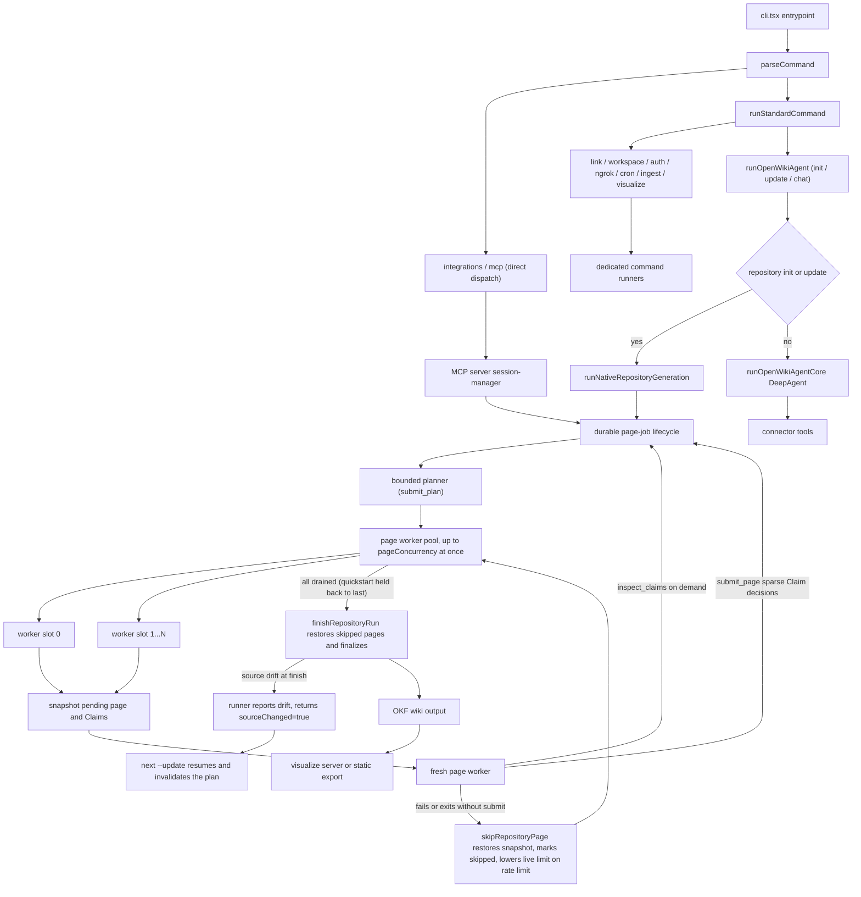
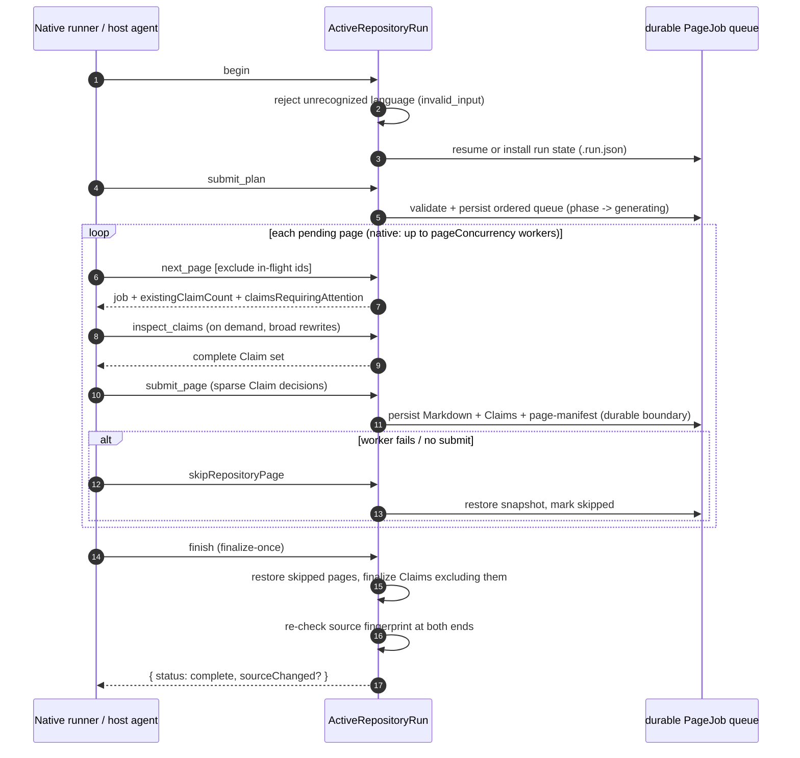

# Architecture Overview

OpenWiki is a CLI that writes and maintains a Markdown wiki for a code
repository or for a person's connected knowledge sources. An agent reads the
sources, synthesizes a linked wiki the user owns, and keeps it current. This
page maps the top-level pieces and the two axes that shape almost every runtime
decision: **which mode** (code vs personal) and **which driver** (OpenWiki's own
model vs a host coding agent). Deeper mechanisms live in the related pages linked
throughout.

## The two axes

OpenWiki's behavior is organized along two independent distinctions.

**Mode** decides what is documented and where output lands. `code` mode
documents the current Git repository and writes to `openwiki/` in that repo;
`personal` mode documents connected sources and writes to `~/.openwiki/wiki`.
The CLI defaults to `code`; the `personal` positional or `--mode personal`
selects the personal brain. See [Two modes](../concepts/two-modes.md).

**Driver** decides which model and tools do the authoring. In _native_
generation, OpenWiki resolves a configured provider, builds its own chat model,
and runs its own DeepAgents workers. In _host-driven_ generation, a coding agent
(Codex, Claude Code, OpenCode, Cursor, IBM Bob / Bob Shell, Kiro, Oh My Pi, or
Antigravity) uses its own authenticated model and native repository tools, while
OpenWiki exposes the durable page-job lifecycle over MCP and owns validation
and finalization. Host-driven runs currently support only repository code wikis,
not personal brains.

Caption: High-level component relationships from the CLI through native and
host-driven generation to OKF output and the visualizer. A finish-time source
drift does not abort the run: `runNativeRepositoryGeneration` finalizes
honestly and returns, leaving a later `--update` to reconcile.

The lifecycle both drivers share is a strict, ordered sequence over a durable
queue:

Caption: The `begin → submit_plan → next_page → submit_page → finish`
lifecycle. `finish` is a single deterministic finalization; it refuses to run
while any page job is still `pending`, restores skipped pages' Markdown, and
persists `interrupted` metadata when pages were skipped or source drifted.

## CLI entrypoint

The executable `cli.tsx` registers a crash guard, parses `process.argv` with
`parseCommand`, and dispatches. `integrations` and `mcp` commands are routed
straight to their own runners before any environment is loaded; everything else
flows through `runStandardCommand`, which optionally loads the OpenWiki
environment, resolves the effective startup command, and then dispatches the
direct-target commands — `link`, `workspace`, `auth`, `ngrok`, `cron`,
`ingest`, and `visualize` — to their handlers, prints a startup error, runs
non-interactively in print mode, or renders the interactive Ink TUI.

`parseCommand` produces a discriminated `CliCommand` union whose `run` variant
carries the resolved `command` (`init`, `update`, `chat`), `mode`
(`personal` or `code`) and its source, model id, print flag, dry-run flag,
resolved language, a `shouldStart` hint, and the user message. `auth`, `ngrok`,
`cron`, `ingest`, `visualize`, `link`, `workspace`, `integrations`, and `mcp`
are distinct command kinds, each routed to its own runner.

## Agent runtime

`runOpenWikiAgent` is the shared entrypoint for model-driven work. It loads the
`~/.openwiki/.env` environment, syncs bundled skills, and then branches on
whether this is a repository generation run — `outputMode === "repository"`
combined with an `init` or `update` command. Repository generation is delegated
to `runNativeRepositoryGeneration` (after the same `resolveRunConfig` that the
core path uses); every other case (personal-mode runs, chat, ingestion
synthesis) builds a DeepAgents graph via the core path.

Run configuration is resolved once, up front, by `resolveRunConfig`: provider,
credentials, model id, model availability, page concurrency, provider retry
attempts (raised automatically for concurrent workers), output-token and
stream-idle limits. The model is built from that resolved config before any
agent runs, so credential and availability failures are tagged to the `config`
stage and surface before any agent starts. Page concurrency comes from
`resolvePageConcurrency` — an integer from 1 to 8 via
`OPENWIKI_PAGE_CONCURRENCY`, defaulting to 1; when more than one worker shares
one provider key, retries default to `PARALLEL_PROVIDER_RETRY_ATTEMPTS` (5)
instead of the sequential `DEFAULT_PROVIDER_RETRY_ATTEMPTS` (3).
`createOpenWikiAgent` is the lower-level factory that assembles a DeepAgent
graph from an already-initialized model; it refuses repository
`init`/`update` (any non-`chat` repository command) because those must go
through the durable page-job runner. More detail lives in
[Agent runtime](agent-runtime.md).

## Native repository generation

`runNativeRepositoryGeneration` drives the same durable lifecycle the host
integrations use, but with OpenWiki's own model. It begins or resumes a run,
runs a bounded planner when the run is in the planning phase, runs fresh
per-page workers for the pending page jobs (up to `pageConcurrency` at once),
and finalizes. `beginRepositoryRun` rejects an unrecognized language with
`invalid_input` before touching the repository, so a typo never persists the
wrong language in run state. Each worker is a non-delegating DeepAgent: the
planner gets read-only filesystem tools plus `submit_plan`; page workers
additionally get `write_file`/`edit_file` plus `inspect_claims` and
`submit_page`, and the general-purpose `task` delegation tool is stripped so
workers cannot spawn subagents. A page worker submits only sparse Claim
decisions (`confirmedClaimIds`, `claims`, `retractedClaimIds`) with current
issue-free Claims retained automatically, and can call `inspect_claims` on
demand before revising otherwise-current content; `nextRepositoryPage` returns
only `existingClaimCount` and the Claims requiring attention.

**Parallel page workers.** The single initialized model is reused across
fresh workers. `runPendingPageAgents` runs a pool of up to `pageConcurrency`
worker loops (`Math.max(1, Math.floor(pageConcurrency))`). Job acquisition is
serialized through `acquireNextJob`: each call passes the in-flight job ids it
already owns via `nextRepositoryPage`'s `exclude` set, so every worker gets a
distinct pending job; ownership stays process-local and is never written to
the durable checkpoint. The first wave of worker starts is staggered by
`workerStartStaggerMs` (default 1s, ignored for a single worker) so concurrent
opening requests do not hit the provider simultaneously. The quickstart page is
explicitly held back when more than one worker is running, so its
task-routing map links to pages that already exist; once the rest of the queue
drains, a final single-worker pass documents quickstart. Progress events keep
the historical single-page shape for one worker and add `completedCount` and
`inFlightPages` only for a concurrent pool. A fatal submission error stops new
work, lets in-flight workers submit or skip, and is rethrown before finish so
the run never finalizes with pending jobs. If a worker fails on a provider
rate limit, the live pool size is lowered by one (never below 1) and a notice
is emitted; other skip causes keep the pool size.

The lifecycle is resumable and self-correcting. Before a page worker runs, its
pending page and Claims sidecar are snapshotted (`captureRepositoryPageSnapshot`).
If the worker fails or exits without submitting, `skipRepositoryPage` restores
the page and Claims from that snapshot, marks the job `skipped`, and the run
continues with the next page rather than aborting; the page is reconsidered on a
later update. `runPendingPageAgents` collects every skipped-page snapshot and
passes them to `finishRepositoryRun`, which restores the skipped pages' Markdown
after finalization, finalizes Claims with those pages excluded, and persists
`interrupted` update metadata so the run is honestly recorded as partial.
Page restore and the planned/abandoned-page deletions at finish tolerate a
human-readable "not found" backend error instead of aborting the run, so a
page that never existed or was already removed is treated as already restored
or deleted.

If finalization detects that repository source drifted underneath the plan,
the run does not abort or auto-replan. `finishRepositoryRun` re-checks the
source fingerprint at both ends of its deterministic window, finalizes the
wiki honestly with `interrupted` metadata when needed, and returns
`{ status: "complete", sourceChanged: true }`. The native runner then emits a
notice telling the user to run `openwiki --update` and returns; it does not
loop. Reconciliation happens on the next `--update`: `begin` resumes the
durable run, the changed fingerprint invalidates the whole plan (phase resets
to `planning`, the plan is deleted), and the lifecycle replans from the new
source. Correctable submission rejections are returned to the worker as
error-status tool messages so it can fix and resubmit rather than aborting the
run. The end-to-end flow is documented in
[Repository generation workflow](../workflows/repository-generation.md).

## Host-driven (coding-agent) generation

An installed coding-agent integration runs the same lifecycle over MCP instead
of launching an OpenWiki model. `ProtocolToolName` enumerates ten tool names —
four read-only retrieval tools (`openwiki_list_workspaces`,
`openwiki_list_wikis`, `openwiki_search`, `openwiki_read`) plus six
transport-neutral lifecycle tools — `openwiki_begin`, `openwiki_submit_plan`,
`openwiki_next_page`, `openwiki_inspect_page_claims`, `openwiki_submit_page`,
and `openwiki_finish` — backed by a session manager that holds at most one
active process-local run and rejects any operation whose `runId` does not
match, plus a single-operation guard that rejects overlapping lifecycle calls.
`openwiki_begin` rejects an unrecognized `language` with `invalid_input`
instead of starting a run (delegating to the same `beginRepositoryRun`
language check), so the caller can correct the code and retry with nothing to
clean up. `openwiki_inspect_page_claims` returns the current pending page's
complete Claim set on demand for broad rewrites; `openwiki_next_page` returns
only `existingClaimCount` and the stale or unresolved Claims requiring an
explicit decision, so focused updates stay compact. `openwiki_finish` is the
single finalize-once step: it refuses to run while any page job is still
`pending`, and clears the process-local session only after durable completion.
Host-driven runs document pages sequentially with the coding agent's own
model and native repository tools — the parallel page-worker pool is a native
runner capability not exposed over MCP. The coding agent owns repository
research, planning, and factual authoring; OpenWiki owns the durable queue,
Claims validation and persistence, source-drift handling, and deterministic
finalization. Host-driven runs use only repository source and tests; connector
context is not yet available to them.

## Claims

For repository code wikis, OpenWiki tracks the material propositions behind
each page, not just when the Markdown was regenerated. A run rebuilds a strict
process-local Claims runtime from durable state. Before an update, OpenWiki
checks every persisted evidence version; a stale or unresolved Claim requires
work for its owning page even if the planner omits it. Each page worker
receives only the Claims requiring attention plus an existing-Claim count, and
submits only sparse Claim decisions — `confirmedClaimIds` for rechecked issue
Claims kept unchanged, `claims` for revisions or additions, and
`retractedClaimIds` for removals — while current issue-free Claims are retained
automatically without being repeated through every model turn. Workers can
call `inspect_claims` (host: `openwiki_inspect_page_claims`) on demand to read
the complete Claim set before intentionally revising otherwise-current content.
Reconciliation keeps unchanged Claims' IDs and refreshes their evidence
versions, revises named Claims in place, assigns IDs to new Claims, and
retracts named Claims; an unresolved issue Claim that receives no explicit
decision is rejected. Claim state is persisted alongside the Markdown under
`openwiki/.claims/`, and page completion is a durability boundary that
persists reconciled Claims before marking the job done. Grounded Claims apply to
repository code wikis and repository evidence only; connector-derived facts
are not claimed.

## OKF output and finalization

Every wiki is an Open Knowledge Format bundle. Each page begins with concept
frontmatter, and finalization is deterministic: `finalizeWikiArtifacts`
validates Mermaid fences (degrading unparseable ones to text), synchronizes wiki
indexes, validates internal links, synchronizes Claim sources, and finalizes
generated provenance with a producer actor and timestamp. See
[OKF output](../concepts/okf-output.md).

## Connectors and personal-mode ingestion

In personal mode, `runOpenWikiIngestion` walks the configured source instances
from onboarding config, runs each connector, and synthesizes the wiki. For
deterministic connectors it first pulls raw data and manifests under
`~/.openwiki/connectors/<connector>/raw/`, then runs a source-specific agent
that writes into `~/.openwiki/wiki`. The same connector type can be configured
multiple times as separate instances (for example `web-search-1` and
`web-search-2`). Connectors ingest over a rolling window and can be run for all
sources or one target at a time.

## Visualization

`openwiki visualize` turns any wiki into an interactive node graph beside a live
Markdown reader. Without `--export` it serves the wiki directory on a local
loopback address with live reload; with `--export` it writes a self-contained
static site (`index.html`, `client.js`, `client-lib.js`, `styles.css`,
`graph.json`) suitable for GitHub Pages or any static host.

## Where to go next

- [Agent runtime](agent-runtime.md) — model resolution, DeepAgent graph, workers.
- [Source map](source-map.md) — file-level orientation.
- [Two modes](../concepts/two-modes.md) — code vs personal in detail.
- [OKF output](../concepts/okf-output.md) — the output format and finalization.
- [Repository generation workflow](../workflows/repository-generation.md) — the durable lifecycle end to end.
