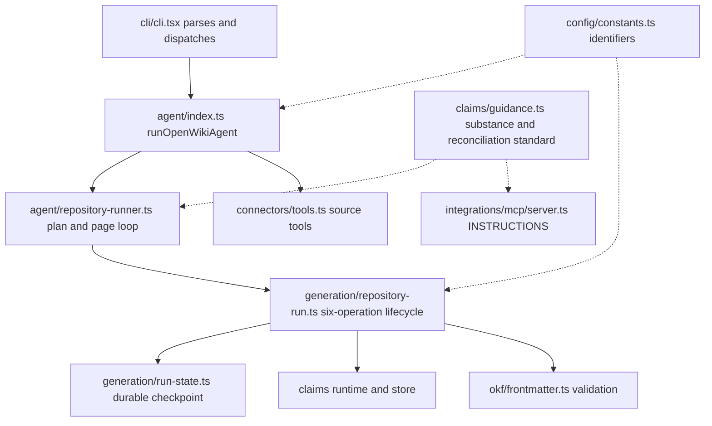

# Source Map

This page maps the `/src` tree to the subsystems it owns. It is organized by
responsibility, not as a file listing: each subsystem gets a one-line role and
its principal entry file(s). Use it to find where a concern lives before diving
into a subsystem's own page.

Related reading: [architecture overview](/openwiki/architecture/overview.md),
[agent runtime](/openwiki/architecture/agent-runtime.md),
[grounded claims](/openwiki/concepts/grounded-claims.md), and
[connectors](/openwiki/integrations/connectors.md).

## The central files

Three files carry a disproportionate share of the system and are worth knowing
before anything else.

- **`src/agent/index.ts`** (the largest source file) owns the LLM agent surface.
  It builds and runs the OpenWiki agent (`runOpenWikiAgent`,
  `createOpenWikiAgent`), resolves and constructs the chat model across every
  supported provider (`resolveModelId`, `createModel`), manages the LangGraph
  checkpoint thread and its history (`createOpenWikiThreadId`,
  `pruneCheckpointHistory`, `resolveCheckpointTarget`), and parses streamed
  agent events into `OpenWikiRunEvent`s (`parseStreamEvent`,
  `parseAgentStreamChunk`, and the `parseUpdatesChunk` helper it dispatches to
  for `'updates'`-mode LangGraph state-delta chunks, which extracts the first
  non-empty assistant text from the per-node output objects). While streaming,
  `parseAgentStreamChunk` suppresses content blocks whose `type` includes
  `file` or `image` (notably `file`, `input_file`, and `image_url` base64
  blobs) so they never reach the terminal — behavior pinned by
  `test/agent/stream-redaction.test.ts`.
- **`src/config/constants.ts`** is the single large registry of stable strings:
  the `openwiki` directory name and the page-manifest/update-metadata paths, plus
  the provider environment-variable key names and defaults for every supported
  provider (`OPENAI_API_KEY_ENV_KEY`, `ANTHROPIC_API_KEY_ENV_KEY`, Bedrock/Vertex,
  Gemini, OpenRouter, Baseten, Copilot, Fireworks, Nebius, NVIDIA, and the
  connector OAuth keys) and the `OpenWikiProvider` union. It also owns the
  output-token ceilings: `resolveConfiguredMaxOutputTokens` picks the right
  provider-specific setting (OpenRouter's legacy `OPENWIKI_OPENROUTER_MAX_TOKENS`
  first, then `OPENWIKI_MAX_OUTPUT_TOKENS`), and `resolveBedrockMaxTokens` falls
  back to `BEDROCK_DEFAULT_MAX_TOKENS` (16000) so Bedrock's 4096-token default
  does not truncate long pages. Nearly every subsystem imports its identifiers
  from here.
- **`src/generation/repository-run.ts`** owns the repository-generation
  lifecycle. It drives the plan-then-page workflow across a six-operation
  surface: `beginRepositoryRun`, `submitRepositoryPlan`, `nextRepositoryPage`,
  `inspectRepositoryPageClaims`, `submitRepositoryPage`, and
  `finishRepositoryRun`, wiring together the run state, claims runtime, wiki
  finalizer, and OKF frontmatter validation — including deterministic
  frontmatter repair (`repairPersistedFile`) before a page job is accepted.
  `beginRepositoryRun` resolves the requested language up front
  (`resolveLanguage`) and rejects an unrecognized language with
  `invalid_input` rather than falling back to English, since run state cannot
  change its language after a start. `nextRepositoryPage` returns the first
  pending job plus its `existingClaimCount` and only the
  `claimsRequiringAttention` (Claims carrying a stale or unresolved issue), so
  focused updates need not re-emit issue-free Claims; `inspectRepositoryPageClaims`
  exposes the page's complete compact Claim set on demand for workers that
  intend to revise or remove otherwise-current content. `submitRepositoryPage`
  takes sparse Claim decisions (`confirmedClaimIds`/`claims`/`retractedClaimIds`)
  which `reconcilePageClaims` turns into confirm/update/add/retract operations,
  retaining omitted issue-free Claims. It also owns the skip-failed-page-workers
  path: `captureRepositoryPageSnapshot` records the pending page and its
  claims sidecar before a worker runs, `skipRepositoryPage` rolls a failed
  worker back (restoring the page markdown and sidecar, marking the job
  `skipped`), and `restoreRepositoryPageMarkdown` re-applies the snapshot
  during `finishRepositoryRun` for every skipped job, tolerating a not-found
  page when the snapshot recorded no markdown.

## Subsystems

### agent — LLM agent construction and repository authoring loop

Owns model/provider wiring, the agent tool loop, and the machinery that turns a
run into wiki pages. Principal entry: `src/agent/index.ts`. Supporting owners
include `src/agent/repository-runner.ts` (the native plan/page tool loop that
calls into `generation/repository-run.ts`), `src/agent/utils.ts` (run-context
construction, content/source snapshots, and update-metadata persistence shared
by the generation lifecycle), `src/agent/docs-only-backend.ts`
(the sandboxed shell/filesystem backend), the OKF and translation middleware
(`okf-middleware.ts`, `translation-middleware.ts`), the prompt builders
(`prompt.ts`, `repository-prompts.ts`), read-boundary enforcement
(`openwiki-ignore.ts`), wiki post-processing (`wiki-finalizer.ts`,
`wiki-link-validator.ts`, `wiki-replacement.ts`), and the ChatGPT/Vertex auth
surfaces (`openai-chatgpt-oauth.ts`, `vertex-surface.ts`).
`runNativeRepositoryGeneration` drives the full loop: it begins the run, runs
the planning agent, then calls `runPendingPageAgents` to spawn one fresh
shell-free worker per pending page. Each `runPageAgent` worker is given an
`inspect_claims` tool (backing `inspectRepositoryPageClaims`) and a
`submit_page` tool (backing the sparse `submitRepositoryPage`); it captures a
`RepositoryPageSnapshot` via `captureRepositoryPageSnapshot` before any model
work, and on a worker that exits without submitting it calls
`skipRepositoryPage` to restore the page and mark it `skipped`, collecting the
snapshots and passing them to `finishRepositoryRun` so skipped pages keep their
pre-work content and are reconsidered on the next update.

### generation — repository run lifecycle and page jobs

Orchestrates a full repository wiki build. Principal entry:
`src/generation/repository-run.ts`, which imports `resolveLanguage`/
`requireResolvedLanguage` from `platform/language.ts` so `beginRepositoryRun`
can reject an unrecognized language before any run state is written.
`src/generation/run-state.ts` owns the durable on-disk checkpoint (`.run.json`,
schema-versioned, with `planning`/`generating` phases and `pending`/`skipped`/
`complete` page-job statuses) so runs resume after interruption.
`src/generation/page-jobs.ts` builds the plan (`createRepositoryPlan`) and
reconciles per-page Claims (`reconcilePageClaims`), turning sparse
`confirmedClaimIds`/`claims`/`retractedClaimIds` decisions into
confirm/update/add/retract operations while retaining omitted issue-free
Claims. `src/generation/page-manifest.ts`
owns the committed page-correctness ledger (`openwiki/.page-manifest.json`,
schema-versioned), recording each completed page's source fingerprint, page
version, and producer provenance. `src/generation/errors.ts` defines
`RepositoryRunError`. The lifecycle exposes a six-operation surface
(`beginRepositoryRun`, `submitRepositoryPlan`, `nextRepositoryPage`,
`inspectRepositoryPageClaims`, `submitRepositoryPage`, `finishRepositoryRun`).
`nextRepositoryPage` returns `claimsRequiringAttention` and
`existingClaimCount` rather than the full Claim set; `inspectRepositoryPageClaims`
returns the complete compact Claim set on demand. Its snapshot/skip/restore
operations (`captureRepositoryPageSnapshot`, `skipRepositoryPage`,
`restoreRepositoryPageMarkdown`) let a failed page worker be rolled back to its
pre-work state and marked `skipped` rather than failing the whole run;
`restoreRepositoryPageMarkdown` tolerates a not-found page when the snapshot
held no markdown, so deleting a newly added page counts as a clean restore;
`finishRepositoryRun` requires a snapshot for every skipped job and re-applies
those snapshots before finalizing.

### claims — grounded-claim persistence, reconciliation guidance, and evidence resolution

Owns the grounded-claims model: strict per-page claim sidecars and the evidence
that backs them. `src/claims/brains/code/runtime.ts` (`prepareClaimsRuntime`)
assembles process-local claims state used by a repository run;
`src/claims/brains/code/store.ts` (`ClaimsStore`) validates and persists claim
sidecars with a schema version; `session.ts` inspects and replaces page claims;
`preflight.ts` computes stable grounding issues. `src/claims/core/` holds
mutations, error types, and the resolver cache. `src/claims/evidence/repository/`
resolves and relocates `repo://` evidence resources (`resolver.ts`,
`resource.ts`), including opaque line-range relocation metadata.
`src/claims/guidance.ts` is the shared model-facing Claims standard: it exports
`CLAIMS_SUBSTANCE_GUIDANCE` (the rules for selecting substantive, atomic
propositions over shallow per-symbol facts) and `CLAIMS_RECONCILIATION_GUIDANCE`
(the sparse-reconciliation rules), consumed verbatim by the page-worker prompt
(`repository-prompts.ts`), the `submit_page` tool description, and the MCP
server `INSTRUCTIONS` so the model sees one standard across every surface.

### okf — Open Knowledge Format frontmatter, indexing, and verification

Owns OKF concept-page structure. `src/okf/frontmatter.ts` is the principal
entry: it validates OKF frontmatter (`validateOkfFrontmatter`), including the
OKF v0.2 trust families — `generated`, `verified`, `sources`, `status`, and
`stale_after` — via `validateTrustFamilies`. It reads and writes individual
fields while preserving unrelated front-matter lines byte-for-byte
(`parseFrontmatterFields`, `readFrontmatterField`, `setFrontmatterField`), and
stamps producer-owned control fields (`setGeneratedEvent`, `setOkfSources`,
`setOkfVerified`). It also deterministically repairs persisted pages
(`repairOkfFrontmatter`, `repairPersistedFile`), which the repository lifecycle
calls before accepting a page. `index-sync.ts` and `index-labels.ts` keep index
pages and concept-type labels in sync; `claims-verification.ts` synchronizes
and rolls back claim verification; `generated-provenance.ts` and
`claim-sources.ts` handle provenance metadata.

### connectors — external read-only knowledge sources

Owns the built-in source connectors and their MCP plumbing.
`src/connectors/registry.ts` (`createConnectorRegistry`, `CONNECTOR_IDS`) is the
central registry mapping ids (`git-repo`, `slack`, `x`, `google`, `web-search`,
`hackernews`, `langsmith`, `notion`, `custom-mcp`) to runtimes. `tools.ts`
exposes connectors to the agent as tools; `mcp-client.ts` and `mcp-runtime.ts`
run MCP transports; `src/connectors/sources/` holds one file per connector
implementation.

### ingestion — pulling connector content into the wiki

Owns the ingestion command that fetches from configured connectors and feeds the
generation pipeline. Principal entry: `src/ingestion/ingestion.ts`
(`runOpenWikiIngestion`). `src/ingestion/code-mode.ts` prepares repository
("code mode") setup consumed by repository runs.

### cli — command parsing and terminal UI

Owns the executable entrypoint and terminal experience. `src/cli/cli.tsx` is the
`#!/usr/bin/env node` entry that installs the crash guard, parses the command,
and dispatches to the Ink app or a non-interactive runner. `src/cli/commands.ts`
is the large command parser/router (`parseCommand`, and predicates such as
`commandLoadsEnvironment`). `runners.ts` and `integrations.ts` host per-command
handlers; `app/`, `components/`, and `input/` hold the Ink UI.

### auth — provider and OAuth credential management

Owns credential acquisition and storage. Principal entries: `src/auth/oauth.ts`
(OAuth flows) and `src/auth/tokens.ts` (token persistence), with
`oauth-discovery.ts`, `providers.ts`, `configure.ts`, `external-cli-auth.ts`, and
`ngrok.ts` for discovery, provider selection, and tunneling.

### config — environment, home directory, and constants

Owns runtime configuration. `src/config/constants.ts` is the central identifier
registry (path constants, provider env keys, the `OpenWikiProvider` union, and
defaults), and also owns the output-token resolution helpers
(`resolveConfiguredMaxOutputTokens`, `resolveBedrockMaxTokens`,
`BEDROCK_DEFAULT_MAX_TOKENS`); `env.ts` loads and saves the OpenWiki `.env`;
`openwiki-home.ts` resolves the home/wiki directories; `reasoning.ts` resolves
reasoning settings.

### integrations — host-tool integration and MCP server surface

Owns embedding OpenWiki into external hosts. `src/integrations/core/session-manager.ts`
is the principal entry: `HostSessionManager` is a thin single-run MCP adapter over
the transport-neutral lifecycle core, serializing one lifecycle operation at a time
(`runOperation`) and mapping `RepositoryRunError` codes into stable
`HostIntegrationError`s at the boundary. Its `begin`, `submitPlan`, `nextPage`,
`inspectPageClaims`, `submitPage`, and `finish` methods delegate to the
`generation/repository-run.ts` lifecycle, and `tools()` returns exactly the six
OpenWiki lifecycle tools (`openwiki_begin`, `openwiki_submit_plan`,
`openwiki_next_page`, `openwiki_inspect_page_claims`, `openwiki_submit_page`,
`openwiki_finish`) for an MCP transport to expose. The
tool descriptions are the host-facing contract: `openwiki_begin` advertises that
an unrecognized `language` returns `invalid_input` instead of starting a run,
`openwiki_next_page` returns only the stale or unresolved Claims requiring an
explicit decision (plus an `existingClaimCount`),
`openwiki_inspect_page_claims` returns the complete Claim set on demand,
`openwiki_submit_page` states the sparse Claim-reconciliation rules (reuse ids
for revisions, omit to retain, omit id for new, `retractedClaimIds` for removals),
and `openwiki_finish` requires every job complete before deterministic
deletion/validation/indexing. `src/integrations/core/protocol.ts` defines the
`ProtocolToolName` union (the six tool names), the strict Zod input schemas
including the sparse `SubmitPageInput` (optional `confirmedClaimIds`,
`claims`, and `retractedClaimIds`) and `InspectPageClaimsInput`, and host-id
validation; `repository-root.ts` resolves the repository root.
`src/integrations/mcp/server.ts` exposes OpenWiki over MCP, advertising an
`INSTRUCTIONS` preamble that incorporates `CLAIMS_RECONCILIATION_GUIDANCE` from
`claims/guidance.ts` so the host model follows the same sparse-reconciliation
standard as the native page-worker prompt (stdio in
`stdio.ts`); `src/integrations/install/` handles host installation.

### visualize — local graph viewer

Owns the interactive wiki/graph viewer. `src/visualize/server.ts`
(`createRequestHandler`) serves the app; `graph.ts` builds the graph model;
`page.ts`, `client.ts`, `client-lib.ts`, and `static-export.ts` render and export
it.

### scheduling — recurring connector and generation runs

Owns cron/launchd scheduling. Principal entry: `src/scheduling/schedules.ts`,
which validates cron expressions and installs, lists, pauses, resumes, and
deletes connector and "power" schedules.

### telemetry — run recording and error classification

Owns opt-out usage telemetry and error taxonomy. `src/telemetry/index.ts` is the
public barrel re-exporting `recordRun`/`recordRunSafe`, `withRunTelemetry`,
error classification (`classifyError`, `tagErrorStage`), and the opt-out gates
(`isTelemetryDisabled`, `isCiEnvironment`). `senders.ts`, `errors.ts`, and
`taxonomy.ts` carry the implementation.

### platform — OS and filesystem primitives

Owns cross-platform helpers shared by other subsystems: `fs-errors.ts`
(`isFileNotFoundError`), `diagnostics.ts` (secret redaction), `language.ts`
(language resolution), `windows-acl.ts`, and `utils.ts`.

### mermaid — diagram validation for generated pages

Owns Mermaid handling in generated wikis: `fences.ts` extracts fences,
`validate.ts` parses/validates them (degrading invalid diagrams), `wiki.ts`
applies the policy to pages, and `dom-shim.ts` provides the headless render
environment.

## How the central subsystems connect

The CLI entrypoint parses a command and, for repository generation, the agent
constructs a model and runs the plan/page loop, which calls the generation
lifecycle; that lifecycle reconciles sparse Claim decisions, persists claims,
and validates OKF frontmatter as it writes each page. Both the native
page-worker prompt and the MCP host instructions share the same Claims
reconciliation guidance from `claims/guidance.ts`.

Caption: Control flow from the CLI through the agent into the repository
generation lifecycle, with the shared Claims guidance feeding both the native
page-worker prompt and the MCP host instructions, and config identifiers
shared across subsystems.
