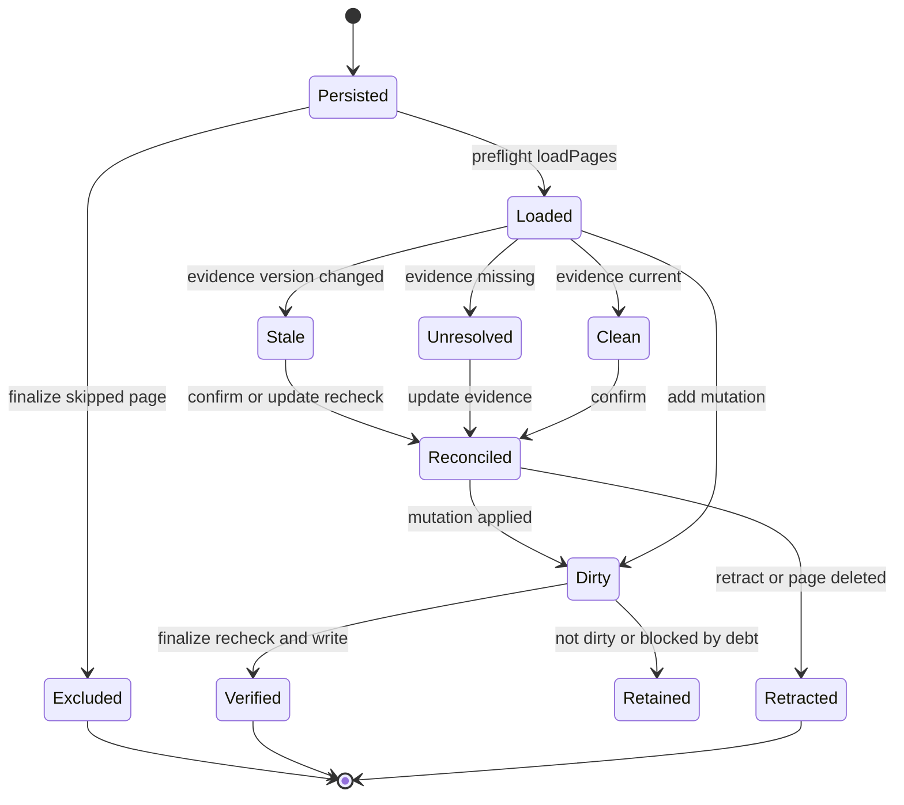

# Grounded Claims

A **Claim** is one atomic, independently verifiable factual proposition about the
system, backed by one or more pieces of versioned repository evidence. Claims are
the factual backbone of a generated wiki page: each page owns a complete set of
Claims, and OpenWiki tracks whether the source those Claims cite still matches
what was observed when the page was written.

The data model is deliberately small. A `Claim` has a stable OpenWiki-generated
`id`, an atomic `statement`, and one or more `Evidence` records; each `Evidence`
pairs a resolver-owned `resource` identity with an opaque `version` token
captured when the Claim was established.

## Responsibilities and the store/session/runtime split

The code brain under `src/claims/brains/code` separates persistence, run-scoped
working state, and lifecycle orchestration into three cooperating layers.

- **Store** (`ClaimsStore`) is the OpenWiki-owned persistence boundary rooted at
  one repository. It discovers grounded pages, loads and validates sidecars,
  hashes generated Markdown, and atomically writes and deletes sidecars.
- **Session** (`ClaimSession`) holds mutable run-scoped Claim state per page,
  applies mutation batches, exposes model-facing inspection, tracks evidence
  debt, and finalizes durable state through the store.
- **Runtime** (`prepareClaimsRuntime` / `ClaimsRuntime`) wires a store, a
  repository evidence resolver, and preflight results into a session, and
  exposes a single `finalize` entrypoint that persists Claims and synchronizes
  OKF projections.

Claim lifecycle and state transitions from persisted sidecar through preflight
classification, reconciliation, and durable finalization. An `Excluded` page is
one passed in `finalize`'s `excludedPages` set and is left untouched.

## Where Claim state persists

Claim state is not stored inside the generated Markdown. Each grounded page has a
JSON **sidecar** under `openwiki/.claims/`, mirroring the page's path below
`openwiki/` with a `.json` extension. Sidecars are OpenWiki-owned control state:
they carry the persisted schema version, a `pageVersion` hash of the generated
Markdown bytes, the complete `claims` array, and an optional `verification`
event.

Only pages that own factual state receive a sidecar. Structural and reserved
files (`index.md`, `log.md`, `instructions.md`) and anything inside the
`.claims` directory are excluded from grounding, and evidence itself can never
point back at Git metadata or generated `openwiki/` output.

Sidecars are written atomically: the store serializes validated state to a
temporary file and renames it into place, cleaning up the temporary file on
failure so a partial write can never corrupt a sidecar.

## Evidence resources and versions

Evidence is addressed by a canonical `repo://` URI. The resource is a normalized
repository-relative path, optionally followed by a GitHub-style line-range
fragment such as `repo://src/agent/index.ts#L40-L82`. A single-line fragment like
`#L8` is accepted and canonicalized to `#L8-L8`. Every evidence resource MUST use
this `repo://<repository-relative-path>` form (optionally with `#Lx-Ly`); a bare
path such as `src/agent/index.ts` is invalid. Parsing rejects paths that
escape the repository, absolute or drive-letter paths, control characters, and
references to `.git` or `openwiki/`.

Resolution is fully deterministic and never involves the model. The
`RepositoryEvidenceResolver` reads the file through a containment gate that
refuses symbolic links and filesystem aliases — raising an
`EvidenceSecurityError` when the resolved path escapes the physical repository
root — then produces an opaque `version` token. Whole-file evidence is versioned
by a SHA-256 hash of the entire file (`repo-file-v1:sha256:...`). Line-range
evidence is versioned by a hash of the selected content plus resolver-owned
relocation anchors (`repo-lines-v1:sha256:...`), so that when edits move or
resize a range the resolver can relocate the same selected text using its first
and last selected lines and surrounding context, keeping the version stable when
the content did not actually change.

Because versions are content-derived, a version mismatch is exactly a content
change. Resolution returns `null` when a file or range no longer exists, which is
distinct from a version that merely changed.

## Staleness and unresolved detection

Preflight (`runClaimsPreflight`) runs global freshness checks without creating
mandatory agent work. For every persisted Claim it re-resolves each evidence
resource against its recorded prior version and classifies the Claim:

- **unresolved** when any evidence resource no longer resolves; and
- **stale** when every resource still resolves but at least one resolved to a
  different version than the one recorded.

Unresolved takes precedence over stale for a given Claim. Issues are produced in
a deterministic sorted order and carried into the session as `GroundingIssue`
records attached to the owning page. Resolution errors (as opposed to a missing
file) propagate so they cannot be mistaken for deleted evidence, with one
exception: an `EvidenceSecurityError` — a permanent containment refusal raised
when evidence traverses a symbolic link or filesystem alias — is caught and
treated as `null` (unresolved) for that resource, so the owning Claim is reported
for reconciliation rather than aborting the run.

A stale or unresolved marker is a **requirement to recheck current source**, not
an instruction to retract. When a Claim is inspected, its issue is surfaced to
the model so the owning page can confirm, update, or retract it against current
code.

## Mutations and reconciliation

The core mutation engine (`applyClaimOperations`) applies an ordered batch of
`add`, `confirm`, `update`, and `retract` operations against a page's complete
Claim set as an all-or-nothing transaction: nothing is mutated until every
operation validates and all evidence resolves. A batch may not target the same
existing Claim id twice, may not reference unknown ids, and rejects evidence that
repeats or resolves to a duplicate resource. `confirm` re-resolves the Claim's
existing evidence to refresh its versions; an `update` that omits evidence
likewise retains and refreshes the current resources.

The session layer wraps this with cross-page ownership: claim identifiers are
globally unique across pages, allocated to avoid collisions, and a batch is
rejected if it would give one id to two pages. Applying any successful mutation
marks only the owning page dirty and clears the grounding issues for the Claim
ids it targeted, so reconciling a stale Claim removes its debt.

Inspection is side-effect-free: it returns cloned, model-facing Claims with the
opaque evidence versions stripped and any preflight issue attached, without
creating a write obligation.

## Sparse page-completion submission

A page job never resubmits its whole Claim set. The worker hands
`submit_page` a **sparse** `ProposedPageClaimReconciliation` with three optional
fields:

- `confirmedClaimIds` — existing Claims explicitly rechecked and retained
  unchanged (used for issue-bearing Claims the worker verified are still
  accurate);
- `claims` — revised existing Claims (carrying their existing id) and genuinely
  new propositions (without an id);
- `retractedClaimIds` — existing Claims removed from the completed page.

`reconcilePageClaims` translates these sparse decisions into the complete
`confirm` / `update` / `add` / `retract` operation batch the session expects.
Existing issue-free Claims omitted from every field are **confirmed
deterministically** — the model need not repeat their statements or evidence,
and they are retained automatically. A Claim carrying a stale or unresolved
grounding issue is the exception: it must appear in one of the three explicit
fields, or reconciliation rejects the submission, so required grounding work
cannot be skipped. Retraction is delete-like and stays safe across retries: an
unknown id in `retractedClaimIds` is tolerated when it is no longer owned by the
session, while unknown `update` / `confirm` ids remain strict.

A proposed Claim with an existing id that is unchanged is folded into a
`confirm`; a changed one becomes a partial `update` carrying only the fields that
differ. A proposed Claim without an id is matched against an existing Claim with
identical statement and evidence before falling back to an `add`, which the
session allocates a globally unique id for. Reconciliation also refuses a result
that would leave a completed factual page with zero Claims, so a grounded page
always retains or establishes at least one material proposition.

## On-demand full-Claim inspection

`nextRepositoryPage` returns the first pending page job not excluded by the
caller's in-flight worker set, without reserving or mutating it, along with
only what a focused update needs: the job's `existingClaimCount` and
`claimsRequiringAttention` — the subset of Claims carrying a stale or
unresolved issue. Issue-free Claims are summarized as a count, not
enumerated, so ordinary updates do not have to carry them.

When a worker must intentionally revise or remove otherwise-current content —
for example rewriting a section whose Claims are not in `claimsRequiringAttention`
— it needs the actual Claim ids. `inspectRepositoryPageClaims` (the
`openwiki_inspect_page_claims` tool) returns the pending page's complete compact
Claim set without opaque evidence versions, and only for the current pending job.
It is the on-demand way to obtain complete ids before a revision or removal;
focused updates that touch only issue-bearing Claims need not call it.

## The durability boundary at page completion

`ClaimSession.finalize` is the boundary where run-scoped Claim state becomes
durable. It accepts an `excludedPages` set — pages whose generation jobs were
skipped during an interrupted run — and leaves those pages untouched: it neither
persists, rechecks, nor deletes their sidecars. For every other page, finalization
only touches pages that actually changed, and each such page must pass two gates
before its sidecar is written:

1. **No evidence debt** — a page with unresolved grounding issues is refused, so
   stale or unresolved Claims cannot be silently persisted as verified.
2. **Evidence still current** — every Claim's evidence is re-resolved one final
   time; if any resource disappeared or changed version since the mutation was
   accepted, the page is not persisted.

The runtime exposes this through `ClaimsRuntime.finalize(at, excludedPages)`,
which builds the OpenWiki producer verification event and forwards the skipped
set.

### Per-page proof at `submit_page`

Each page job is grounded individually before its job is marked complete.
`submitRepositoryPage` first runs page-local validation and front-matter
repair without the run mutation lock (they touch only the submitted page),
then takes the lock so concurrent workers never lose each other's
completions: `reconcilePageClaims` translates the model's sparse Claim
decisions into the complete `confirm` / `update` / `add` / `retract`
operation batch the session expects, then `claimsRuntime.finalize` persists
the dirty page — excluding every other still-pending page, which a concurrent
worker may be mid-edit on, so projecting a stamp or rehashing their sidecar
here would record transient bytes — and finally `assertPageClaimsDurable`
re-opens the freshly written sidecar and proves the page is durable before
the job is marked complete and the queue advances.

`assertPageClaimsDurable` is the strict per-page proof. It re-reads the sidecar
from disk and refuses the page when any of the following fail, so a partially or
incorrectly persisted page cannot silently advance:

- the sidecar was actually persisted and reloads;
- its persisted `pageVersion` hash equals the current Markdown bytes
  (`store.hashPage`);
- it carries a durable `verification` event;
- that verification event is durably projected into the page's front-matter
  `verified` field (matching `by` and `at`);
- the persisted Claim set has the same count as the session's expected set, and
  every expected Claim is present with a matching `statement` and an equal
  evidence resource set.

The whole-run proof waits until every page job is complete (see below); the
per-page proof lets `submit_page` fail fast and request a retry before the queue
moves on.

### Finishing a run: skipped pages and the whole-run proof

When a repository run finishes, `finishRepositoryRun` first validates that every
skipped page job carries its original `captureRepositoryPageSnapshot` capture,
refusing to finish if any skipped job is missing its snapshot or its path no
longer matches the job. It then derives `skippedPages` from the skipped jobs and
passes the set both to `finalize` and to the post-run durability assertion
(`assertRepositoryClaimsDurable`), so skipped pages are exempt from Claims
persistence and from the "no orphan sidecar" / "every claimed page is durable"
checks that gate the run.

Finalization also removes orphaned sidecars (whose pages no longer exist),
deletes sidecars for pages whose Markdown vanished during the run, and removes
sidecars for pages recorded as deleted. Each page's Markdown is hashed before
its sidecar is written so the persisted `pageVersion` describes the exact bytes on
disk. A page finalized with a non-empty Claim set receives a durable
`verification` event; a page whose Claims were fully retracted is persisted
without one.

Finalization is best-effort per page: recoverable per-page failures are isolated
as warnings rather than aborting the run, but the runtime treats any warning as a
durability failure and rejects, so an incomplete finalization does not pass
silently.

## OKF projection: sources and verification

After Claims are durable, the runtime projects them into OKF front matter on the
generated pages. Evidence resources become `sources` entries
(`synchronizeClaimSources`): precise line ranges are collapsed to whole-file
`repo://` resources for provenance, OpenWiki-owned entries get deterministic ids
derived from the resource, and independently authored producer `sources` are
retained.

Durable verification is projected into the OKF `verified` field
(`synchronizeClaimsVerification`). For every grounded page it keeps all
producer-authored events whose `by` actor is not in the `openwiki/<version>`
family, then appends at most one active durable verification event from Claims
state (or none, when the page is ineligible). Bare verifier mappings are
normalized to the canonical list form when the field is touched, and the
projector records the pre-projection Markdown for each changed page so a failed
hash refresh can roll the field back. Only a page that is persisted, clean,
non-empty, free of evidence debt, and carrying a verification event is eligible
for a machine stamp.

The projection can rewrite code-owned front matter, which changes the Markdown
bytes and therefore the page hash. To keep sidecars consistent with the final
bytes, `refreshPageVersions` re-hashes represented pages after projection; if a
page whose stamp was newly exposed cannot be refreshed, the verification stamp is
rolled back so a stamp never outlives an accurate `pageVersion`.

## Preparation, resolver caching, and configuration

`prepareClaimsRuntime` is active only for `repository` output outside `chat`
mode. A fresh `init` starts from empty Claim state while still discovering
existing sidecars as orphan candidates; updates and resumed inits run full
preflight first. The repository evidence resolver is constructed with the
repository root and the shared `.openwikiignore` read-boundary rules, so evidence
resolution honors the same exclusions as the agent's file reads.

Every processing phase — preflight, one mutation batch, and one finalization
pass — wraps the resolver with a fresh `cacheEvidenceResolver` so each
`(resource, previousVersion)` pair resolves at most once within that phase while
never caching across a freshness boundary.

## Shared model-facing guidance

The substance and reconciliation standards the worker sees are not ad hoc: they
live in `src/claims/guidance.ts` as two shared constants —
`CLAIMS_SUBSTANCE_GUIDANCE` (what counts as a material, atomic, evidence-backed
proposition, including the `repo://` evidence-resource form requirement) and
`CLAIMS_RECONCILIATION_GUIDANCE` (the sparse-decision rules: retain issue-free
Claims automatically, give every issue-bearing Claim an explicit decision, never
resubmit an unchanged Claim). These constants are shared by the page-worker
prompt for init, update, and migration and by the MCP server instructions, so the
same rules reach every host integration and tool description.

## Related pages

- [Source Map](/openwiki/architecture/source-map.md)
- [OKF Output](/openwiki/concepts/okf-output.md)
- [Claims Reconciliation](/openwiki/workflows/claims-reconciliation.md)
- [Repository Generation](/openwiki/workflows/repository-generation.md)
