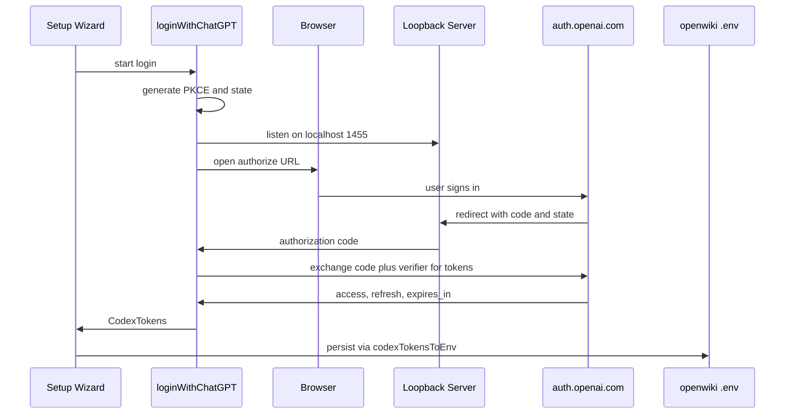
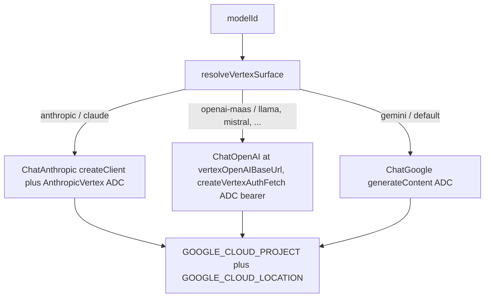

# Model Providers and Credentials

OpenWiki drives its agent through a pluggable set of LLM providers. A single
declarative registry — `PROVIDER_CONFIGS` in `src/config/constants.ts` — is the
source of truth for every provider's display label, model options, environment
keys, base URL, and authentication method. The agent's model factory
(`createModel` in `src/agent/index.ts`) consumes that registry to build the
right LangChain chat model, and all persisted credentials live in a single
`0600` file at `~/.openwiki/.env`.

## Provider registry and selection

Each entry of `PROVIDER_CONFIGS` is keyed by an `OpenWikiProvider` and declares
how that provider is configured and authenticated. Helper accessors
(`getProviderConfig`, `getProviderApiKeyEnvKey`, `getProviderAuthMethod`,
`getProviderBaseUrlEnvKey`, `resolveProviderBaseUrl`, `resolveProviderRegion`,
`resolveProviderLocation`, and friends) read from this registry rather than
hardcoding provider knowledge elsewhere. Two transport-selecting accessors
take a model ID in addition to the provider: `providerUsesResponsesApi`
(`true` for `openai`, the `gpt-5` pattern for `copilot`, and a configurable
flag for `openai-compatible`) and `providerUsesStreaming` (forced on for
`copilot` and configurable for `openai-compatible`).

The active provider is resolved by `resolveConfiguredProvider`: it prefers the
explicit `OPENWIKI_PROVIDER` value (normalized case-insensitively by
`normalizeProvider` / `isValidProvider`), and otherwise infers a provider from
whichever recognized API-key variable is present, finally falling back to
`DEFAULT_PROVIDER` (`"openai"`). The default model when none is configured is the
first model option of the default provider (`DEFAULT_MODEL_ID`).

### Environment keys by provider

| Provider (`OPENWIKI_PROVIDER`) | Label                         | Auth method   | Primary credential env key                  | Base URL / override key                                        |
| ------------------------------ | ----------------------------- | ------------- | ------------------------------------------- | -------------------------------------------------------------- |
| `openai`                       | OpenAI                        | api-key       | `OPENAI_API_KEY`                            | (SDK default) / `OPENAI_BASE_URL`                              |
| `openai-chatgpt`               | OpenAI (ChatGPT login)        | oauth         | `OPENAI_CHATGPT_ACCESS_TOKEN` (+ token set) | Codex backend (fixed)                                          |
| `anthropic`                    | Anthropic                     | api-key       | `ANTHROPIC_API_KEY`                         | (SDK default) / `ANTHROPIC_BASE_URL`                           |
| `copilot`                      | GitHub Copilot                | external-cli  | `COPILOT_API_KEY`                           | `https://api.githubcopilot.com` / `COPILOT_BASE_URL`           |
| `gemini`                       | Gemini (AI Studio)            | api-key       | `GEMINI_API_KEY`                            | (SDK default)                                                  |
| `gemini-enterprise`            | Gemini Enterprise (Vertex AI) | ADC (keyless) | none — `GOOGLE_CLOUD_PROJECT`               | derived from project/location                                  |
| `openrouter`                   | OpenRouter                    | api-key       | `OPENROUTER_API_KEY`                        | `https://openrouter.ai/api/v1`                                 |
| `openai-compatible`            | OpenAI-compatible             | api-key       | `OPENAI_COMPATIBLE_API_KEY`                 | required via `OPENAI_COMPATIBLE_BASE_URL`                      |
| `bedrock`                      | AWS Bedrock                   | aws-sdk       | `BEDROCK_AWS_ACCESS_KEY_ID` (legacy pair)   | AWS SDK credential chain                                       |
| `fireworks`                    | Fireworks                     | api-key       | `FIREWORKS_API_KEY`                         | `https://api.fireworks.ai/inference/v1` / `FIREWORKS_BASE_URL` |
| `baseten`                      | Baseten                       | api-key       | `BASETEN_API_KEY`                           | `https://inference.baseten.co/v1` / `BASETEN_BASE_URL`         |
| `nebius`                       | Nebius Token Factory          | api-key       | `NEBIUS_API_KEY`                            | `https://api.tokenfactory.nebius.com/v1/`                      |
| `nvidia`                       | NVIDIA NIM                    | api-key       | `NVIDIA_API_KEY`                            | `https://integrate.api.nvidia.com/v1` / `NVIDIA_BASE_URL`      |

`SELECTABLE_OPENWIKI_PROVIDERS` fixes the order these providers appear in the
setup wizard.

## Authentication methods

`ProviderAuthMethod` is one of `"api-key"`, `"oauth"`, `"aws-sdk"`, or
`"external-cli"`; a provider config omitting `authMethod` is implicitly
`"api-key"`. The method drives which setup step runs, which env keys are
required, and how `createModel` constructs the client.

### API key providers

Most providers just need a pasted secret persisted to their `*_API_KEY`
variable. `providerRequiresApiKey` is true when the method is `api-key` and an
`apiKeyEnvKey` exists. `getMissingProviderEnvKey` reports the first required-but-
unset variable so setup and startup can prompt for it. `resolveProviderBaseUrl`
prefers the provider's `baseUrlEnvKey` override over the built-in `baseURL`, so
self-hosted or proxied endpoints can be pointed at without code changes. The
`openai-compatible` provider has no default endpoint and requires
`OPENAI_COMPATIBLE_BASE_URL` (`requiresBaseUrl`); its base-URL validation rejects
a URL that already ends in `/chat/completions`, since the SDK appends that path
itself.

### ChatGPT OAuth (`openai-chatgpt`)

The `openai-chatgpt` provider authenticates model calls against OpenAI's Codex
backend (`https://chatgpt.com/backend-api/codex`) with a ChatGPT subscription
rather than a metered API key. The flow, implemented in
`src/agent/openai-chatgpt-oauth.ts`, ports the Codex CLI's browser
Authorization-Code + PKCE login: `loginWithChatGPT` generates a PKCE verifier
and `state`, opens `https://auth.openai.com/oauth/authorize` using OpenAI's
first-party Codex client id, and starts a loopback HTTP server bound only to
`localhost:1455` at `/auth/callback` to capture the authorization code.

Diagram: ChatGPT OAuth PKCE login and token persistence.

State is verified on the callback, and if the browser cannot complete the flow a
manual-paste path (`submitManual` / `parseManualCallbackInput`) accepts the full
redirect URL or a bare code so headless environments can finish the login.
`exchangeToken` posts to `https://auth.openai.com/oauth/token`, and the returned
access-token JWT is decoded by `decodeChatGptIdentity` to extract the mandatory
`chatgpt_account_id` (sent on every Codex request) plus best-effort `email` and
`plan_type` used only for display.

Tokens are represented by `CodexTokens` and serialized to the env file by
`codexTokensToEnv`, which is the single contract for the ChatGPT env keys:
`OPENAI_CHATGPT_ACCESS_TOKEN`, `OPENAI_CHATGPT_REFRESH_TOKEN`,
`OPENAI_CHATGPT_EXPIRES_AT` (epoch ms), `OPENAI_CHATGPT_ACCOUNT_ID`, and
optionally `OPENAI_CHATGPT_EMAIL` and `OPENAI_CHATGPT_PLAN`.
`readCodexTokensFromEnv` reads them back but returns `null` unless the access
token, refresh token, and account id are all present, so an incomplete login is
treated as unauthenticated.

Because OpenWiki is a short-lived CLI process, there is no background refresh
loop. `ensureFreshChatGptTokens` runs once at run startup (before the model is
built, keeping `createModel` synchronous): if the persisted token is expired or
within the near-expiry threshold (`CHATGPT_TOKEN_REFRESH_THRESHOLD_MS`, 60s), it
calls `refreshChatGptTokens` and writes the rotated set back. Callers must
persist whatever refresh token comes back, since OpenAI may rotate it. When no
usable token set exists, the run fails with a message telling the user to re-run
`--init` to sign in.

At model-build time, `createModel` reuses LangChain's `ChatOpenAI`
Responses-API integration pointed at `CODEX_RESPONSES_BASE_URL`: it forces
`useResponsesApi`, `zdrEnabled` (the Codex backend requires `store: false`), and
`streaming: true` (the backend rejects non-streaming requests), and attaches the
`chatgpt-account-id`, `originator`, and `OpenAI-Beta` headers. A `createCodexFetch`
wrapper adapts the request body at the final fetch boundary (rewriting `system`
roles to `developer`, stripping `prompt_cache_retention` for GPT-5.6, and
applying the Codex Luna protocol for `gpt-5.6-luna`).

### Vertex AI / Gemini Enterprise (keyless ADC)

`gemini-enterprise` is keyless: it authenticates through Google Application
Default Credentials against a Cloud project (`GOOGLE_CLOUD_PROJECT`) and location
(`GOOGLE_CLOUD_LOCATION`, defaulting to `global` via `DEFAULT_VERTEX_LOCATION`),
not an API key. Because there is no API key, `getMissingProviderEnvKey` treats a
missing `GOOGLE_CLOUD_PROJECT` as the blocking requirement, and
`getProviderCredentialHint` points users to `gcloud auth
application-default login` or `GOOGLE_APPLICATION_CREDENTIALS`.

A single project + region + ADC credential can reach every Vertex Model Garden
surface; `createGeminiEnterpriseModel` selects the transport per model ID via
`resolveVertexSurface` (`src/agent/vertex-surface.ts`):

- `gemini` — Google's own Gemini/Gemma models over native `generateContent`, via `ChatGoogle`.
- `anthropic` — Claude over Anthropic's wire protocol, bridged through `ChatAnthropic`'s `createClient` hook and the `AnthropicVertex` SDK, which authenticates via ADC.
- `openai-maas` — partner/open-weight models (Llama, Mistral, DeepSeek, Qwen, …) over Vertex's OpenAI-compatible endpoint, whose base URL is built by `vertexOpenAIBaseUrl`.

Diagram: How `createGeminiEnterpriseModel` routes one ADC credential to three Vertex surfaces by model family.

For the MaaS surface the OpenAI SDK authenticates via an `Authorization` header,
so `createVertexAuthFetch` wraps `fetch` to inject a fresh ADC bearer token on
every request (Google's auth client caches and auto-refreshes it), keeping
`createModel` synchronous over long sessions; the configured `apiKey` is only a
placeholder that the header overwrites. For the Claude-on-Vertex surface,
`withAnthropicAuthEnvNeutralized` deletes `ANTHROPIC_API_KEY` /
`ANTHROPIC_AUTH_TOKEN` around the synchronous `AnthropicVertex` constructor so a
leftover Anthropic key cannot clobber the Google OAuth token and cause
`ACCESS_TOKEN_TYPE_UNSUPPORTED`.

### AWS Bedrock (AWS SDK credential chain)

`bedrock` has `authMethod: "aws-sdk"` and delegates authentication to the AWS
SDK credential provider chain (`ChatBedrockConverse`), so it does not require the
legacy access/secret key pair. `getMissingProviderEnvKey` gives the Bedrock
bearer token (`AWS_BEARER_TOKEN_BEDROCK`) precedence, then validates the legacy
`BEDROCK_AWS_ACCESS_KEY_ID` / `BEDROCK_AWS_SECRET_ACCESS_KEY` pair and the
standard `AWS_ACCESS_KEY_ID` / `AWS_SECRET_ACCESS_KEY` pair — rejecting a partial
or blank pair but allowing an entirely absent one so OIDC/web identity, IAM
roles, or `AWS_PROFILE`/SSO can still resolve. A complete legacy pair short-
circuits to `null` so unrelated standard AWS variables cannot affect the run.
Bedrock requires a region (`requiresRegion`), resolved from `BEDROCK_AWS_REGION`
with fallbacks to `AWS_REGION` and `AWS_DEFAULT_REGION`. Its model list is empty
because available model IDs are account- and region-specific and must be pasted
directly.

Without an explicit `maxTokens`, the Bedrock Converse API caps output at 4096
tokens by default, which truncates long wiki pages mid-write. OpenWiki avoids
this by defaulting Bedrock to a 16000-token ceiling:
`resolveBedrockMaxTokens` returns `BEDROCK_DEFAULT_MAX_TOKENS` (16000) unless
`OPENWIKI_BEDROCK_MAX_TOKENS` overrides it (validated as a positive integer),
matching @langchain/anthropic's built-in ceiling for Claude models. The provider-
neutral `resolveConfiguredMaxOutputTokens` — used by `createModel` to set
`maxTokens` — applies this Bedrock default as its last fallback: when the provider-
neutral `OPENWIKI_MAX_OUTPUT_TOKENS` is unset, a Bedrock run still gets the 16000
default instead of the Converse API's 4096 cap (the OpenRouter legacy
`OPENWIKI_OPENROUTER_MAX_TOKENS` setting takes precedence on OpenRouter runs, and
an explicit `OPENWIKI_MAX_OUTPUT_TOKENS` always wins for any provider).

### External CLI auth (GitHub Copilot)

`copilot` has `authMethod: "external-cli"` with the `github-cli` adapter
(`src/auth/external-cli-auth.ts`). Rather than storing a secret, OpenWiki reuses
the credential from an already-authenticated `gh` CLI: `detectExternalCliCredential`
runs `gh auth token`, and `resolveExternalCliCredential` injects that token into
`COPILOT_API_KEY` for the current process only — it is deliberately never written
to the env file, leaving the CLI as the source of truth. The `gh` `--hostname`
flag is derived from the configured `COPILOT_BASE_URL` so a GHE.com data-residency
host authenticates against the correct tenant. `runExternalCliLogin` can launch
`gh auth login` interactively when no session exists; for CI, `COPILOT_API_KEY`
may still be set directly.

The Copilot API serves non-GPT-5 models (Claude, Gemini) over the chat
completions transport and rejects or returns empty responses for non-streaming
requests, which would cause repository workers to exit without calling
`submit_plan`/`submit_page`. `providerUsesStreaming` therefore forces the
streaming HTTP transport (`streaming: true`) for every Copilot model — the same
rationale that forces streaming on the openai-chatgpt Codex backend. For GPT-5
models that use the Responses API (`responsesApi: /^gpt-5/u`), `streaming: true`
is redundant but harmless, matching the openai-chatgpt provider pattern.
`createModel` applies this with a conditional spread (`...(providerUsesStreaming(provider) ? { streaming: true } : {})`) rather than assigning `streaming: false`, because LangChain turns an explicit `false` into `disableStreaming`, which is not equivalent to omitting the key.

## Reasoning effort

`OPENWIKI_REASONING_EFFORT` selects a reasoning effort for models that expose
one. `resolveReasoningConfig` (`src/config/reasoning.ts`) reads it, validates it
against the permitted `REASONING_EFFORT_VALUES` (`none`, `low`, `medium`, `high`,
`xhigh`, `max`), and — only when a capability is declared for the
provider+model pair — returns a `{ effort, transport }` resolution that
`createModel` turns into the right client option. When the variable is unset,
no reasoning option is applied; when it is set but no capability matches the
provider/model, the run throws `OPENWIKI_REASONING_EFFORT is not supported for
provider "..." and model "..."`.

The transport determines where the effort lands:

- `responses-reasoning` — `reasoning: { effort }` on `ChatOpenAI` (the OpenAI Responses API payload). Used by `openai` and `openai-chatgpt` for the `gpt-5.6-terra`/`gpt-5.6-luna`/`gpt-5.6-sol` models, and by `openai-compatible` when it opts into the Responses API.
- `chat-completions-reasoning-effort` — `modelKwargs: { reasoning_effort }` on `ChatOpenAI`, for endpoints that take the effort as a chat-completions field. Used by `nvidia` for `nvidia/nemotron-3-super-120b-a12b` (values `none`/`low`/`high`) and by `openai-compatible` when it does not opt into the Responses API.
- `gemini-thinking-level` — the `thinkingLevel` option on `ChatGoogle`, for Gemini models that expose a thinking budget. `gemini-3.6-flash` supports it with values `low`/`medium`/`high`.

`createModel` spreads exactly one of these three option sets (`responsesReasoningOptions`, `chatCompletionsReasoningOptions`, or `geminiThinkingLevelOptions`) depending on the resolved transport, so a single `OPENWIKI_REASONING_EFFORT` value is routed to the correct wire field per provider and model.

### OpenAI-compatible reasoning opt-in

The `openai-compatible` provider points at arbitrary third-party endpoints, so
reasoning effort is off by default: without an explicit opt-in,
`resolveReasoningConfig` returns no capability for `openai-compatible`, and
because the effort was set, `createModel` throws `not supported`.

Setting `OPENWIKI_OPENAI_COMPATIBLE_REASONING_EFFORT_SUPPORTED=true` opts in.
The transport then depends on the same Responses-API flag that selects the wire
transport for the provider:

- with `OPENWIKI_OPENAI_COMPATIBLE_USE_RESPONSES_API=true`, the capability is `responses-reasoning` and the effort is sent as `reasoning: { effort }`;
- otherwise the capability is `chat-completions-reasoning-effort` and the effort is sent as `modelKwargs: { reasoning_effort }`.

`getOpenAiCompatibleReasoningCapability` derives the transport from
`providerUsesResponsesApi("openai-compatible", modelId, env)` (which itself reads
`OPENWIKI_OPENAI_COMPATIBLE_USE_RESPONSES_API`), so the reasoning transport and
the request transport always agree.

## Credential persistence and env file

All managed settings and credentials are read from and written to
`~/.openwiki/.env`. `MANAGED_ENV_KEYS` in `src/config/env.ts` is the single
ordered list of every variable OpenWiki reads or persists; the credential
diagnostics list (`CREDENTIAL_DIAGNOSTIC_ENV_KEYS`) and the agent's debug key
dump (`DEBUG_ENV_KEYS`) are derived from it so they cannot drift as new keys are
added.

`loadOpenWikiEnv` reads the file into `process.env`, but only for keys not
already set — a shell export wins over the saved value. It also snapshots the
saved values at first load (`getSavedEnvValue`) so the setup wizard can pre-fill
from the saved config rather than a shadowing shell variable.

`saveOpenWikiEnv` serializes writes through a queue (so a failed save never
blocks later ones), merges updates over the current file contents, drops empty
values (an empty string means "not set"), creates the home directory as `0700`,
and writes atomically: it writes a temp file in the same directory as `0600` and
`rename`s it into place so a crash mid-write cannot truncate the credential file
and lose every saved token. After writing, it updates `process.env` for changed
keys but skips any key already exported in the shell.

The setup wizard computes the update map purely via `buildCredentialEnvUpdates`
(`src/setup/credentials/persistence.ts`): it maps the collected values to the
selected provider's env keys (API key, base URL, secret key, region, GCP
project/location), writes the provider key only when it actually changes, and —
for the ChatGPT provider — expands the collected `CodexTokens` through
`codexTokensToEnv`. The caller then persists the result via `saveOpenWikiEnv`.

## Related pages

- [Agent runtime](/openwiki/architecture/agent-runtime.md) — how `createModel` builds and drives the selected provider.
- [Configuration](/openwiki/operations/configuration.md) — operational configuration and the full env variable surface.
- [Onboarding](/openwiki/workflows/onboarding.md) — the interactive setup that collects and persists provider credentials.
