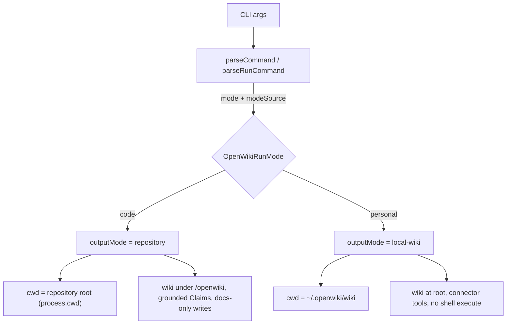

# Code vs Personal Modes

OpenWiki runs in exactly one of two modes per invocation. **Code** mode documents
the current repository and writes the generated wiki into `openwiki/` inside that
repository. **Personal** mode maintains a personal knowledge brain from connected
sources and writes it into the local wiki directory under the OpenWiki home
(`~/.openwiki/wiki` by default). The mode chosen at parse time flows through the
run as an internal _output mode_ that determines the working directory, the wiki
layout, which tools are available, and whether grounded Claims apply.

## Two run modes and their internal output mode

The user-facing selector is `OpenWikiRunMode`, which is either `"personal"` or
`"code"`. Every parsed `run` command carries both the resolved `mode` and a
`modeSource` recording how that mode was chosen (`default`, `option`, or
`positional`).

Internally, the run mode is mapped to an `OpenWikiOutputMode`
(`"local-wiki" | "repository"`) by `getRunModeOutputMode`: `code` maps to
`repository` and `personal` maps to `local-wiki`. This output mode is the value
that the agent, prompts, finalizer, and backends branch on.



## Default mode selection

Mode resolution happens entirely at argument-parse time. `parseCommand`
dispatches to `parseRunCommand`. When the first argument is a mode word
(`personal` or `code`), it is consumed as a positional mode with source
`positional`; otherwise parsing begins with `code` as the default mode and source
`default`.

Bare `openwiki`, `openwiki --init`, and `openwiki --update` therefore run in
`code` mode. In addition, when an `init` or `update` command is requested and the
mode is still at its `default` source, the parser explicitly pins the mode to
`code`. To operate on the personal brain, add the `personal` positional (for
example `openwiki personal --init`) or pass `--mode personal`.

## The personal positional and the --mode flag

There are two ways to request a non-default mode:

- **Positional mode word.** A mode word in the first positional slot selects the
  mode even when flags precede it (for example `openwiki --print code --update`).
  This positional handling is deliberate: without it the mode word would be
  treated as the user message and the run would silently target the default
  personal-style wiki.
- **`--mode <personal|code>` flag.** The flag (and its `--mode=` form) validates
  the value and sets the mode with source `option`. An unrecognized value fails
  with `Invalid mode: ...`.

Mode requests must be consistent. `resolveExplicitMode` rejects a second explicit
mode that conflicts with an already-explicit one, producing a `Conflicting modes`
error; a request that merely repeats the current mode, or that overrides a
still-`default` mode, is accepted.

## How the output mode flows into the run

The parsed `run` command's `mode` is converted to an output mode once per run and
then carried as an option into the agent. Both dispatch paths compute it the same
way:

- The non-interactive (`--print`) path in `runPrintCommand` resolves
  `runtimeOutputMode = getRunModeOutputMode(command.mode)` and `runtimeCwd =
  getRunModeCwd(command.mode)`, then passes `outputMode` into
  `runOpenWikiAgent`'s `OpenWikiRunOptions`.
- The interactive TUI (`App`) computes the same `runtimeOutputMode` and
  `runtimeCwd` from the startup `runMode` and threads them through the same
  `runOptions` into `runOpenWikiAgent`.

Inside `runOpenWikiAgent`, `outputMode` defaults to `"local-wiki"` when an option
is not supplied, and selects two top-level behaviors before any agent is built:

- **Repository generation routing.** When `outputMode === "repository"` and the
  command is `init` or `update`, the run takes the native page-job generation
  path (`runNativeRepositoryGeneration`) instead of the conversational agent.
  `createOpenWikiAgent` refuses repository `init`/`update` for the same reason —
  those runs must go through the page-job runner.
- **`.openwikiignore` loading.** The ignore ruleset is loaded from the runtime
  cwd only in `repository` mode; `local-wiki` mode constructs an empty
  `OpenWikiIgnore`, so personal runs never apply repository ignore rules.

The output mode then reaches the `OpenWikiLocalShellBackend` (which stores it
and branches every constraint on it), the system prompt
(`createSystemPrompt`/`formatRuntimeRootInstruction`), the connector tools
(`createOpenWikiConnectorTools`), and the middleware that constrains personal
runs to filesystem tools only.

## Working directory and wiki layout differ by mode

The resolved mode drives where the run reads and writes:

- **Working directory.** `getRunModeCwd` returns the code runtime's cwd
  (`process.cwd()` by default) in `code` mode, and the local wiki directory
  (`openWikiLocalWikiDir`) in `personal` mode.
- **Wiki content root.** In `repository` output mode the generated wiki lives
  under the `openwiki/` subdirectory of the repository; in `local-wiki` output
  mode the wiki _is_ the root of the local wiki directory, with pages written
  directly under `/` (no nested `/openwiki` directory).

The agent prompt reflects this: in `local-wiki` mode the virtual `/` root is the
local wiki directory and pages are written at the root, while in `repository`
mode `/` is the repository root and the wiki lives under `/openwiki`.

## Capabilities that apply to code mode only

Several capabilities are gated on `outputMode === "repository"` and therefore
apply to code repository wikis only:

- **Docs-only write boundary.** Repository init/update runs may only write under
  `openwiki/`; writes escaping that tree are refused. In `local-wiki` mode the
  docs-only check is relaxed and writes are allowed.
- **Grounded Claims ownership.** Repository Claims state (the `/openwiki/.claims`
  tree) is implementation-owned: generic read/write/edit/delete/ls/glob/grep
  operations into Claims state paths are refused, and shell `execute` commands
  that reference Claims state are rejected. This ownership boundary is applied
  only in `repository` output mode — `isClaimsPath` returns false unless
  `outputMode === "repository"`.
- **Host-driven (coding-agent) runs.** Running OpenWiki inside Codex, Claude
  Code, OpenCode, and the other registered coding agents currently supports
  repository code wikis only, not personal brains, and uses only repository
  source and tests as context; connector-sourced context (including LangSmith)
  is not yet supported in that path.

## Capabilities that apply to personal mode only

Connector ingestion tools are a personal/local-wiki capability. When the output
mode is `repository`, `createOpenWikiConnectorTools` returns no tools at all,
because a code-mode run documents a codebase and must never be handed connector
ingestion. Personal ingestion runs (see the ingestion pipeline) always run
against the local wiki directory as their working directory and use the
`local-wiki` output mode.

### Shell execution is denied in personal mode at the backend

Personal mode denies shell execution at the backend level, not only at the tool
surface. `OpenWikiLocalShellBackend.execute` short-circuits any shell command
when `outputMode === "local-wiki"`, returning exit code 1 with the message
`Shell execution is disabled in personal mode. Use wiki filesystem tools and
openwiki_read_raw_item for connector evidence.`

This is distinct from the repository-mode Claims-state shell rejection and is
enforced deliberately at the backend because personal agents consume untrusted
connector content (including during unattended ingestion), so a delegated or
stale tool call must not be able to reach the host shell even if it bypasses the
tool layer. The conversational agent graph reinforces this by replacing the
general-purpose subagent's tools with a filesystem-only middleware
(`ls`, `read_file`, `glob`, `grep`, `write_file`, `edit_file`) in `local-wiki`
mode, so personal runs have no shell tool regardless of command.

## Local state directory and the OPENWIKI_CONFIG_DIR override

The personal wiki, credentials, connector data, conversation history, and skills
all live under the OpenWiki home directory. `resolveOpenWikiHomeDir` returns
`~/.openwiki` by default, but honors the `OPENWIKI_CONFIG_DIR` environment
variable when it is set, expanding a leading `~` and resolving relative paths.
For example:

```sh
OPENWIKI_CONFIG_DIR=/data/openwiki openwiki personal --init
```

The override simply selects a different state directory; OpenWiki does not move or
copy an existing `~/.openwiki`. `ensureOpenWikiHome` creates the home and its
subdirectories (`connectors`, `conversation_history`, `wiki`, `skills`) with
owner-only `0o700` permissions and restricts the home to the current user, so the
target should be a dedicated, writable directory such as a mounted container
volume. The personal wiki directory itself is always the `wiki` subdirectory of
whichever home directory is in effect.

## Related pages

- [Architecture overview](/openwiki/architecture/overview.md)
- [Configuration](/openwiki/operations/configuration.md)
- [Personal ingestion workflow](/openwiki/workflows/personal-ingestion.md)
- [Repository generation workflow](/openwiki/workflows/repository-generation.md)
