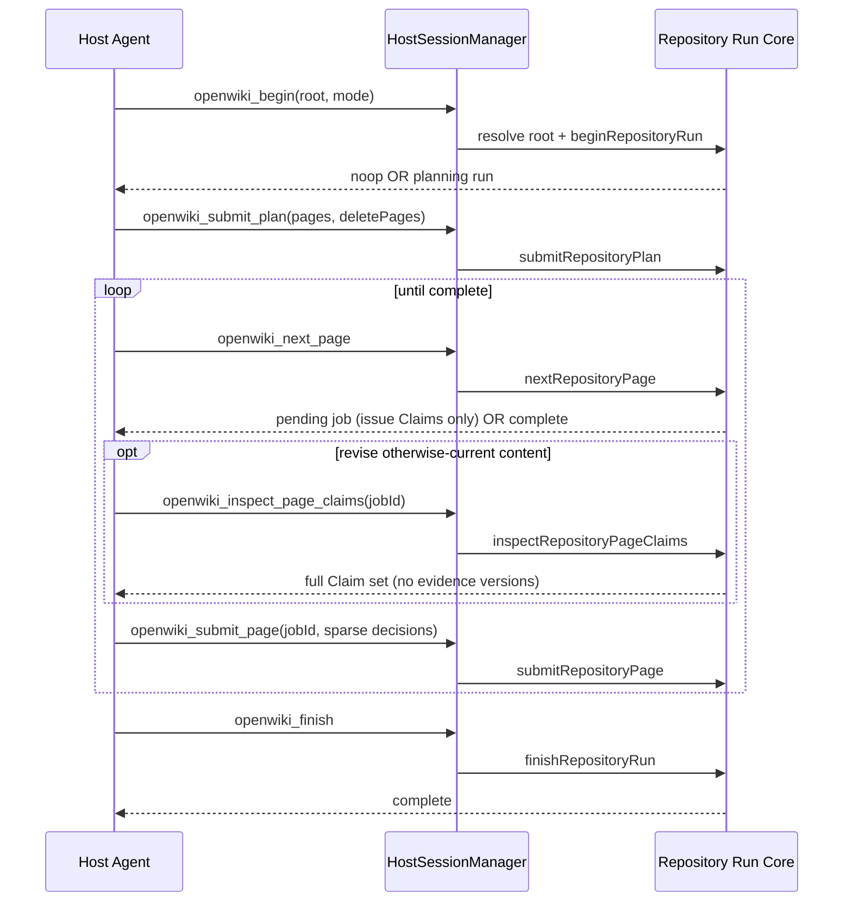

# Coding-Agent Integrations (IBM Bob/Codex/Claude/OpenCode/Cursor/Kiro/Oh My Pi/Antigravity)

OpenWiki can run _inside_ a host coding agent (IBM Bob, Codex, Claude Code,
OpenCode, Cursor, Kiro, Oh My Pi, or Antigravity CLI) instead of as a standalone
process. The host agent supplies the model, native repository tools, and Markdown
authoring; OpenWiki supplies a deterministic, resumable **page-job lifecycle** over
the Model Context Protocol (MCP). The two sides communicate through four read-only retrieval tools plus six
generation lifecycle tools (ten in all), and installation wires a local stdio
MCP server plus a shared skill bundle into each host's own configuration.

This page documents the protocol operations, the divided ownership of research
versus finalization, repository-root resolution, install/uninstall mechanics, and
the scope model. For the internal generation engine these tools drive, see
[Repository generation workflow](/openwiki/workflows/repository-generation.md)
and [Architecture overview](/openwiki/architecture/overview.md). For the
`openwiki mcp` and `openwiki integrations` commands, see the
[CLI reference](/openwiki/operations/cli-reference.md).

> Note: This is the **host integration** path. It is unrelated to the
> `write-connector` skill, which adds a new _source connector_ for ingesting
> external content. To add a new host, follow
> `CONTRIBUTING.md` §"Adding a coding-agent integration".

## Ownership boundary

The integration keeps a deliberately narrow boundary. The host model researches
and authors **only the current PageJob**; OpenWiki owns durable run state, the
page queue, Claims validation and reconciliation, indexes, provenance,
finalization, and all managed setup files. This split is stated in the shared
skill (`integrations/openwiki/SKILL.md`) and reinforced in the MCP server
instructions advertised at initialization
(`src/integrations/mcp/server.ts`), which embed the shared
`CLAIMS_RECONCILIATION_GUIDANCE` from `src/claims/guidance.ts` so the sparse
reconciliation rules reach the host model through the transport as well as the
skill bundle. The server instructions also carry workspace-aware retrieval
guidance — directing the host not to enumerate or preload wikis at task start,
to use `openwiki_search` only when a concrete architecture or dependency
uncertainty materially affects the task, and to resolve workspace ambiguity via
`openwiki_list_workspaces` and `openwiki_list_wikis` — so the four read-only
tools and the six lifecycle tools share one coherent guidance surface.

## The MCP tool set

`HostSessionManager.tools()` exposes an ordered, transport-neutral tool set:
four read-only retrieval tools followed by six generation lifecycle tools. The
`ProtocolToolName` type enumerates all ten names and is the single source of
truth for the set; `tools()` returns `...createRetrievalTools()` (the four
read-only tools) followed by the six lifecycle tools, each parsing its input
against a strict Zod schema before delegating to the repository-generation
core.

### Read-only retrieval tools

The four retrieval tools — `openwiki_list_workspaces`, `openwiki_list_wikis`,
`openwiki_search`, and `openwiki_read` — never start a generation run or invoke
a model. `openwiki_search` searches an existing repository OpenWiki (resolving
workspace membership automatically), `openwiki_read` returns complete Markdown
sections selected from search refs, and the two `list_*` tools discover the
named workspaces a wiki belongs to and the wikis within one. They share the same
`resolveRepositoryRoot` safety as the lifecycle tools and map retrieval failures
to bounded `HostIntegrationError` codes. The host is directed to use retrieval
only when a concrete architecture or dependency uncertainty materially affects
the task, then stop once grounded.

### The six generation lifecycle tools

In order, the six lifecycle tools are: `openwiki_begin`,
`openwiki_submit_plan`, `openwiki_next_page`, `openwiki_inspect_page_claims`,
`openwiki_submit_page`, and `openwiki_finish`.

- **`openwiki_begin`** — Starts or resumes a run for an absolute Git root in
  mode `init` or `update`, with optional `language` and `force`. It validates the
  optional `language` via `resolveLanguage` and rejects an unrecognized BCP-47
  value with `invalid_input` before any run state is created, so a rejected
  request leaves nothing to clean up and can simply be retried with a real code.
  It then resolves the root, calls `beginRepositoryRun`, and either records the
  active run or returns a proven update **no-op** (`status=noop`) without an
  active run. A clean update returns no-op so the host reports "no update
  required" and stops.
- **`openwiki_submit_plan`** — Persists the run's final canonical page plan.
  `pages` may be empty (a valid update with no page work or only deletions), and
  `deletePages` is optional.
- **`openwiki_next_page`** — Returns the first pending page job with its Claim
  count and **only the stale or unresolved Claims requiring an explicit
  decision**; current issue-free Claims are retained automatically and stay
  compact. Returns `status=complete` when the queue is drained.
- **`openwiki_inspect_page_claims`** — On-demand tool that returns the current
  pending page's complete Claim set **without opaque evidence versions**, scoped
  to the current pending job only (`jobId` must match the first pending page, or
  the call fails with `invalid_state`). Focused updates normally need only the
  issue Claims already returned by `openwiki_next_page`; this tool exists for the
  case where the worker intentionally revises or removes otherwise-current
  content whose Claim ids are not in the pending job.
- **`openwiki_submit_page`** — Completes the active job after its Markdown is
  written. It takes a **sparse** payload — `confirmedClaimIds` for rechecked
  issue Claims kept unchanged, `claims` for revised/new propositions, and
  `retractedClaimIds` for removals — and retains every other current Claim
  automatically. At least one material, repository-grounded Claim must remain
  after reconciliation; structural `index.md` pages are generated
  deterministically and never become jobs. If validation rejects the page or
  payload, the worker corrects it and retries; completion requires one
  successful submission.
- **`openwiki_finish`** — Finalizes the run only after every job is complete:
  deletion, validation, indexing, provenance, Claims finalization, and metadata
  persistence, then clears process-local state.

The MCP page-job lifecycle a host agent drives end to end. The inspect step is
optional and used only before intentionally revising or removing
otherwise-current page content.

## Session lifecycle and invariants

`HostSessionManager` is a **single-run** adapter over the transport-neutral
lifecycle core. It holds one process-local `ActiveRepositoryRun` and enforces
several invariants:

- **Single active run.** `requireSession(runId)` rejects any operation whose
  `runId` does not match the currently active run with an `invalid_state` error,
  telling the caller to `openwiki_begin` first. `begin` clears the active run on
  no-op and sets it on a real run; `finish` clears it on success.
- **Serialized operations.** `runOperation` acquires a single-operation guard
  (`startOperation`) and rejects concurrent lifecycle calls with `invalid_state`;
  the guard is always released in a `finally` block.
- **Bounded, mapped errors.** `mapRepositoryRunError` converts internal
  `RepositoryRunError` codes into stable `HostIntegrationError` codes
  (`conflict`, `invalid_input`, `invalid_state`). The MCP transport further wraps
  any non-`HostIntegrationError` as a generic "OpenWiki MCP operation failed."
  so unexpected exception detail never leaks through the transport.

`HostSessionManager.create` validates the host identity against a lowercase
`[a-z0-9-]{1,64}` pattern (`isValidHostId`) and derives the metadata model
identity as `host-agent/<host>`; the producer actor defaults to the host id when
not supplied.

## Repository-root resolution and safety

`resolveRepositoryRoot` turns a host-supplied path into a canonical Git worktree
root before any run begins. It requires an absolute path, canonicalizes it with
`realpath`, verifies it is a directory, and asks Git for the top-level worktree
via `git -C <dir> rev-parse --show-toplevel` (a bounded, read-only query with a
10-second timeout). It then **refuses the filesystem root and the user's home
directory** so a globally installed integration cannot treat an ambiguous launch
directory as a wiki repository. All failures surface as `invalid_input` errors
without exposing the offending path.

## Connector context is not yet supported here

The repository-generation core accepts an optional `planningContext` (user and
connector context) for planning and replanning, but `HostSessionManager.begin`
does not forward one — it passes only `root`, `mode`, `language`, `force`, and
actor identities. Host-driven runs therefore run without connector context in
this path today.

## The MCP transport

`runOpenWikiMcp` starts the local stdio server: it creates a
`HostSessionManager`, builds the MCP server with `createOpenWikiMcpServer`, and
connects a `StdioServerTransport`. The adapter registers each tool's schema and
description with the MCP SDK and executes it through `executeTool`. The server
is invoked by the CLI's `openwiki mcp --host <id>` command, which looks up the
host's registry entry to supply the correct provenance actor.

## Installation: host config and the skill bundle

Installing an integration writes two managed artifacts into a host's chosen
scope: a **skill directory** (a copy of the canonical `integrations/openwiki`
bundle) and a **managed MCP server entry** in the host's config file. The
`HostIntegrationInstaller` performs this transactionally.

### The host registry

`HOST_TARGETS` in `src/integrations/install/registry.ts` is the immutable
registry of supported hosts. Each entry declares its display name, provenance
actor, per-scope skill directory and MCP config, and a documentation URL:

- **IBM Bob** — `.bob/mcp.json` (`json`) at both user and project scope, skill
  under `.agents/skills/openwiki` at both scopes; `producerActor` `bob`. IBM Bob
  additionally ships an agent manifest at
  `integrations/openwiki/agents/bob.yaml` (`display_name`, `short_description`,
  `default_prompt`) consumed by the Bob host to surface the OpenWiki agent.
- **Codex** — `.codex/config.toml` (`codex-toml`), skill under
  `.agents/skills/openwiki`, at both user and project scope; `producerActor`
  `codex`.
- **Claude Code** — user config `.claude.json` and project config `.mcp.json`
  (both `json`), skill under `.claude/skills/openwiki`;
  `producerActor` `claude-code`.
- **OpenCode** — user config `.config/opencode/opencode.jsonc` and project config
  `opencode.jsonc` (both `opencode-json`), with distinct user/project skill
  directories (`.config/opencode/skills/openwiki` vs `.opencode/skills/openwiki`);
  `producerActor` `opencode`.
- **Cursor** — `.cursor/mcp.json` (`json`), skill under
  `.cursor/skills/openwiki`, at both user and project scope;
  `producerActor` `cursor`.
- **Kiro** — `.kiro/settings/mcp.json` (`json`) at both user and project scope,
  skill under `.kiro/skills/openwiki` at both scopes; `producerActor` `kiro`.
- **Oh My Pi** — `.omp/agent/mcp.json` (`json`) at user scope (the default
  profile), skill under `.omp/agent/skills/openwiki`; project scope uses
  `.omp/mcp.json` with skill under `.omp/skills/openwiki`; `producerActor` `omp`.
  User-scope installation targets Oh My Pi's default profile only — named
  profiles and `PI_CODING_AGENT_DIR` overrides use another agent directory, so
  install with `--project` when that is the intended repository-local
  configuration. The `omp` target is distinct from upstream Pi
  (`earendil-works/pi`); this integration adds no upstream Pi target, generated
  extension, or other Pi-specific artifact.
- **Antigravity CLI** — user config `.gemini/config/mcp_config.json` (`json`)
  with skill under `.gemini/antigravity-cli/skills/openwiki`; project scope uses
  `.agents/mcp_config.json` with skill under `.agents/skills/openwiki`;
  `producerActor` `antigravity`.

`defaultMcpServerCommand(target)` produces the published invocation
`openwiki mcp --host <target>`, which is what installed configs launch.

### Config adapters

Three adapters own the managed entry per config kind, each preserving unrelated
user configuration and enforcing exact ownership:

- **`json`** adds/removes an `mcpServers.openwiki` entry and refuses to touch an
  `openwiki` entry it does not own.
- **`codex-toml`** writes a fenced block delimited by `# OPENWIKI:MCP:START` /
  `# OPENWIKI:MCP:END` and refuses to replace a modified block or an unmanaged
  `openwiki` table.
- **`opencode-json`** edits the `mcp.openwiki` local-server entry in JSONC while
  preserving surrounding comments.

Each adapter reports whether its entry is `not-installed`, `installed`, or
`modified`, and refuses to overwrite or remove content it did not author.

### Skill bundle and ownership receipt

The canonical bundle is resolved relative to the installer module
(`resolveCanonicalSkillBundle`) and inventoried into a deterministic SHA-256
hash map keyed by relative path (`inventorySkill`), which requires a `SKILL.md`
at the root. The bundle root is restricted to `SKILL.md`, an `agents/` tree
(host agent manifests such as `agents/bob.yaml` and `agents/openai.yaml`), and a
`references/` tree; any other path is rejected. On install, a
`.openwiki-install.json` **receipt** records the owning package, OpenWiki
version, host target, installed MCP command, and per-file hashes.
`inspectInstallation` uses the receipt to classify a destination as
`not-installed`, `installed` (intact), or `modified` (present but altered or
unmanaged).

### Transactional install/uninstall

`install` stages the bundle into a private sibling directory, verifies the staged
copy matches the canonical inventory, writes the receipt, then commits by
snapshotting the config, mutating it, moving any prior skill aside, and atomically
moving the staged skill into place. On any failure it rolls back the config and
prior skill; an incomplete rollback is surfaced as an `AggregateError`. When the
installed state already matches the requested version, command, and files, it
only reconciles config and reports whether anything changed. A `modified`
destination is refused unless `--force`, which preserves the prior skill as a
timestamped backup.

`uninstall` refuses to remove a `modified` skill or a modified/unmanaged config
entry, snapshots the config for rollback, removes the managed entry, moves the
skill to a cleanup backup, and prunes now-empty skill parent directories.
`status` reports `installed` only when both the skill and the config entry are
intact, `modified` when either is partially present, and `unsupported` when the
requested scope does not exist for the host.

## User-level vs project scope

Every host supports **project** scope; user scope is optional (`user` may be
`null` in the registry, though all eight current hosts support both). For
**project** scope the installer resolves the root through the same
`resolveRepositoryRoot` used by runs, so a project install always lands at the
Git worktree root; for **user** scope it anchors at the home directory. When a
host does not support the requested scope, `resolveInstallContext` raises an
`invalid_input` error directing the user to re-run with `--project`.

User-scope destinations match each host's own conventions: IBM Bob writes the
skill under `~/.agents` and the MCP entry under `~/.bob`, Codex writes under
`~/.agents` and `~/.codex`, Claude Code under `~/.claude`, OpenCode under
`~/.config/opencode` (OpenCode's global configuration directory on every
supported platform), Cursor under `~/.cursor`, Kiro under `~/.kiro`, Oh My Pi
under `~/.omp/agent` (default profile), and Antigravity CLI under `~/.gemini`.

## Contributing a new host

Adding a host is a registry-and-config change, not a new skill or new tools:
hosts share one canonical skill, four read-only retrieval tools, and the six
lifecycle tools — add the id to `HostTargetId`, add the entry to `HOST_TARGETS`,
reuse an existing config adapter when possible (add a focused one only for a
genuinely different format), and add focused registry/install/status/uninstall/config-conflict tests.
The full procedure, including the local dogfooding command
`pnpm integrations:dev <bob|codex|claude|opencode|cursor|kiro|omp|antigravity>`, lives in
`CONTRIBUTING.md` §"Adding a coding-agent integration". `pnpm integrations:dev`
builds OpenWiki, refreshes the host skill, and records absolute paths to the
current Node executable and `dist/cli/cli.js`; all eight current hosts install at
user scope, and later source changes only require `pnpm build` unless the bundled
skill itself changes.

## Focused tests

Behavior is pinned by the integration test suite under `test/integrations/`:
`session-manager.test.ts` drives the full lifecycle over real temporary Git
repositories; `mcp-server.test.ts` and `mcp-stdio.test.ts` cover the transport
adapter; `protocol.test.ts` covers schema validation; `repository-root.test.ts`
covers root resolution and its safety refusals; and `installer.test.ts`,
`config-adapters.test.ts`, `skill.test.ts`, and `package-contents.test.ts` cover
the transactional installer, config ownership, and packaged bundle.
