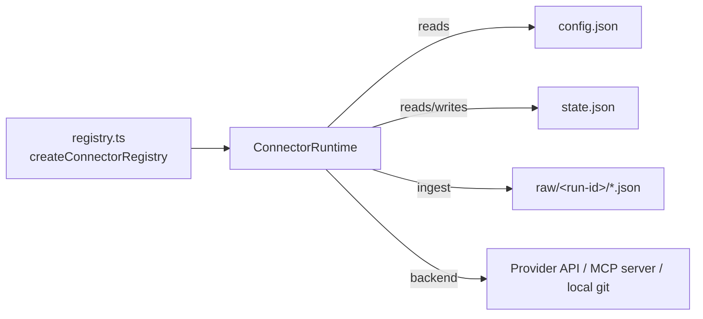

# Source Connectors

OpenWiki connectors are built-in TypeScript modules that pull read-only knowledge
from external sources into a per-connector staging area under the OpenWiki home
directory. They are a **personal/local-wiki capability**: a code-mode
(`repository`) run documents a codebase and is deliberately never handed
connector tools, because credentialed external fetches have no place in that
context. Ingestion is deterministic — connectors write raw JSON and manifests
that the agent later inspects — so citations preserve source IDs, timestamps,
URLs, and authors.

Two implementation families exist:

- **MCP-backed connectors** (`custom-mcp`, `notion`) wrap an external read-only
  Model Context Protocol server over HTTP or stdio.
- **Bespoke API connectors** (`git-repo`, `google`/Gmail, `slack`, `x`,
  `web-search`, `hackernews`, `langsmith`) fetch directly from a provider API or
  local filesystem with connector-specific logic.

Related pages: [Source map](../architecture/source-map.md),
[Model providers](../concepts/model-providers.md),
[Personal ingestion](../workflows/personal-ingestion.md),
[Testing overview](../testing/overview.md).

## The ConnectorRuntime contract

Every connector is a `ConnectorRuntime`: a static `ConnectorDefinition`
(`id`, `displayName`, `description`, `backend`, `mode`, `requiredEnv`,
`supportsAgenticDiscovery`) plus an `ingest()` method that returns a
`ConnectorIngestResult` (`status` of `success` / `skipped` / `error`,
`runId`, `rawFiles`, `statePath`, `message`, `warnings`).

`ConnectorId` is a closed union of nine ids, and `ConnectorBackend` is one of
`direct-api`, `local-git`, `mcp-http`, or `mcp-stdio`. `mode` marks a connector
as `personal` or `code`; `langsmith` is the only `code`-mode connector and skips
cleanly when invoked without a repo root.

## Connector registry

`createConnectorRegistry()` constructs a fresh map from every `ConnectorId` to
its runtime; the `CONNECTOR_IDS` tuple is the canonical enumeration. Because the
registry is rebuilt on demand, it always reflects the current process
environment.

| id           | displayName            | backend      | requiredEnv                                                   | agentic discovery |
| ------------ | ---------------------- | ------------ | ------------------------------------------------------------- | ----------------- |
| `custom-mcp` | Custom MCP             | `mcp-stdio`  | (none)                                                        | yes               |
| `notion`     | Notion                 | `mcp-stdio`  | `OPENWIKI_NOTION_MCP_ACCESS_TOKEN`                            | yes               |
| `git-repo`   | Local Git repositories | `local-git`  | (none)                                                        | yes               |
| `google`     | Google / Gmail         | `direct-api` | `OPENWIKI_GMAIL_ACCESS_TOKEN`, `OPENWIKI_GMAIL_REFRESH_TOKEN` | no                |
| `slack`      | Slack                  | `direct-api` | `OPENWIKI_SLACK_USER_TOKEN`                                   | no                |
| `x`          | X / Twitter            | `direct-api` | `OPENWIKI_X_ACCESS_TOKEN`                                     | no                |
| `web-search` | Web Search             | `direct-api` | `TAVILY_API_KEY`                                              | no                |
| `hackernews` | Hacker News            | `direct-api` | (none)                                                        | no                |
| `langsmith`  | LangSmith              | `direct-api` | `OPENWIKI_LANGSMITH_API_KEY`                                  | no                |

`getConfiguredConnectorIds()` reports which credentialed connectors have all
their `requiredEnv` present, used purely as a telemetry adoption signal.
`isConnectorId()` validates arbitrary strings against the union.

## State, config, and raw storage

All persistence lives under `~/.openwiki/connectors/<id>/`:

- **config** in `config.json`, merged over a connector-supplied default via
  `readConnectorConfig`; a missing file falls back to the default rather than
  erroring. Config is treated as hand-editable, so `normalizeStringArray` and
  similar coercions defend against scalar/blank/non-string entries.
- **state** in `state.json`, versioned (`version: 1`) with `lastRunAt`,
  optional per-stream `latestIds` cursors, and a `runs` history that
  `updateStateWithRun` prepends to and truncates to the 20 most recent runs.
- **raw dumps** in `raw/<run-id>/<file>.json`, where the run id is an
  ISO timestamp with `:`/`.` replaced by `-`.

All state and raw files are written with owner-only permissions (files `0600`,
directories `0700`) and the connector home is restricted to the current user.
Connector ids are validated with `assertSafeConnectorId`, and raw reads/writes
are constrained inside the connector's `raw/` directory (`resolveConnectorRawPath`
rejects any path that escapes it), so a malicious relative path cannot read or
write outside the staging area.

## Agent tools

`createOpenWikiConnectorTools(outputMode)` returns the connector tool set, and
**returns an empty array for `repository` (code) mode** — this is the boundary
that keeps codebase documentation runs away from credentialed ingestion. In
personal/local-wiki mode it exposes:

- `openwiki_list_connectors` — backends, required env var names (presence only,
  never values), config and raw paths, and readiness.
- `openwiki_list_mcp_tools` / `openwiki_call_mcp_tool` — live MCP discovery and a
  single exact read-only tool call; both accept only `custom-mcp` or `notion`.
- `openwiki_ingest_connector` / `openwiki_ingest_all_connectors` — run
  deterministic ingestion for one or every configured connector (unconfigured
  connectors are skipped). `ingestAllConnectors` runs every connector
  concurrently with `Promise.allSettled` and **isolates per-connector failures**:
  a connector that throws does not discard the results of connectors that
  succeeded — each rejection is converted to an `error` result
  (`ingestFailureResult`) so the agent still sees every outcome.
- `openwiki_list_raw_items` / `openwiki_read_raw_item` — enumerate and read raw
  files, newest run first, capped at 500 KB per read and confined to the
  connector's `raw/` directory.

Secret values are never returned by any tool; env status is reported as presence
only.

## MCP-backed connectors

`createMcpConnector` builds both `custom-mcp` and `notion` from a shared runtime.
Their config (`McpConnectorConfig`) carries `enabled`, a `transport` (HTTP or
stdio), optional `allowedTools`, and optional `readOnlyOperations`. Disk config
is the base and an ingest-time `connectorConfig` override wins field-by-field.

`ingest()` behavior:

- not `enabled` → `skipped` with guidance to configure the transport;
- missing `transport`/`readOnlyOperations` → `error`;
- `readOnlyOperations` empty → lists MCP tools and returns `skipped` (never
  guesses operations);
- otherwise executes the configured read-only operations and returns `success`.

### Read-only enforcement

The MCP runtime enforces a read-only posture at the tool-call boundary
(`getToolCallPolicy`). A tool is allowed only if it is in the connector's
`allowedTools`, **or** carries an MCP `readOnlyHint: true` annotation, **or**
(for `notion` only) is served by the hosted `https://mcp.notion.com/mcp`
endpoint and its name/description matches read-only verbs. Anything else is
rejected. `openwiki_call_mcp_tool` additionally rejects any tool name not
returned by a live `tools/list`.

### MCP client transport and safety

The MCP client speaks JSON-RPC 2.0 over stdio (spawned child process, no shell)
or HTTP. Key safeguards:

- HTTP URLs must be `https`, except `http` to localhost.
- HTTP headers must reference credentials as `${ENV_VAR}` and never carry a
  literal secret; template refs resolve from `process.env` or, for OAuth
  access-token env keys, through the OAuth token layer. Resolution treats an env
  var explicitly set to an empty string (`""`) as **present**, not missing —
  only a truly undefined variable (`typeof undefined`) throws the
  `… is required for MCP connector ingestion.` error. This empty-string-is-present
  rule mirrors `buildChildEnv`'s `typeof value === "string"` check for base env
  vars, so an explicitly-blank credential is passed through rather than rejected.
- `tools/list` is fully paginated but bounded twice (a repeated cursor and a
  100-page cap) so a misbehaving server cannot hang discovery.
- stdio commands and args are validated against control characters, requests
  time out (60s per JSON-RPC call), and the child is killed on close.
- Persisted transports are sanitized (`sanitizeMcpTransport` masks `${ENV}`
  references) before being written into raw dumps.

## Bespoke API connectors

- **git-repo** (`local-git`, no env): reads configured local clones and writes
  compact per-repo manifests (branch, HEAD, recent commits, status, changed
  files); the local repo remains the source of truth. It is incremental: each run
  records every repo's HEAD as a `latestIds` cursor in state, and the next run
  diffs against that recorded head to describe what landed since. A repo with an
  unsafe id is skipped. `createRepoManifest` resolves a usable previous head via
  `resolveReachableHead`, which verifies the recorded commit is still reachable
  (`git rev-parse --verify ...^{commit}`) before diffing against it. When
  `previousHead` is undefined (first run), equals the current head (nothing new),
  or is no longer reachable (history rewritten or a force-push made the recorded
  commit disappear), the manifest falls back to the working-tree diff
  (`git diff --name-status HEAD`) rather than failing, so the manifest still
  reflects local, uncommitted work.
- **google / Gmail** (`direct-api`): fetches recent messages from the Gmail API
  using OAuth access + refresh tokens.
- **slack** (`direct-api`): fetches conversations, recent messages, and assistant
  search context with a Slack user token; supports `recent_messages`,
  `my_messages_search`, and `assistant_search` streams.
- **x / Twitter** (`direct-api`): fetches home timeline, user posts, mentions,
  list posts, and bookmarks via X API v2 with an OAuth access token. Each stream
  (and each list within `list_posts`) is **isolated per run**: a failure on one
  stream — e.g. a 429 on `mentions` — records a warning and moves on instead of
  aborting the whole run. Already-fetched dumps are kept, other streams keep
  going, and state is still written so every successful stream's `since_id`
  cursor advances. If at least one dump was produced the run status is `success`;
  if nothing fetched and any stream failed it is `error` (not a benign `skipped`).
- **web-search** (`direct-api`): runs Tavily searches via the LangChain Tavily
  integration; enabled by default but produces nothing without configured
  queries.
- **hackernews** (`direct-api`, no env): pulls public HN feeds and Algolia search
  results with no credentials.
- **langsmith** (`direct-api`, `code` mode): pulls recent traces via the LangSmith
  SDK. It reads committed repo config (workspaces/projects), requires a
  `repoRoot`, and builds an anomaly-weighted sample (errors first, then latency
  outliers) capped at 20 traces. Per-workspace/per-project failures degrade to
  warnings rather than failing the run.

### Resilient fetching

All direct-API connectors and the HTTP MCP client fetch through
`fetchWithResilience`, which adds a per-attempt timeout (default 30s) and bounded
exponential backoff with full jitter on 429/5xx and network errors, honoring a
`Retry-After` header within a cap. Auth failures (401/403) and other 4xx are
returned unchanged so callers (e.g. Gmail) can trigger a token refresh instead of
retrying.

## Adding a connector

Follow `/skills/write-connector/SKILL.md` (read it with `limit=1000`). The short
version:

1. **Prefer `custom-mcp`** for any source that already exposes a read-only MCP
   server — configure `~/.openwiki/connectors/custom-mcp/config.json` instead of
   adding a new `ConnectorId`. Add a dedicated built-in connector only when you
   need provider-specific auth, scoping, or deterministic API pulls MCP cannot
   express.
2. Add the id to `src/connectors/types.ts` and `src/connectors/registry.ts`, and
   implement `src/connectors/sources/<connector>.ts` exposing a
   `ConnectorRuntime`.
3. Write raw dumps under `raw/<run-id>/`, state in `state.json`, config in
   `config.json`; keep secrets in `~/.openwiki/.env` and reference them only by
   env var name.
4. Never read, log, return, or hardcode secret values; validate ids and paths;
   store cursors/hashes for incremental sources; treat any wrapped MCP server as
   read-only.
5. Add tests, then tell the user which files changed, which env vars to set,
   which config to create, how to run `openwiki personal --update`, and which
   provider scopes are required.
