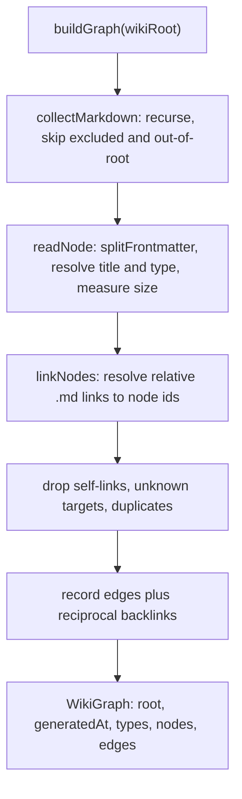
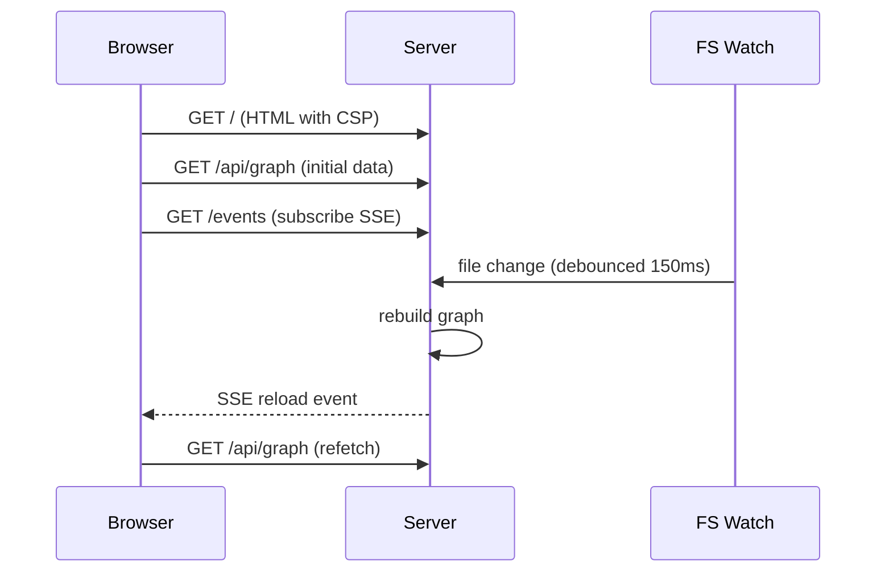
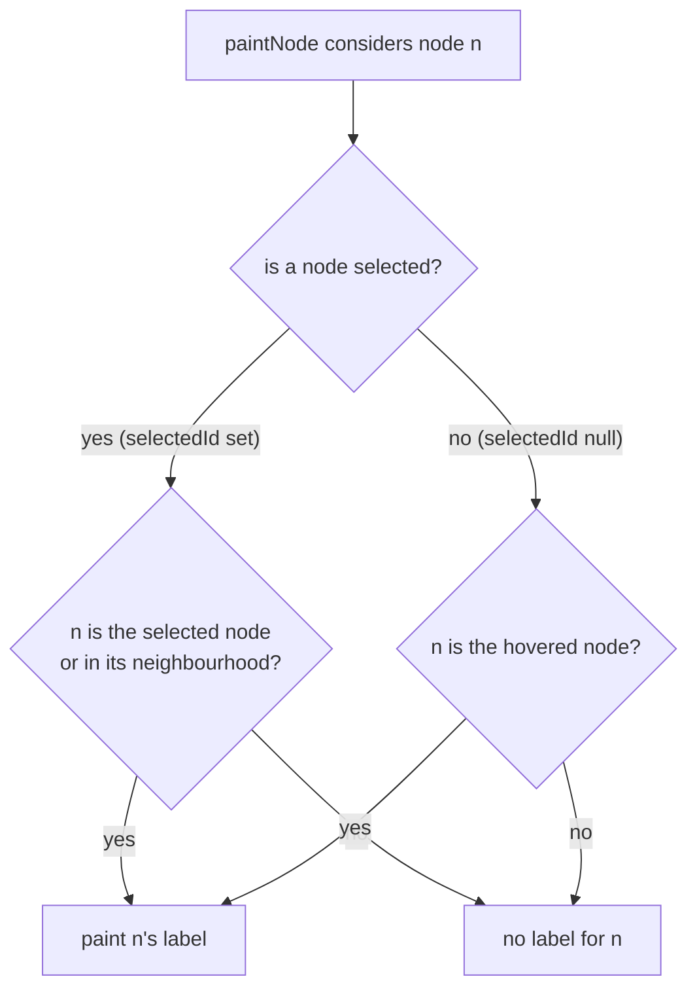

# Interactive Visualizer

The visualizer turns a generated wiki directory into an explorable node graph
paired with a Markdown reader. It runs in two modes from a single command,
`openwiki visualize`: a **live local server** that reflects edits in the browser
as you save, and a **static export** that writes a deployable folder you can host
anywhere. Both modes render the same branded single-page app; they differ only in
where the graph data comes from and whether live reload is wired.

## Command surface

`openwiki visualize [path] [--port <port>] [--no-open] [--export <dir>]` is parsed
in `src/cli/commands.ts`. The positional `path` defaults to `openwiki`, `--port`
defaults to `4321` (validated to the range 1024–65535), and the browser is opened
automatically unless `--no-open` is passed. Passing `--export <dir>` switches to
static-export mode; the parser rejects combining `--export` with `--port` or
`--no-open` because those flags only affect the live server.

`runVisualizeCommand` in `src/cli/runners.ts` dispatches on the parsed command:
when `exportDir` is set it calls `exportStaticVisualizer` and prints a summary,
otherwise it calls `runVisualizeServer`. Both wiki paths are resolved against the
current working directory before use.

## Building the graph

`buildGraph(wikiRoot)` in `src/visualize/graph.ts` is the shared data source for
both modes. It recursively collects `.md` files under the wiki root, reads each
into a node, resolves inter-page links into directed edges, and returns a
`WikiGraph` with a `root` basename, an ISO `generatedAt` timestamp, the sorted set
of distinct node `types`, and the `nodes`/`edges` arrays.

Each file becomes one `WikiNode`. Its stable `id` is the path relative to the wiki
root with the `.md` suffix removed. `splitFrontmatter` parses the small YAML subset
OpenWiki emits (scalars, inline `[a, b]` arrays, and dashed lists), and the known
OKF fields — `type`, `title`, `description`, `tags` — populate the node. When a
field is absent the node falls back deterministically: the title resolves from
frontmatter, then the section name for `index.md` pages or the first H1 otherwise,
then the filename; the type defaults to `Section` for `index.md` pages and
`Reference` for everything else. Node `size` is the body length in characters,
which the client uses to scale each node's radius.

Edges come from Markdown links. `linkNodes` scans each body for relative `.md`
link targets, resolves them against the linking page's directory into node ids,
and records a directed edge plus the reciprocal `backlinks` entry. Self-links,
links to pages not in the graph, and duplicate edges are dropped, so the graph
only ever contains resolvable page-to-page references. The walk stays inside the
wiki: paths that resolve outside `wikiRoot` are skipped, symlinks (which are
neither files nor directories to the dirent check) are never followed, and the
scaffolding files `INSTRUCTIONS.md` and `log.md` are excluded.

Graph construction from wiki files and OKF frontmatter to the serialized graph.

## Live server

`runVisualizeServer` in `src/visualize/server.ts` binds an HTTP server to the
loopback address `127.0.0.1` only, so the wiki is never exposed on the network. It
tries the preferred port and increments on `EADDRINUSE` for up to 20 attempts
before giving up. On startup it verifies the wiki directory exists, loads the
compiled browser assets once, performs an initial `buildGraph`, then begins a
recursive filesystem watch and prints a banner.

The request router built by `createRequestHandler` is a pure function over a fixed
route set — `/` and `/index.html` (the HTML page, sent with the strict
Content-Security-Policy), `/client.js`, `/client-lib.js`, `/styles.css`,
`/api/graph` (the current graph as JSON), and `/events` (the Server-Sent-Events
stream) — and every other path returns 404. No filesystem path is ever derived
from the request URL, which removes path-traversal as a class of bug. The handler
receives the graph through a getter rather than a captured value, because the
server reassigns the graph on each rebuild and every request must serve the latest
one.

The page's Content-Security-Policy is a single shared `CSP` constant in
`src/visualize/page.ts` that both the live server (as the `content-security-policy`
HTTP response header on `/` and `/index.html`) and a static export (as a
`<meta http-equiv="Content-Security-Policy">` tag in the HTML) enforce, so the
anti-XSS/supply-chain boundary cannot drift between modes. It pins scripts to
`'self'` and the jsdelivr CDN (`script-src 'self' https://cdn.jsdelivr.net`) with
no inline scripts — the CDN `<script>` tags carry Subresource Integrity hashes —
while inline styles remain allowed (`style-src 'self' 'unsafe-inline'`) so the
client can theme the graph. The page itself requests the Inter typeface from
Google Fonts: a `<link>` to a `fonts.googleapis.com` stylesheet whose CSS in turn
references font files on `fonts.gstatic.com`. The CSP therefore allows the
stylesheet origin in `style-src` (`'self' 'unsafe-inline'
https://fonts.googleapis.com`) and the font-file origin in `font-src` (`'self'
https://fonts.gstatic.com`); before these origins were added both directives were
`'self'` only, and every CSP-enforcing browser silently blocked the font request
so the visualizer never actually rendered in the Inter typeface it ships. The
remaining directives (`default-src 'none'`, `img-src 'self' data:`,
`connect-src 'self'`, `base-uri 'none'`, `form-action 'none'`) keep the reader
locked down while rendering arbitrary wiki Markdown.

Live reload is driven by the filesystem watch. A change under the wiki triggers a
debounced (150 ms) rebuild; on success the server broadcasts an SSE `reload` event
to every open `/events` subscriber, and the browser refetches `/api/graph`. A
rebuild failure is logged and does not crash the server. The `/events` handler
registers each response in a live set and removes it when the connection closes.

Live-reload flow from an edit on disk to a refreshed browser.

The server lifecycle glue (listen/retry, watch, browser launch, banner) requires a
real socket and filesystem and is excluded from coverage, while the pure routing
logic is extracted into `createRequestHandler` so it can be unit-tested without
booting a server.

## Reader client and graph rendering

The browser client (`src/visualize/client.ts`) fetches the graph, then builds three
coordinated views: the force-directed graph canvas, a type/color legend, and a
sidebar index of every page grouped by type. Clicking a node — on the canvas, in
the sidebar, via a backlink chip, or through an in-page wiki link — opens that page
in the reader without moving the camera, so reading never yanks the graph out from
under you. The hint and legend are not standalone panels: `renderPage` nests the
`#graph-overlay` (the `#hint` line plus the `#legend`) directly inside the `#graph`
div, and the stylesheet caps that overlay with `position: absolute` and a
`max-height` against the graph panel's own box. Anchoring the overlay to `#graph`
rather than to `.main` keeps it confined to the graph column, so a wiki with many
page types can no longer grow the legend into a full-width bar that covers the
sidebar, the graph, and the reader.

Clicking empty graph space is deliberately a no-op. The graph instance registers
only `onNodeClick` and `onNodeHover`; there is no `onBackgroundClick` handler, so a
stray click on blank canvas never clears the selection or the reader. This is the
issue #670 regression fix — the former background-click handler wiped the page the
user was reading.

Graph labels are contextual, not ambient — the "declutter visualizer graph labels"
feature. By default no node labels are painted on the canvas: the sidebar index is
the always-visible page list, so the graph stays readable at any size. `paintNode`
consults the pure `shouldShowNodeLabel` helper (from `client-lib.ts`) with the
current selection, hover, and neighbourhood state to decide, per node, whether to
draw its title. When nothing is selected, only the hovered node's label shows;
when a node is selected, that node plus its directly connected neighbours show
labels; unrelated nodes never show labels. Hovering is suspended while a page is
selected — `hoverHighlight` returns early when a selection is active, so the
selected neighbourhood's labels hold until the selection changes.

`shouldShowNodeLabel` decision logic: selection wins over hover, and only the
selected node plus its immediate neighbours — or the single hovered node when
nothing is selected — ever paint a canvas label.

The reader renders the page body as Markdown. Because `marked` passes raw HTML
through, the output is sanitized with DOMPurify before assignment to `innerHTML`,
which is defense in depth on top of the server's CSP; all scalar wiki fields
(title, type, tags) are additionally HTML-escaped by `escapeHtml`, the single XSS
gate for wiki text. Fenced `mermaid` code blocks in the reader are upgraded into
rendered diagrams, and in-page Markdown links whose targets resolve to a known node
are rewritten into in-app navigation. The reader also surfaces each page's
backlinks ("Referenced by") derived from the graph.

Rendering is designed to survive live reloads without disruption. `signature`
computes a stable fingerprint of the graph topology (node ids plus directed edges);
when a reload leaves the topology unchanged the scene and viewport are left
completely untouched, and when it changes the client re-feeds data while reusing
persisted per-id node objects so layout and camera stay put. Node colors are
assigned by `colorsForTypes`, mapping each distinct type to a palette entry by
position so the graph canvas and legend always agree. The client detects its mode
from the `data-static-export` attribute on the document element: static exports read
`./graph.json` and never open an SSE connection, while live mode reads `/api/graph`
and subscribes to `/events`.

The pure, DOM-independent helpers used by the client — `escapeHtml`,
`colorsForTypes`, `nodeRadius`, `signature`, `matchesFilter`, `normalize`,
`stripFrontmatter`, `hexA`, and `shouldShowNodeLabel` (with its
`NodeLabelContext` interface) — live in `src/visualize/client-lib.ts` so they can
be unit-tested directly without a browser. `shouldShowNodeLabel` decides whether
a node label should be painted on the canvas based on interaction context: when
nothing is selected, only the hovered node's label shows; when a node is
selected, the selected node plus its immediate neighbours show labels; unrelated
nodes never show labels.

## Static export

`exportStaticVisualizer` in `src/visualize/static-export.ts` writes a self-contained
directory that can be hosted without OpenWiki running. It builds the graph, then
writes `index.html` (the static variant of the page), `client.js`, `client-lib.js`,
`styles.css`, and a pretty-printed `graph.json` into the output directory. Because
the static page carries its own CSP `<meta>` tag, loads assets from sibling paths,
and the client reads `./graph.json` instead of hitting the server, the export needs
no live server and no SSE — the live/stale pill simply reads "Static".

The HTML for both modes is produced by a single `renderPage` function in
`src/visualize/page.ts`, parameterized by whether it is a static export; this keeps
the live and exported apps identical apart from asset URLs, the CSP delivery
mechanism, and the live indicator — including the shared DOM layout, where the
hint-plus-legend overlay lives inside the `#graph` panel rather than as a sibling of
it. The three browser libraries (force-graph, marked, DOMPurify) plus mermaid load
from `cdn.jsdelivr.net` at pinned exact versions with Subresource Integrity hashes,
the page also `<link>`s the Inter typeface from Google Fonts, and the shared CSP
forbids inline scripts while allowing the Google Fonts stylesheet and font-file
origins, so the reader stays locked down even while rendering arbitrary wiki
Markdown and rendering in its shipped typeface.

## Build pipeline and assets

The client TypeScript is compiled separately from the server code. The `build`
script in `package.json` runs `tsc -p tsconfig.json`, then `tsc -p
tsconfig.client.json` (which compiles `client.ts` and its imported `client-lib.ts`
with DOM libs enabled), and finally `node scripts/copy-visualize-assets.cjs`. That
last step exists because `styles.css` is a hand-authored asset TypeScript does not
emit: the copy script explicitly copies `src/visualize/styles.css` into
`dist/visualize/styles.css` and fails the build if the source is missing, the
`dist/visualize` directory does not exist (a sign the build did not run first), or
the copied file ends up missing or empty. At runtime `loadVisualizerAssets` reads
`client.js`, `client-lib.js`, and `styles.css` from beside the compiled module in
`dist`, which is why the copy step must run before the server or an export can serve
the stylesheet.

## Related pages

- [OKF output](../concepts/okf-output.md) — the frontmatter shape the graph reads.
- [CLI reference](../operations/cli-reference.md) — full `openwiki visualize` flags.
- [Testing overview](../testing/overview.md) — how the visualizer is tested.
