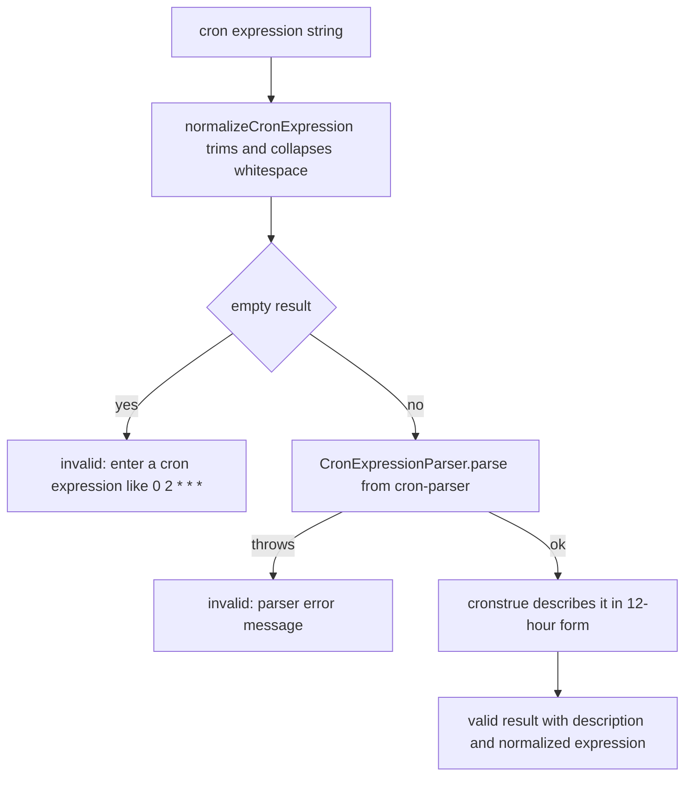
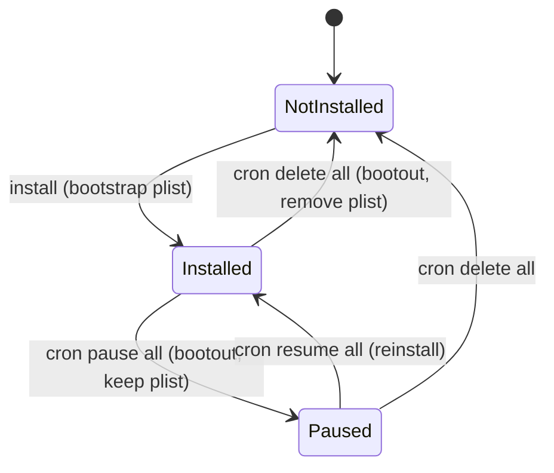

# CI Scheduling and Self-Update

OpenWiki can keep a committed wiki current without human intervention by running
itself on a schedule. There are two distinct scheduling surfaces:

1. **Hosted CI self-update** — a scheduled CI job (GitHub Actions, GitLab CI, or
   Bitbucket Pipelines) that runs `openwiki code --update` on the repository and
   opens a documentation pull/merge request whenever the generated wiki changes.
2. **Native local scheduling** — a macOS-only `launchd`/`pmset` scheduler,
   driven by the CLI `cron` subcommand and the scheduling module, that installs
   a recurring ingestion job on a developer's machine.

Both surfaces share the same cron parsing and validation code in
`src/scheduling/schedules.ts`. This page documents the cron mechanics, the
lifecycle of a native schedule, and what the CI example files do.

For the CLI surface that drives these flows see
[CLI reference](/openwiki/operations/cli-reference.md); for what
`code --update` actually regenerates see
[repository generation](/openwiki/workflows/repository-generation.md); and for
the ingestion side used by native schedules see
[personal ingestion](/openwiki/workflows/personal-ingestion.md).

## Cron parsing and validation

The scheduling module accepts standard five-field cron expressions and validates
them before any schedule is created. Validation runs in three steps in
`validateCronExpression`:

- The expression is normalized by trimming and collapsing runs of whitespace to
  single spaces (`normalizeCronExpression`). An empty result is rejected with the
  guidance message `Enter a cron expression like 0 2 * * *.`
- The normalized expression is parsed with `CronExpressionParser.parse` from the
  `cron-parser` package. A parse failure is surfaced as an invalid result
  carrying the parser's error message.
- A valid expression is described in human-readable, twelve-hour form via
  `cronstrue` (`describeCronExpression`), which is configured to throw on parse
  errors rather than return junk.

`getSuggestedCronExpression` supplies the default offered during onboarding: the
saved ingestion expression if one exists, otherwise `0 2 * * *` (2 AM daily).

Cron validation flow in `validateCronExpression`.

## Native schedule lifecycle (macOS launchd)

On macOS, `installConnectorSchedule` turns a validated cron expression into a
`launchd` LaunchAgent that runs `openwiki ingest all --scheduled --print` on the
configured interval. The agent is written to
`~/Library/LaunchAgents/com.openwiki.ingestion.plist`, and is (re)loaded by first
`bootout`-ing any existing agent and then `bootstrap`-ing the new plist into the
per-user GUI launchd domain via `launchctl`.

Because `launchd`'s `StartCalendarInterval` cannot express everything cron can,
`installConnectorSchedule` degrades gracefully rather than installing a wrong
timer:

- On non-macOS platforms it returns a warning that the schedule was saved but
  native installation is macOS-only.
- If the expression is too complex to represent as a single
  `StartCalendarInterval` (`parseLaunchdCalendarInterval` returns `null`), it
  saves the schedule but warns that direct `launchd` installation is not
  possible.

The complexity check in `parseLaunchdCalendarInterval` deliberately rejects cron
expressions where **both** day-of-month and day-of-week are restricted. Cron
treats that combination as a logical OR ("the 1st OR any Monday"), while
`launchd` ANDs every field in a `StartCalendarInterval` ("the 1st AND a Monday"),
so emitting the plist would fire far less often than intended — often never. It
also rejects any field it cannot reduce to a single integer in range.

The CLI `cron` subcommand manages the lifecycle of the single "all ingestion"
schedule through `runCronCommand`, which dispatches to the scheduling module:

- `openwiki cron list` — renders the saved schedule and Mac wake window,
  reporting `launchd` status (loaded, plist exists but not loaded, plist missing,
  not installed, or paused).
- `openwiki cron pause all` — marks the schedule `pausedAt` and unloads the
  LaunchAgent, leaving the plist in place.
- `openwiki cron resume all` — reinstalls the LaunchAgent from the saved
  expression and clears the paused state.
- `openwiki cron delete all` — removes the schedule from config, unloads the
  agent, and deletes the plist.

Every mutation only accepts the target `all`; the CLI parser rejects any other
target with a usage error. After each mutation the config is saved and the macOS
repeat wake window is reconciled.

Lifecycle of the single native ingestion schedule.

### Mac wake window reconciliation

Because a machine that is asleep will not run its LaunchAgent, the module keeps a
matching `pmset` repeat wake/sleep window in sync with the active schedule.
`reconcileOpenWikiPowerSchedule` runs after every schedule mutation: it installs
a wake window covering the active schedule when one exists and is representable,
or cancels the window when no active schedule remains. macOS supports only one
repeat power schedule, so OpenWiki overwrites it to cover the currently saved
schedule; the wake time is set a couple of minutes before the earliest run and
sleep a while after the latest. Schedules that restrict day-of-month or month, or
whose wake/sleep window would fall outside a single day, cannot be represented
and are skipped with a warning. `pmset` is invoked via `osascript` with
administrator privileges. Power scheduling, like `launchd` installation, is
macOS-only.

## Hosted CI self-update

The recommended way to keep a committed repository wiki fresh is a scheduled CI
job that runs `openwiki code --update`. Example configurations ship for the three
supported CI systems, plus a GitHub Actions variant that auto-merges successful
update PRs:

- `examples/openwiki-update.yml` — GitHub Actions (canonical example).
- `examples/openwiki-update-auto-merge.yml` — GitHub Actions variant that
  enables auto-merge for the update PR.
- `examples/openwiki-update.gitlab-ci.yml` — GitLab CI.
- `examples/openwiki-update.bitbucket-pipelines.yml` — Bitbucket Pipelines.

The live workflow the OpenWiki repository itself runs is
`.github/workflows/openwiki-update.yml`, which builds from the checked-out
source to dogfood unreleased changes rather than installing the published
package. The OpenWiki repository also runs its own release pipeline in
`.github/workflows/release.yml`, the npm trusted-publishing pipeline; the
examples above are what an external repository should copy, and the live repo
runs both workflows separately.

### What the scheduled job does

Every example follows the same shape:

1. **Check out full history.** All three configs force a non-shallow clone
   (`fetch-depth: 0` on GitHub, `GIT_DEPTH: "0"` on GitLab, `depth: full` on
   Bitbucket). `openwiki code --update` diffs `HEAD` against the commit it last
   documented; a shallow clone hides that commit and the update runs against an
   empty change summary.
2. **Install and run OpenWiki.** The examples install `openwiki` globally (plus
   optional `mermaid` and `jsdom` for high-fidelity Mermaid validation) and run
   `openwiki code --update --print`. Provider and model are supplied through
   environment variables/secrets (for example `OPENWIKI_PROVIDER`,
   `OPENROUTER_API_KEY`, `OPENWIKI_MODEL_ID`), with LangSmith tracing variables
   set for observability.
3. **Open a docs PR only on change.** The GitHub example uses
   `peter-evans/create-pull-request`, which no-ops when nothing changed. The
   GitLab and Bitbucket examples make the change check explicit: they run
   `git diff --quiet` over the documentation paths (`openwiki`, `AGENTS.md`,
   `CLAUDE.md`, and the workflow file) and exit early with "OpenWiki is already up
   to date." when there is no diff; otherwise they create a branch, commit,
   push, and open a merge/pull request through the provider's REST API.

The PR is scoped to the documentation paths (`openwiki`, `AGENTS.md`, `CLAUDE.md`,
and the workflow file), branched under `openwiki/update` (GitHub) or
`openwiki/update-<pipeline id>` (GitLab/Bitbucket), with the commit and title
`docs: update OpenWiki`.

The GitHub example also models a **failure-tolerant** run. The `openwiki code
--update` step sets `continue-on-error: true` so a failed generation does not
abort the job; the PR step still runs (`if: ${{ !cancelled() }}`) and its body
reports `steps.openwiki.outcome`. When the outcome is `failure`, the PR
intentionally preserves only the pages completed before the failure, so merging
it makes that partial progress the baseline for the next scheduled run. A
trailing **"Propagate OpenWiki failure"** step (`exit 1` when the outcome is
`failure`) then fails the job so a real error is not hidden by the partial PR.
Both the example and the live workflow delete the transient `openwiki/.run.json`
run-state file before creating the PR, so the partial progress that survives is
the committed wiki, not leftover in-process state.

#### Auto-merge variant

`examples/openwiki-update-auto-merge.yml` extends the canonical GitHub Actions
example with two extra steps that manage the PR's auto-merge state through the
`gh` CLI after the PR is created:

- **Enable auto-merge after a successful update** runs `gh pr merge --auto
  --squash` when `steps.openwiki.outcome == 'success'` and a PR was created
  (`steps.create-pr.outputs.pull-request-number` is non-empty).
- **Disable auto-merge after a failed update** runs `gh pr merge --disable-auto`
  when the outcome is `failure` and a PR was created, so the partial-progress PR
  opened on a failed run is not silently auto-merged; a reviewer must still
  review and merge it manually.

The `Propagate OpenWiki failure` step still runs after both, so a failed run
fails the job and the next scheduled run starts fresh.

The auto-merge variant differs from the canonical `examples/openwiki-update.yml`
in three ways beyond the auto-merge steps:

1. **PR token.** It authenticates both `peter-evans/create-pull-request` and `gh`
   with a dedicated `OPENWIKI_PR_TOKEN` secret (the canonical example relies on
   the default `GITHUB_TOKEN`). The token needs `pull-requests: write` to enable
   auto-merge.
2. **Workflow file excluded from the PR.** `code --update` regenerates the
   workflow file from an internal template, which would otherwise drop the
   fork guard on the live repo. The variant restores the protected file with
   `git checkout -- .github/workflows/openwiki-update.yml` before the PR step
   (`if: ${{ !cancelled() }}`) and omits it from `add-paths`, so only
   `openwiki`, `AGENTS.md`, and `CLAUDE.md` are committed.
3. **Concurrency control.** It adds a `concurrency` group
   (`openwiki-update`, `cancel-in-progress: false`) so overlapping scheduled and
   manual runs queue rather than clobber each other, and pins
   `peter-evans/create-pull-request` to the v8.1.1 commit SHA
   (`5f6978faf089d4d20b00c7766989d076bb2fc7f1`).

### Scheduling and gating

- **GitHub Actions** triggers on `schedule` (`cron: "0 8 * * *"`, interpreted in
  UTC) plus `workflow_dispatch`. The live repo workflow gates scheduled runs so
  they only fire in the origin repository (`langchain-ai/openwiki`) or when a fork
  opts in via the `OPENWIKI_ENABLE_SCHEDULED_UPDATE` repository variable, so
  contributor forks do not silently arm a daily job needing a provider secret;
  manual dispatch always remains available.
- **GitLab CI** has no built-in `on: schedule`; the job runs only for pipeline
  sources `schedule` or `web`, and you attach a schedule in the project's
  CI/CD → Schedules settings.
- **Bitbucket Pipelines** likewise relies on a repository Pipeline schedule that
  invokes the `openwiki-update` custom pipeline.

The live GitHub workflow also builds OpenWiki from the checked-out source and
runs `node dist/cli/cli.js code --update` rather than the published package, so
the daily run dogfoods unreleased changes. This is the key difference between
the three GitHub workflows: `examples/openwiki-update.yml` installs the published
`openwiki` package globally (`npm install --global openwiki …`) and is what an
external repository should copy; `examples/openwiki-update-auto-merge.yml` does
the same but adds the auto-merge/disable-auto-merge pattern; whereas
`.github/workflows/openwiki-update.yml` runs `pnpm install --frozen-lockfile &&
pnpm build` against the checked-out OpenWiki source to dogfood main. The live
workflow additionally restores the protected workflow file with `git checkout --
.github/workflows/openwiki-update.yml` after the run because `code --update`
regenerates that file from an internal template and would otherwise drop the
fork guard; the discard runs `if: ${{ !cancelled() }}` so the guard survives
whether the run succeeded or failed.

### Ephemeral-runner resume caveat

Repository generation and update are resumable: OpenWiki records in-progress work
in `openwiki/.run.json` and can resume the durable page queue when the same
checkout persists across a rerun. **CI runners are ephemeral** — their workspace
is discarded after the job ends — so a scheduled CI run that fails does not retain
uncommitted run state and the next run starts fresh rather than resuming. Resume
only helps on a persistent checkout (for example a developer's machine). This is
why the CI examples treat each run as a full pass and rely on the committed wiki,
plus full git history, as the only durable state carried between runs.

## Related pages

- [CLI reference](/openwiki/operations/cli-reference.md) — the `cron`, `ingest`,
  and `code --update` commands invoked by these schedules.
- [Repository generation](/openwiki/workflows/repository-generation.md) — what
  `code --update` regenerates and its resumable page-job architecture.
- [Personal ingestion](/openwiki/workflows/personal-ingestion.md) — the
  ingestion run that native macOS schedules trigger.
