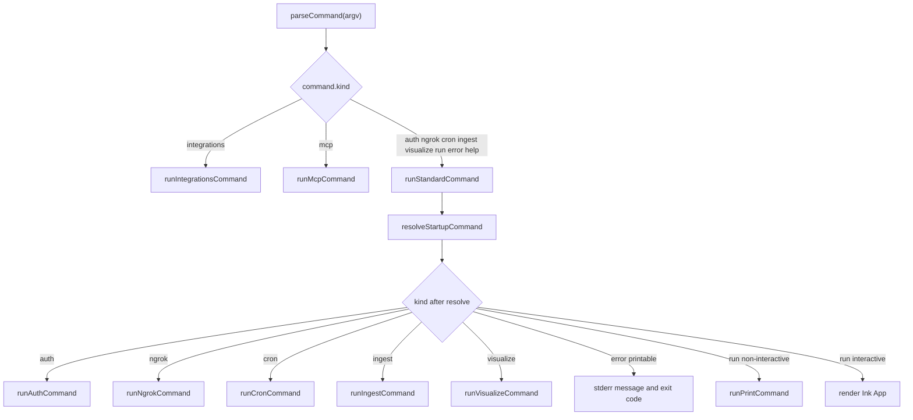

# CLI Commands and Flags

The OpenWiki CLI is a single executable whose behavior is entirely determined by
a two-stage pipeline: a pure parser (`parseCommand` in `src/cli/commands.ts`)
turns `process.argv` into a discriminated `CliCommand` union, and the entrypoint
(`src/cli/cli.tsx`) dispatches that value to a runner or to the interactive Ink
application. This page documents the parsed command surface, the flags each
command accepts, how run mode is selected, when a run goes non-interactive, and
how each command reaches its executor.

## Entrypoint and dispatch

`src/cli/cli.tsx` is the shebang binary. It installs a crash guard, slices
`process.argv`, and calls `parseCommand`. Two host-facing commands —
`integrations` and `mcp` — are handled directly by `runIntegrationsCommand` and
`runMcpCommand` (from `src/cli/integrations.ts`); everything else flows through
`runStandardCommand`, which uses OpenWiki's own model credentials and rendering
pipeline.

`runStandardCommand` first conditionally loads the private OpenWiki environment
(`commandLoadsEnvironment`), then re-resolves the command through
`resolveStartupCommand` (which can downgrade a run to an `error` when a terminal
or credentials are missing), decides whether to show the one-time first-run
telemetry notice (`commandEmitsTelemetry`), and finally routes on
`command.kind`.

Dispatch of a parsed CLI command to its runner or the interactive UI.

## The parsed command union

`parseCommand` returns a `CliCommand` — a discriminated union whose `kind`
selects one of: `integrations`, `mcp`, `auth`, `ngrok`, `visualize`, `ingest`,
`cron`, `help`, `run`, or `error`. Any bad flag or malformed invocation is
represented as `{ kind: "error", exitCode: 1, message }` rather than throwing, so
the entrypoint decides uniformly whether to print the error to stderr or surface
it in the UI. A leading `--help`/`-h` yields `{ kind: "help" }`, and an argv that
matches no subcommand is treated as a `run`.

### Run commands: init, update, print, mode, model, language

Any invocation that is not a recognized subcommand is parsed by
`parseRunCommand`, producing a `run` command whose `command` field is one of
`chat`, `init`, or `update` (default `chat`). `--init` and `--update` select the
respective run command; specifying both is a parse error. `-p`/`--print`
requests non-interactive output; because print needs something to do, it errors
unless a message, `--init`, or `--update` is present. `--language`/`-l` takes a
locale that is canonicalized via `resolveLanguage` when valid; an unrecognized
BCP-47 value is rejected with a parse error (`{ kind: "error", exitCode: 1 }`)
whose message names the offending value and suggests a BCP-47 code such as
`ko`, `zh-CN`, or `pt-BR`, so a typo can never quietly produce an English wiki. `--modelId`/`--model-id` (with
`=value` and space-separated forms) is normalized and validated against
`isValidModelId`. `--telemetry-file` records a run-event sink path. `--debug`
sets `OPENWIKI_DEBUG` at parse time, and the developer-only `--dry-run` is
rejected as an unknown option outside development mode
(`NODE_ENV=development` or `OPENWIKI_DEV=1`). Remaining positional words are
joined into the user message.

The `resolveLanguage`/`requireResolvedLanguage` internals — how
`getCanonicalLocales` and `DisplayNames` distinguish a recognized BCP-47 code
from a structurally valid but unregistered one — are documented in
[Configuration and Environment](./configuration.md).

### Run mode selection

Run mode is `personal` or `code`. It can be set three ways, tracked by
`modeSource` (`default`, `positional`, or `option`): a leading `code`/`personal`
positional word (`openwiki code ...`), a positional mode word in the first slot
even when flags precede it (`openwiki --print code --update`), or the `--mode`
flag (`--mode code` or `--mode=code`). An explicit `--mode` that conflicts with
an already-selected non-default mode is a parse error (`resolveExplicitMode`).
When no mode is given, `parseRunCommand` defaults to `personal` for interactive
chat but promotes to `code` for `init`/`update` runs that did not select a mode.
Mode determines the run's working directory and output target:
`getRunModeCwd`/`getRunModeOutputMode` map `code` to the current repository and
`repository` output, and `personal` to the local wiki directory and `local-wiki`
output.

### Non-interactive vs interactive runs

`shouldRunNonInteractively` returns true for a non-dry-run `run` when `--print`
was requested, or when stdin is not a TTY and the run was asked to start (CI,
cron, pipes). In that case the entrypoint calls `runPrintCommand`, which streams
events into a buffer, prints to stdout, and reports failures on stderr with auth
"how to fix" and error diagnostics (`writePrintAuthFix`,
`writePrintErrorDiagnostics`). Otherwise the entrypoint renders the Ink `App`.

`writePrintErrorDiagnostics` renders the `ErrorDiagnostic` list that
`getErrorDiagnostics` (in `src/cli/diagnostics/error-diagnostics.ts`) extracts
from the error. It always surfaces OpenRouter metadata (`provider_name`,
`is_byok`, `finish_reason`, the `raw` body, and a `previous_errors` list capped
at five) and any attached `openRouterDebug` payload — these are read regardless
of debug mode. When `OPENWIKI_DEBUG` is set and the error is an `Error`
instance, the panel additionally includes the error `name`, a sanitized
`message`, an inline HTTP status extracted from the message
(`httpStatusFromMessage`, the first 4xx/5xx value), and a `stack` diagnostic.
The stack is sanitized via `sanitizeDiagnosticText` — which redacts the live
values of secret-bearing environment variables and bearer-token / known provider
key patterns such as `sk-or-v1-…` — and truncated to 2,000 characters with a
trailing `...` so a long trace cannot flood the terminal. Debug mode also widens
the walk to nested `cause`/`error`/`response` objects and other allowlisted
fields; the final list is deduped by `label:value`.

Interactive chat with no message still requires a TTY: `resolveStartupCommand`
converts such a run into an error telling the user to pass a message or use
`--init`/`--update`. `resolveStartupCommand` also fails non-interactive runs when
the configured provider's credentials are missing, with a narrow exception for a
clean `update` that can be skipped before credentials are needed.

`runPrintCommand` and the interactive `App` share the same run machinery: both
resolve mode-specific cwd/output, wrap the run in `withRunTelemetry`, perform
code-mode repo setup (`ensureCodeModeRepoSetup`, creating the workflow on
`init`), run code-mode connectors to augment the message, and then invoke
`runOpenWikiAgent`. The interactive `App` additionally handles help/error views,
credential setup, and auto-exit for a real init/update run
(`shouldAutoExitStartupRun`).

## Host integrations

`openwiki integrations <install|list|uninstall>` is parsed by
`parseIntegrationsCommand` and executed by `runIntegrationsCommand`. `install`
and `uninstall` require a host target validated against the installation
registry (`getHostTarget`/`listHostTargets`); `list` takes no target and reports
each registered host's status. Scope defaults to `user` (installing into the home
directory) and switches to `project` when `--project` is supplied, with either an
explicit path (`--project <path>` or `--project=<path>`) or the current directory
(`--project` alone defaults to `.`). `--force` is accepted only for `install`
(allowing replacement of unmanaged skill content) and may appear at most once, as
may `--project`. On success the runner prints the changed/unchanged status plus
the skill directory and MCP config paths, and after an install prints
restart-and-confirm next steps scoped to user or project.

`openwiki mcp [--host <id>]` is parsed by `parseMcpCommand` and runs the local
stdio MCP server via `runMcpCommand`. The host id must be 1–64 lowercase
letters, digits, or hyphens (`isValidHostId`); it defaults to `unknown` and is
written into run metadata, with the host's `producerActor` looked up from the
registry when available. Integration and MCP commands deliberately do not load
OpenWiki model credentials, relying on the host's authenticated session.

## Auth

`openwiki auth` supports `oauth` (the default, per-provider), `configure`,
`tools`, and `list`. `auth list` (also `auth oauth list`) prints the provider
list; `auth configure <provider>` creates local connector config referencing
saved env vars; `auth tools <provider>` lists a provider's MCP tools; and
`auth <provider>` runs OAuth, saves credentials, writes connector config, and,
when applicable, discovers MCP tools. `--force` is valid for every action except
`tools`; providers are validated via `isAuthProviderId`, and unknown options or
providers produce action-specific usage errors. Execution is handled by
`runAuthCommand`.

## Ingestion and cron scheduling

`openwiki ingest <source|source-instance|all>` targets one connector, one source
instance, or all configured sources (`parseIngestionTarget`, default `all`). It
accepts `--print`/`-p`, `--scheduled` (limit to scheduled sources), and
`--modelId`/`--model-id`. `runIngestCommand` streams text events to stdout, then
prints a per-source summary and exits non-zero if any source errored.

`openwiki cron` manages saved connector schedules: `cron list` (no target) and
`cron pause|resume|delete all` (which require the literal `all` target). Any
other form is a usage error. `runCronCommand` reads the onboarding config, applies
the mutation (`pauseConnectorSchedules`, `resumeConnectorSchedules`,
`deleteConnectorSchedules`), persists the updated config, and prints results.
Listing and mutation output are formatted by `src/cli/schedule-format.ts`, which
renders the schedule header, the Mac wake-window (launchd power schedule) block,
each connector's cron/launchd status, and the mutation summary of changed,
skipped, and warned connectors.

## ngrok and visualize

`openwiki ngrok start [url] [--port <port>]` starts a tunnel (default port
`53682`, validated to the 1024–65535 range) for Slack OAuth; `runNgrokCommand`
delegates to `startNgrokTunnel`. `openwiki visualize [path] [--port <port>]
[--no-open] [--export <dir>]` serves a live graph and reader from the wiki
directory (default `openwiki`, default port `4321`, opens a browser unless
`--no-open`), or exports a static site when `--export <dir>` is given.
`--export` cannot be combined with `--port` or `--no-open`. `runVisualizeCommand`
resolves the wiki root against the cwd and either exports the static visualizer
or runs the visualize server.

## Environment loading and telemetry

`commandLoadsEnvironment` gates loading of OpenWiki's private credential
environment: real `run`, `auth`, `cron`, `ingest`, and `ngrok` commands load it,
while `integrations` and `mcp` do not. `commandEmitsTelemetry` restricts
telemetry emission (and therefore the one-time first-run disclosure) to real
`init`/`update` runs; chat, auth, and ingest record nothing. These predicates,
`shouldRunNonInteractively`, and `shouldPrintStartupError` are the small set of
exported decision functions the entrypoint uses to keep parsing pure and side
effects at the edges.
