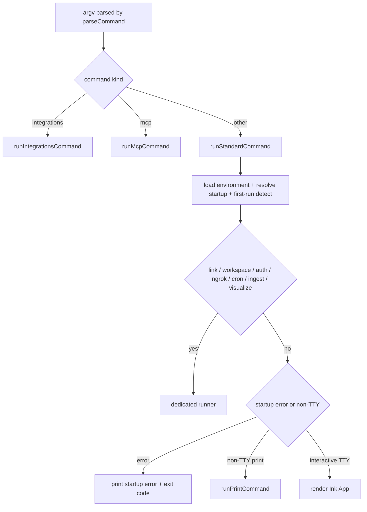

# OpenWiki Quickstart

OpenWiki is a command-line tool that writes and maintains a Markdown wiki for a
codebase or for personal knowledge. A [Deep Agents](https://github.com/langchain-ai/deepagentsjs)
documentation agent reads your sources, synthesizes a linked wiki you own, and
keeps it current as those sources change. It is built for agents to read as
memory and ships an interactive visualizer for humans to explore.

This page orients a coding agent to the codebase and routes you to the page that
matches your task. Read this first, then follow the links below.

## What OpenWiki is

OpenWiki is published as the `openwiki` npm package (v0.5.2), a Node.js
(>=22.22.0) CLI whose binary resolves to `dist/cli/cli.js`. Its purpose, per the
package manifest, is "a CLI that uses a DeepAgents documentation agent to
generate and maintain an OpenWiki for a codebase." The runtime is a DeepAgents
documentation agent driven by one of fourteen model providers, wrapped by a CLI
that can run interactively (an Ink TUI) or one-shot (print mode).

The CLI has two operating modes:

- **Code** _(default)_ — documents the current repository and writes the wiki to
  `openwiki/` inside the repo.
- **Personal** — documents your connected sources and writes to
  `~/.openwiki/wiki`.

## Developer workflow

OpenWiki is a pnpm + TypeScript project. The commands you will use most:

```sh
pnpm install          # install dependencies
pnpm run build        # tsc (server + client) then copy visualizer assets
pnpm run dev          # run the CLI from source via tsx (src/cli/cli.tsx)
pnpm run coverage     # run the Vitest suite with coverage
pnpm test             # typecheck + build + coverage (the full CI-equivalent gate)
```

`pnpm run dev` executes the TypeScript entrypoint directly with `tsx`, while the
shipped binary runs the compiled `dist/cli/cli.js`. Before opening a PR, run
`pnpm run format`, `pnpm run lint`, and `pnpm test`; `format` and `lint` mirror
the per-PR checks and `test` typechecks, builds, and runs Vitest with coverage.

To exercise the CLI against another local repository, link the package globally
(`pnpm link --global`) or alias `openwiki` to `node /path/to/openwiki/dist/cli/cli.js`,
then run it from the target repo's working directory.

## Entrypoint and control flow

The process entrypoint is `src/cli/cli.tsx`. It installs a crash guard before any
run so escaped rejections are recorded with telemetry, parses the argument vector
into a command, and dispatches one of three ways:

- `integrations` and `mcp` commands go to the host-integration surface
  (`runIntegrationsCommand` / `runMcpCommand`) and never load the native model
  pipeline.
- `link`, `workspace`, `auth`, `ngrok`, `cron`, `ingest`, and `visualize`
  commands dispatch directly to their own runners inside `runStandardCommand`
  after environment load and first-run detection, without entering the print or
  interactive TUI path.
- All other commands (the documentation agent: `init`, `update`, and the default
  chat) continue through `runStandardCommand` to either print a startup error,
  run non-interactively in print mode, or render the interactive Ink `App`.

`runStandardCommand` loads environment (when the command requires it), resolves
the startup command, and decides once whether this is the first run (mints the
install id) before routing to the direct runner or the print/interactive branch.



The CLI dispatch routes integrations and mcp to the host-integration surface,
direct commands to their own runners, and the documentation agent to print or
interactive.

The `dev` script points at this same `.tsx` file, so behavior is identical
between `pnpm run dev` and the built binary.

> **Behavioral change operators hit first:** an unrecognized `--language` value
> (for example a misspelled locale or a bare language name) is now rejected at
> parse time as a parse error rather than silently generating an English wiki.
> `parseCommand` classifies the flag via `resolveLanguage` and, on an
> `unrecognized` result, returns an `error` command with the user-facing
> message before any run work or persisted state is touched. The full command
> and flag reference lives in
> [CLI Reference](/openwiki/operations/cli-reference.md).

## Task-routing map

Find your task on the left, then read the page on the right. This routes you to
the canonical wiki pages; each one links into the deeper source map.

### Understand the system

| I want to…                                                                                                          | Read                                                        |
| ------------------------------------------------------------------------------------------------------------------- | ----------------------------------------------------------- |
| Get the top-level picture of how the CLI, agent, modes, resumable generation, Claims, finalization, connectors, and the visualizer fit together | [Architecture Overview](/openwiki/architecture/overview.md) |
| Find which subsystem lives where under `/src`                                                                       | [Source Map](/openwiki/architecture/source-map.md)          |

### Learn the core concepts

| I want to…                                                                        | Read                                                                 |
| --------------------------------------------------------------------------------- | -------------------------------------------------------------------- |
| Understand grounded Claims: material facts tied to versioned repository evidence   | [Grounded Claims](/openwiki/concepts/grounded-claims.md)             |
| See what OKF output looks like (frontmatter, provenance, validated Mermaid)        | [Open Knowledge Format Output](/openwiki/concepts/okf-output.md)     |

### Follow a workflow end to end

| I want to…                                                                                                              | Read                                                                  |
| ----------------------------------------------------------------------------------------------------------------------- | --------------------------------------------------------------------- |
| Set up OpenWiki for the first time (provider/model, credentials, repo setup)                                            | [First-Run Onboarding](/openwiki/workflows/onboarding.md)             |
| Trace the resumable page-job generation flow (`begin → submit_plan → next_page → submit_page → finish`, with on-demand `inspect_page_claims`)                  | [Repository Generation Lifecycle](/openwiki/workflows/repository-generation.md) |
| Understand how a failing or early-exiting page worker is skipped and restored without losing completed pages            | [Repository Generation Lifecycle](/openwiki/workflows/repository-generation.md) |
| Understand how repository source drift during a run is detected and why the run finalizes without advancing the source checkpoint | [Repository Generation Lifecycle](/openwiki/workflows/repository-generation.md) |
| Understand how Claims are reconciled on update and how a page submits sparse Claim decisions (`confirmedClaimIds` / `claims` / `retractedClaimIds`) with issue-free Claims retained automatically and full Claims available via on-demand inspect | [Claims Reconciliation](/openwiki/workflows/claims-reconciliation.md) |
| Understand deterministic finalize-once finalization, index/provenance sync, link validation, and skipped-page restore on finish | [Wiki Finalization Workflow](/openwiki/workflows/wiki-finalization.md) |

### Operate and configure it

| I want to…                                                                                   | Read                                                         |
| -------------------------------------------------------------------------------------------- | ------------------------------------------------------------ |
| Look up CLI commands and flags (init/update, mode, print, integrations, visualize, schedule) | [CLI Reference](/openwiki/operations/cli-reference.md)        |
| Understand environment loading, the `~/.openwiki` state directory, provider/token/reasoning settings, and secret sanitization | [Configuration and Environment](/openwiki/operations/configuration.md) |
| Set up scheduled self-update in CI and the docs-PR workflow                                  | [CI Scheduling and Self-Update](/openwiki/operations/ci-scheduling.md) |

### Integrate with other tools

| I want to…                                                                  | Read                                             |
| --------------------------------------------------------------------------- | ------------------------------------------------ |
| Run OpenWiki inside IBM Bob, Codex, Claude Code, OpenCode, Cursor, Kiro, Oh My Pi, or Antigravity CLI | [Coding-Agent Integrations](/openwiki/integrations/coding-agents.md) |
| Understand the built-in source connectors, the ConnectorRuntime contract, and how to add a new one | [Source Connectors](/openwiki/integrations/connectors.md) |
| Explore the interactive graph visualizer (live server and static export)    | [Interactive Visualizer](/openwiki/integrations/visualizer.md) |

### Test your changes

| I want to…                                                | Read                                           |
| --------------------------------------------------------- | ---------------------------------------------- |
| Understand the test layout and how to run and scope tests | [Testing Guide](/openwiki/testing/overview.md) |
| Understand the LEDGER longitudinal evaluation framework and DeepSWE evaluation harness | [Evaluation Systems](/openwiki/testing/evals.md) |

## Where OpenWiki keeps its state

- **Repository (code) wiki:** written to `openwiki/` in the repo, alongside the
  structured Claims sidecar under `openwiki/.claims/` and in-progress run state
  in `openwiki/.run.json`.
- **Local state:** credentials, the personal wiki, connector data, conversation
  history, and skills live under `~/.openwiki` by default; set
  `OPENWIKI_CONFIG_DIR` to relocate to a different writable directory.

Repository (code) generation follows the resumable page-job flow
`begin → submit_plan → next_page → submit_page → … → finish`, with the
non-mutating `inspect_page_claims` available on demand inside `generating` for a
worker that needs the complete current Claim set before intentionally revising
or removing otherwise-current content. Each page job has
a `PageJobStatus` of `pending`, `skipped`, or `complete`. A worker that fails or
exits without submitting its page is marked `skipped` and rolled back to its
pre-worker state so completed pages are not lost; the run can still `finish` once
every remaining job is `complete` or `skipped`, and a resumed run resets skipped
jobs back to `pending` so they are re-attempted. In-progress runs are recorded in
`openwiki/.run.json`; on a persistent checkout, an interrupted run resumes the
durable page queue, while ephemeral CI runners start fresh after failure unless
their workspace is preserved. An update whose Claims preflight is clean, source
fingerprint is unchanged, and every existing page has complete baseline coverage
is proven a strict no-op at `begin` time and skips model invocation.

By default a native run documents one page per worker. Set
`OPENWIKI_PAGE_CONCURRENCY` to an integer from `1` to `8` (default `1`) to run
that many page workers at once; each worker still owns exactly one page, the
quickstart page is held back until every other page has finished so its
task-routing map links to pages that exist, and every page remains a durable
resume unit. A worker that fails on a provider rate limit lowers the live
concurrency by one (never below `1`) and restores its page for the next run.
For worker-scaling, retry, and output-token details see
[Repository Generation Lifecycle](/openwiki/workflows/repository-generation.md)
and [Configuration and Environment](/openwiki/operations/configuration.md).

Finalization is deterministic and runs once. `finishRepositoryRun` refuses to
finish while any page job is still `pending`, validates that every `skipped` job
carries its original page snapshot, restores skipped pages to their pre-worker
Markdown and Claims, persists and proves the reconciled Claims durable,
restamps the page manifest so only pages this run actually regenerated advance
to the current source checkpoint while all other tracked pages keep their prior
checkpoint, and only then removes `openwiki/.run.json` — so any earlier failure
leaves the run resumable. If repository source changed while OpenWiki was
running (detected by re-fingerprinting the source before and after
finalization), the run finalizes without advancing the source checkpoint and
writes `interrupted` update metadata instead of `complete`, prompting a
follow-up `openwiki --update` to reconcile the drift.

## Host-driven generation

OpenWiki can also run inside a host coding agent — IBM Bob, Codex, Claude Code,
OpenCode, Cursor, Kiro, Oh My Pi (`omp`), or Antigravity CLI (`antigravity`) —
instead of launching its own model. The integration shares one canonical skill
and the same six MCP operations as native generation:
`openwiki_begin`, `openwiki_submit_plan`, `openwiki_next_page`, optional on-demand
`openwiki_inspect_page_claims`, `openwiki_submit_page`, and `openwiki_finish`. The
host owns repository research, planning, and factual authoring; OpenWiki owns the
durable queue, Claims reconciliation, source-drift handling, and deterministic
finalization. Host-driven runs currently support repository code wikis (not
personal brains), use the host's authenticated model session, and use repository
source and tests only — connector context (including LangSmith) is not yet
supported. The host submits only sparse Claim decisions for each page
(`confirmedClaimIds` for rechecked issue Claims kept unchanged, `claims` for
revisions and additions, `retractedClaimIds` for removals); OpenWiki
automatically retains current issue-free Claims and makes the full Claim set
available through on-demand `openwiki_inspect_page_claims` for broad rewrites.
See [Coding-Agent Integrations](/openwiki/integrations/coding-agents.md) for
install scope, the host registry, and the host-driven lifecycle boundary.
