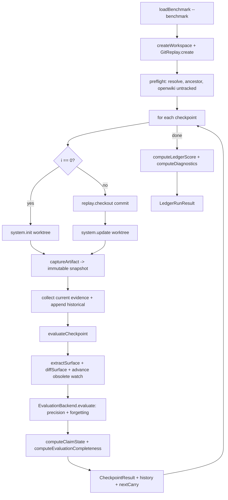

# Evaluation Systems (LEDGER and DeepSWE)

OpenWiki ships two evaluation systems under `evals/`. **LEDGER** is a source-grounded framework that replays a repository's Git history and grades whether a generated wiki's factual claims stay accurate and current as the source evolves. **DeepSWE** is a paired experiment harness that runs the same DeepSWE coding tasks under two Codex conditions — a plain baseline and an OpenWiki-augmented treatment — and compares verifier rewards, tokens, and wall-clock time. LEDGER measures *documentation accuracy over time*; DeepSWE measures *whether OpenWiki helps a coding agent solve real tasks*.

## LEDGER

LEDGER (Longitudinal Evaluation of Documentation Grounding, Evolution, and Revision) evaluates whether generated knowledge artifacts remain accurate and current as their underlying source of truth evolves. The current adapter replays Git checkpoints, runs OpenWiki at each one, and evaluates each frozen wiki snapshot. Truth is read directly from source at each checkpoint; there is no hand-authored knowledge census.

See [Grounded Claims](../concepts/grounded-claims.md) for the Claims model LEDGER evaluates, and [Configuration](../operations/configuration.md) for provider credentials, which LEDGER reuses through the standard `OPENWIKI_PROVIDER` / `OPENWIKI_MODEL_ID` environment variables.

### Claim state

At each checkpoint the evaluator reads every generated Markdown document, splits it into text units, and extracts atomic factual claims. Navigation, opinions, instructions, wiki self-description, and other non-factual material produce no claims. Explicit historical narration remains in the audit record but is excluded from the headline snapshot metric.

Each current-tense claim ends in exactly one state:

| State        | Meaning                                                                                                              |
| ------------ | -------------------------------------------------------------------------------------------------------------------- |
| `supported`  | Current source evidence establishes the claim.                                                                       |
| `stale`      | Current source contradicts the claim and historical source establishes that it was formerly true.                    |
| `invented`   | Current source contradicts the claim and historical source does not establish it. The CLI labels this `hallucinated`. |
| `unverified` | The supplied evidence neither establishes nor contradicts the claim.                                                 |

All four rates share one denominator:

```text
current claims = supported + stale + invented + unverified

supported rate     = supported / current claims
staleness rate     = stale     / current claims
hallucination rate = invented  / current claims
unverified rate    = unverified / current claims
```

Each checkpoint recomputes this partition from the entire current wiki — it is not a delta or an average of earlier checkpoints. When at least one current claim exists, the unrounded rates sum to 100% (whole-number CLI rounding may not). A claim-free wiki reports zero for all four rates. `unverified` is not a factual error; it is the audit worklist and the confidence boundary around the known results.

The reduction is a pure function over the evaluator's per-item verdicts: `computeClaimState` filters to `tense === "current"` claims and counts each verdict, returning the four counts plus the four rates (each `0` when `total === 0`).

### Evaluation pipeline

```text
all generated Markdown
        |
        v
classify every text unit and extract atomic claims with exact artifact quotes
        |
        v
remove normalized exact duplicates
        |
        v
match claim prose to evaluator-only evidence-map concepts
        |
        v
resolve mapped paths/symbols/globs to raw source and add bounded fallback evidence
        |
        v
supported / contradicted / not addressed
        |
        +- contradicted -> check distinct historical evidence
        |                  +- formerly true  -> stale
        |                  +- not established -> invented
        +- not addressed   -> unverified
```

The precision pass (`runPrecisionPass`) drives this. Markdown sections are split into blank-line-delimited text units (list leads ending in a colon are kept with their list so deictic text retains its antecedent). Extraction batches of 25 units classify each unit as `factual`, `mixed`, `navigation`, `meta-artifact`, `opinion`, `instruction`, or `no-claim`; only `factual` and `mixed` units yield assertions. Each assertion carries a normalized statement, an exact `sourceQuote` that must appear verbatim in the originating unit, the unit's full context, the active heading hierarchy, and a `tense` (`current` or `historical`).

Candidates are deduplicated by a conservative normalized key (lowercased, punctuation-stripped) so byte-equivalent repetitions of the same claim across a checkpoint collapse to one assertion that proceeds to accounting. The inventory records every candidate (kept or excluded) plus the per-assertion grounding evidence selection.

Grounding is fail-soft at two granularities. A whole extraction or judgment batch that fails is repaired per-item in isolation; an item still invalid after isolated repair degrades to a no-claim unit (extraction) or a warned `unverified` verdict (judgment) rather than aborting the run. Both cases lower the separately reported evaluator completeness rate and remain visible as warnings in the audit report.

### Evidence routing

Source evidence is collected from the active Git worktree by `GitSourceEvidenceAdapter`: a tracked-file manifest plus bounded text chunks (default 6 000 chars, split on newline boundaries) from every tracked, regular, non-binary file except the generated `openwiki/` artifact. Symlinks are skipped by reading through one stable `O_NOFOLLOW` descriptor to avoid a check/use race. Current evidence comes from the active checkpoint; evidence captured at every earlier checkpoint is marked historical and concatenated into the corpus with checkpoint-prefixed ids.

Current claims are grounded against current evidence first; historical snapshots cannot crowd current truth out of the retrieval window. The selection rules, implemented in `selectEvidence`, are:

- A named source path a claim mentions is always included, resolved as mandatory structural evidence regardless of lexical overlap.
- Routed evidence-map files are mandatory.
- A claim naming a missing file receives the complete tracked-file manifest.
- Small corpora are supplied in full; the full corpus is retained when it fits a 24 000-char soft budget.
- Larger corpora retain mandatory routed evidence and use direct source BM25 to fill a minimum eight-excerpt candidate set within the soft budget.
- Byte-identical historical excerpts are deduplicated.
- Historical evidence is consulted **only after** current source establishes a contradiction, to split `stale` from `invented`.

The contradiction split is explicit: a current claim judged `invented` against current source is pushed onto a `pendingFormerTruth` queue and re-judged against historical evidence with a distinct `PRECISION_HISTORY_JUDGMENT_SYSTEM` prompt; a `supported` verdict there promotes the claim to `stale` and unions the historical evidence ids, otherwise it stays `invented`. A contradiction that lacks any current evidence citation, or a `formerlyTrue` claim that lacks historical evidence, is rejected as an evaluator error.

Retrieval is deterministic BM25 (`SectionBm25Index`, `K1 = 1.2`, `B = 0.75`, no stemming or stop-word removal so technical identifiers carry meaning). A `SemanticEvidenceRouter` runs BM25 over the benchmark's natural-language *concept* descriptions, never over source syntax, and matched selectors (`path`, `path#symbol`, or glob) resolve deterministically to raw source excerpts. V1 supplies the complete owning file for `path#symbol` selectors so the judge sees surrounding context. Routing adds no evaluator model calls, and every matched route id, selector, resolved path, selected evidence identity, cache hit, and historical follow-up is preserved in the assertion inventory.

The `ModelEvaluationBackend` runs the forgetting and precision passes concurrently over each checkpoint, sharing one limiter of `EVALUATOR_CONCURRENCY = 6` in-flight model calls. It owns a cross-checkpoint precision verdict cache keyed by a SHA-256 of the normalized statement, quote, unit context, heading path, tense, and the full content signature of the claim's grounding evidence set, so a claim whose text and grounding evidence are unchanged from an earlier checkpoint reuses its verdict instead of being re-judged. Provider retries are disabled (the model is constructed with `maxRetries = 0`) so a 429 burst degrades verdicts rather than being silently absorbed.

### Benchmark contract

A benchmark contains a source-of-truth Git history, an ordered set of pinned checkpoints, an author-declared difficulty (`easy` | `medium` | `hard`), and optionally a reviewed semantic evidence map. The checked-in `calc` and `taskflow` benchmarks both include maps.

`LedgerCheckpoint` carries a stable `id`, a full-or-abbreviated commit SHA (validated against `/^[0-9a-f]{7,40}$/`), and an optional label. The `LedgerTrace` is frozen: the same commits produce the same replay every run. `BenchmarkDifficulty` is declared by a human, never computed from the trace, and rendered in the run headline and report so weak results on a `hard` benchmark read differently from the same results on an `easy` one.

Evidence-map concepts should identify a fact category, never supply its conclusion — use `task queue insertion, ordering, and removal behavior`, not `tasks are removed FIFO`. Include every source location capable of supporting or refuting that category. Selectors may refer to symbols that exist only at some checkpoints; unresolved selectors are ignored at checkpoints where that source is absent. Multiple matched entries are unioned before grounding.

### Runner architecture

`runBenchmark` owns the end-to-end run. It takes a `RunnerInputs` bundle — benchmark, `SystemUnderTest`, `EvaluationBackend`, resolved `LedgerRunConfig`, injected `startedAt` timestamp, optional `onArtifact`/`onEvidence` durable sinks, and a progress reporter — and returns a `LedgerRunResult`.

Before any system runs, the runner preflight-validates the whole trace against the source repository: every checkpoint SHA resolves to a commit, every checkpoint is a Git ancestor of the one that follows it, and no checkpoint tracks anything under `openwiki/`. The run then walks the trace: index 0 calls `system.init`, every later index calls `system.update` after the replay checks out the next commit. At each checkpoint it freezes an immutable artifact (`captureArtifact`), collects current source evidence, appends historical evidence from all prior checkpoints, and calls `evaluateCheckpoint`.

`evaluateCheckpoint` is the loop body shared verbatim by the live runner and the saved-run re-evaluator; the only per-caller differences (artifact/evidence source and how efficiency is built) are passed in through the inputs. It extracts the source surface at the checkpoint commit, diffs it against the previous checkpoint's surface (`diffSurface`) to derive transitions and newly obsolete versions, advances the sticky forgetting watch set, runs the evaluation backend, and reduces the raw verdicts into claim-state and evaluator-completeness measurements.

State is carried checkpoint to checkpoint by `CheckpointCarry` (previous artifact, previous checkpoint id, previous surface, and the outstanding obsolete watch set). `initialCarry()` returns the empty starting carry for index 0.



The diagram shows the runner flow from benchmark load through checkpoint evaluation to the final score.

#### GitReplay workspace

`GitReplay` drives the source repository through an evolution trace inside one detached Git worktree. It creates a private local clone (`--local --no-checkout`) plus a detached worktree under a caller-provided temp parent, so a running replay does not depend on mutable Git administration files in the benchmark fixture. The generated wiki lives as untracked files inside the worktree, so `checkout` (which never touches untracked files) preserves it from one checkpoint to the next; `GitReplay` therefore never runs `git clean`, which would delete the wiki and defeat longitudinal updates. `checkout` runs `git reset --hard HEAD` (confining the destructive op via a realpath containment check) then `git checkout --detach`, so a SUT that dirtied a tracked file cannot block the checkout.

The `Workspace` is a disposable filesystem root under the OS temp directory, removed on `dispose` with retry logic for transient `ENOTEMPTY`/`EBUSY` under parallel test load. Every destructive filesystem or Git operation passes through `assertContainedByRealpath`, the single guard that resolves the realpath of its target (following symlinks) so a symlink cannot escape the allowed root.

#### The OpenWiki system adapter

The baseline `SystemUnderTest` is `OpenWikiSystem` (`name = "openwiki-baseline"`), driven through OpenWiki's single `runOpenWikiAgent` entrypoint. It sets `OPENWIKI_PROVIDER` and `OPENWIKI_MODEL_ID` into the environment before each run, calls `runOpenWikiAgent(command, worktreeDir, { outputMode: "repository", modelId })`, and translates the result into a `SystemRunOutcome` (`skipped`, `durationMs`). The `outputMode: "repository"` flag is required so the worktree `cwd` is honored — without it OpenWiki ignores `cwd` and writes into the user's local wiki directory. It never passes a user message, so update change-detection is driven purely by the real source deltas between checkpoints.

#### Artifact capture and the sticky forgetting watch set

Once captured, a `KnowledgeArtifact`'s document list is the evaluator's authoritative artifact input; it also carries a SHA-256 fingerprint over the sorted document set to detect whether two checkpoints produced identical wikis. If the initial checkpoint produces no wiki, the runner throws `SystemRunError`.

The forgetting watch set is **sticky**: once a fact version goes obsolete it stays under watch for every later checkpoint and is retired only when the requirements revive that knowledge (the fact is active again with the version's own statement). LEDGER does not treat forgetting as permanent, so a version already judged `forgotten` is still re-checked at later checkpoints — this is what lets the Stale-Knowledge Lifetime diagnostic measure how long stale knowledge lingers and keeps a later lingering regression visible in the forgetting history. It adds one forgetting-pass evaluation per watched version per checkpoint.

### LEDGER score

The run-level score is opportunity-weighted claim health across the trace:

```text
claim health = supported current claims / all current claims across checkpoints
LEDGER score = claim health
```

`computeLedgerScore` sums `supported` and `total` across every `CheckpointResult` and returns `supported / total` (or `0` when there are no current claims). Stale, hallucinated, and unverified claims all lower claim health because they remain in its denominator. The score does not measure whether the wiki covers every important source topic; that limitation remains explicit. The `LedgerScore` records both `value` and `claimHealth` (the same ratio) for audit.

### Trace diagnostics

`computeDiagnostics` derives the Stale-Knowledge Lifetime from the accumulated forgetting history. For each obsolete fact version it counts how many checkpoints the version was judged `lingering` before it was first judged `forgotten`; the mean is taken over resolved (eventually forgotten) versions only, and unresolved obsolete versions (never forgotten before observation stopped) are preserved as records and counted separately rather than folded into the mean as if their final lifetime were known. Lingering verdicts after a first forgetting (an obsolete version that recurs) are left in the raw forgetting history without a separate metric in V1.

### CLI

LEDGER is invoked through pnpm scripts defined in `package.json`:

- `pnpm run eval:ledger -- --benchmark <dir>` — end-to-end run.
- `pnpm run eval:ledger:reevaluate -- --benchmark <dir> --run <results-dir>` — re-evaluate a completed run without invoking OpenWiki.
- `pnpm run eval:ledger:typecheck` — `tsc --noEmit -p evals/ledger/tsconfig.json`.

Recognized flags are `--benchmark <dir>`, `--results <dir>`, `--system-model <id>`, `--evaluator-model <id>`, and `--verbose`. Unknown flags and missing values are hard errors (`LedgerError`) so a typo never runs with a surprising default. `--verbose` does not accept a value; it prints every stale and hallucinated claim beneath the checkpoint that produced it.

`resolveRunConfig` resolves the run config: `OPENWIKI_PROVIDER` is required; the system model comes from `--system-model` or `OPENWIKI_MODEL_ID`; the evaluator model comes from `--evaluator-model` or `LEDGER_EVALUATOR_MODEL_ID`, falling back to the system model. The evaluator model must resolve to a concrete id because the evaluator constructs its model directly rather than deferring to OpenWiki's default resolution. Results default to `evals/ledger/.results`.

```bash
OPENWIKI_PROVIDER=anthropic \
LEDGER_EVALUATOR_MODEL_ID=claude-sonnet-5 \
pnpm run eval:ledger -- --benchmark evals/ledger/benchmarks/taskflow
```

Re-evaluation reuses the immutable artifacts and source evidence snapshots from a completed run directory and recomputes source surface extraction, temporal transitions, forgetting watch sets, every per-item judgment, and every measurement; the System Under Test is never invoked, and the original run's efficiency observations are copied through. The new run records `reevaluatedFrom` pointing at the source run.

Live evaluator calibration is opt-in through `LEDGER_LIVE=1`; the normal suite is offline and substitutes deterministic evaluator and system implementations.

## DeepSWE

The DeepSWE harness runs a paired baseline-vs-OpenWiki experiment with the same tasks, seed, model, reasoning effort, attempts, and Harbor environment in both conditions:

- `baseline`: Codex receives only the DeepSWE task and repository.
- `openwiki`: the adapter restores or generates OpenWiki in an isolated clone, merges OpenWiki's managed instructions into the repository's root `AGENTS.md`, and copies both `AGENTS.md` and `openwiki/` into `/app` before the same Codex adapter solves the unchanged DeepSWE task. Codex automatically loads root `AGENTS.md`; the harness adds no treatment-only task prompt.

For reproducibility the harness pins DeepSWE commit `6db64a40f3318d8659238ff34a8cc4b491c49205`, `harbor[langsmith]==0.20.0`, `litellm==1.83.14`, Codex CLI `0.144.6`, and the current OpenWiki checkout (packed locally per treatment run). Python 3.12 is selected explicitly through `uvx`; Harbor is not added as a package dependency, so `uvx` downloads the pinned runner and LangSmith extra into its tool cache.

### Safety and isolation

DeepSWE's held-out `tests/` and `solution/` live only in a separate verifier environment. OpenWiki runs against an isolated clone of `/app`, then the harness copies the generated `openwiki/` and merged root `AGENTS.md` into the agent repository. Those treatment files are hidden from Git status and excluded from the verifier patch. Both conditions use the same compatibility path to capture the base-to-final-HEAD diff for DeepSWE's verifier.

Credentials are injected at runtime by Harbor and never written into an image, command argument, generated wiki, or result summary; Harbor's debug mode must not be enabled for credentialed runs. Container networking is allowlisted to the package, model, and LangSmith hosts needed by the run. Docker runs remove only inactive, label-verified Harbor trial networks — never a global network prune. Parallel agent setup uses a 3x timeout by default (`--agent-setup-timeout-multiplier`). If `OPENAI_BASE_URL` uses another gateway, pass its hostname (not a URL) with `--allow-host`. The separate verifier environment remains offline.

### Commands

The harness is `evals/deepswe/run.py` with subcommands `prepare`, `baseline`, `openwiki`, `paired`, and `summarize`. `prepare` checks out the pinned DeepSWE repository and packs the current OpenWiki source via `pnpm pack`. `paired` runs both conditions and summarizes them; seeded sampling selects one exact task list for both arms.

```bash
# Inspect without downloading tasks, building images, or calling a model
python3 evals/deepswe/run.py paired --n-tasks 2 --dry-run

# Prepare the pinned DeepSWE checkout and pack OpenWiki
python3 evals/deepswe/run.py prepare

# Run both paired conditions and summarize
source ~/.zshrc && python3 evals/deepswe/run.py paired \
  --run-name pilot-01 \
  --n-tasks 10 \
  --seed 0 \
  --model openai/gpt-5.6-terra \
  --openwiki-model gpt-5.6-terra \
  --reasoning-effort high
```

Named OpenWiki task suites provide exact, reproducible cohorts via `--task-suite` (mutually exclusive with `--task`): `koota-5` (fast iteration), `openwiki-20` (Koota plus 15 independent repositories), and `openwiki-doc-leverage-10` (disjoint multi-surface tasks). A suite selects all of its members regardless of `--n-tasks`; the exact members are pinned in `run.py`.

Generated task wikis are cached on the host in `evals/deepswe/.cache/openwiki-wikis`, keyed by the task repository's base commit, the normalized OpenWiki package contents, and the OpenWiki model. `--no-reuse-compatible-wiki-cache` disables reuse of an older cache whose `openwiki/.last-update.json` records the exact same task commit and model; `--require-openwiki-cache` fails before any wiki-generation model call on a cache miss, for controlled reruns where wiki Markdown must stay fixed.

When the packed OpenWiki checkout exposes `openwiki-retrieval-mcp`, treatment runs register it inside Codex's isolated home. This capability check keeps the harness runnable against `main` and earlier OpenWiki revisions that do not yet ship retrieval tools. When available, retrieval provides read-only `search` and `change_surface` workflows over `/app` and `/app/openwiki`; local vectors are the default, or `--retrieval-embedding-provider openai` opts into hosted reranking.

### LangSmith datasets, experiments, and traces

Every evaluation uses Harbor's official `langsmith` plugin. Baseline and OpenWiki jobs share the default `deepswe-openwiki-6db64a40f331` dataset but create separate experiments named from their Harbor jobs; ambient experiment overrides are cleared so the conditions cannot merge accidentally. A local plugin shim sends only bounded verifier rewards as LangSmith feedback, rounding scores to four decimal places; DeepSWE count metrics stay in local trial outputs. OpenWiki generation traces route to the treatment experiment. Dataset sync and fail-fast behavior are always enabled, so a run cannot silently omit its LangSmith evaluation record.

### Outputs and interpretation

Harbor writes raw jobs to `evals/deepswe/results/`. The harness writes aggregate JSON and trial-level CSV files to `evals/deepswe/summaries/`, including binary reward and exception type, input/cache/output tokens used by Codex, Codex cost, agent and total wall-clock time, and OpenWiki generation wall-clock time. `summarize` aggregates without invoking Harbor and verifies that the paired task sets match across conditions. Efficiency should be compared among successful trials as well as across all trials — a faster failure is not an efficiency improvement.

OpenWiki's current CLI does not expose generation token usage to Harbor's local summary, so treatment summaries include its wall-clock time but not its tokens or provider cost; its LangSmith generation traces in the same experiment provide generation-token details. `analyze_openwiki_usage.py` measures direct treatment overhead after a run, separately reporting OpenWiki MCP calls, shell reads under `openwiki/`, serialized tool-call/result characters at four characters per token, and one automatic inclusion of the managed OpenWiki `AGENTS.md` block, plus totals after subtracting that estimated overhead.
