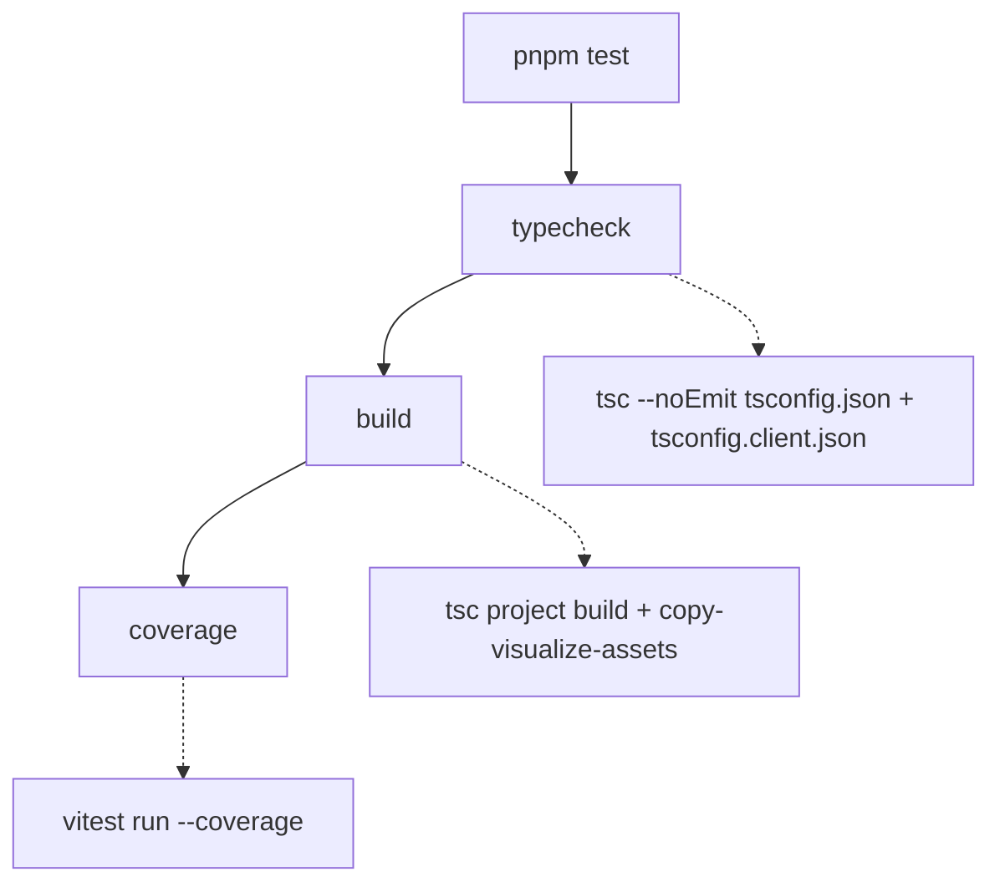

# Testing Guide

OpenWiki is validated by a single [Vitest](https://vitest.dev) suite under `test/`.
The suite is fast, mostly offline (external services and SDKs are stubbed), and
mirrors the `src/` tree directory-for-directory so that the tests for a subsystem
live at the matching path. This page explains the tooling, the full `pnpm test`
pipeline, and — for each subsystem — the narrowest command that proves a change
while preserving complete failure output.

## Tooling

- **Test runner: Vitest.** `vitest` (and `@vitest/coverage-v8`) are dev
  dependencies; there is no separate framework. Tests import `describe`,
  `expect`, `test`, `vi`, and the `beforeEach`/`afterEach` hooks directly from
  `vitest`.
- **Ink component tests: ink-testing-library.** Terminal UI written with Ink is
  exercised by rendering React components with `render` from
  `ink-testing-library` and asserting on the rendered frame (`lastFrame()`).
  These tests are the `.tsx` files under `test/cli/components/` and
  `test/setup/credentials/`.
- **No global config beyond `vitest.config.ts`.** Test discovery keeps Vitest's
  defaults; the only tuning is one discovery exclusion and the coverage block
  (see below).

Tests import source modules directly by relative path (for example
`../../src/agent/index.ts`), so a source module can be unit-tested without
building `dist/` first. `tsx` runs the CLI in development (`pnpm dev`), but the
test suite itself runs through Vitest's own transform.

## The `pnpm test` pipeline

`pnpm test` is not just the unit run — it is a three-stage gate that must pass in
order:

The `pnpm test` gate: typecheck, then build, then the coverage run.

1. **`typecheck`** runs `tsc --noEmit` against both the server project
   (`tsconfig.json`) and the browser/client project (`tsconfig.client.json`).
2. **`build`** compiles both TypeScript projects and copies the visualize
   client assets.
3. **`coverage`** runs `vitest run --coverage`, which executes every test and
   produces a coverage report.

When iterating locally you usually do **not** want the whole gate. Run Vitest
directly (`pnpm exec vitest run <path-or-pattern>`) to execute a focused slice,
then run `pnpm test` once before proposing the change so typecheck, build, and
coverage all agree.

## Coverage configuration

Coverage uses the V8 provider with `all: true` and an explicit
`include: ["src/**/*.{ts,tsx}"]`. `all: true` plus the explicit include makes the
report cover the **entire** `src` tree, so a source file that no test imports yet
appears as 0% rather than being silently omitted from the denominator.

A small set of files are deliberately excluded from coverage because they emit no
runtime JavaScript or can only run in an environment a Node unit test cannot
drive: `*.d.ts`, pure `types.ts` declaration modules, the `telemetry/index.ts`
re-export barrel, the browser-only `visualize/client.ts`, and the Ink keyboard
state machine `setup/credentials/use-init-setup.ts`. In each excluded case the
extractable pure logic lives in a separate, tested module (for example
`visualize/client-lib.ts`, or `steps.ts`/`format.ts`/`persistence.ts` for the
setup wizard), so new logic belongs in those tested modules rather than in the
excluded glue. The coverage reporters are `text`, `text-summary`, `html`,
`json-summary`, and `lcov`.

## Test discovery

Vitest keeps its default discovery globs and adds exactly one exclusion:
`**/benchmarks/*/repo/**`. A KEB benchmark under `evals/keb/benchmarks/` can
rebuild an upstream project's source tree into a `repo/` directory that carries
that project's own `*.test.ts` files. Those belong to the fixture under test, not
to OpenWiki, so the exclusion guarantees that a benchmark whose `repo/` happens
to be present on disk cannot pollute this project's suite.

## Test layout maps to source subsystems

`test/` mirrors `src/`. To find (or add) tests for a subsystem, go to the
matching path. The most important mappings:

| Test directory                                                                                                                                            | Source subsystem it validates                                                                                 |
| --------------------------------------------------------------------------------------------------------------------------------------------------------- | ------------------------------------------------------------------------------------------------------------- |
| `test/agent/`                                                                                                                                             | `src/agent/` — model creation, middleware, prompts, streaming, redaction, the repository runner, update-noop fast-skip, repository source fingerprinting, OKF middleware, frontmatter validation, and the wiki finalizer |
| `test/claims/`                                                                                                                                            | `src/claims/` — grounded-claim core, the code claim brain, and evidence resolution                            |
| `test/connectors/`                                                                                                                                        | `src/connectors/` — connector config, resilient fetch, MCP client/runtime, and per-source ingestion           |
| `test/generation/`                                                                                                                                        | `src/generation/` — repository run lifecycle, page planning, page-manifest persistence, and run-state persistence                                 |
| `test/okf/`                                                                                                                                              | `src/okf/` — OKF frontmatter parsing/normalization/repair/validation and index labels/sync |
| `test/integrations/`                                                                                                                                      | `src/integrations/` — host installers, config adapters, the MCP server, and packaged skill/protocol contracts |
| `test/cli/`                                                                                                                                               | `src/cli/` — CLI wiring, Ink components, and error diagnostics (`--debug` stack extraction/redaction, OpenRouter metadata, `previous_errors` capping)                                    |
| `test/setup/`                                                                                                                                             | `src/setup/` — the credentials setup wizard                                                                   |
| `test/visualize/`                                                                                                                                          | `src/visualize/` — the live-server/static-export HTML page, graph payload, server, static export, client-lib pure logic, and browser client interaction wiring |
| `test/config/`, `test/mermaid/`, `test/scheduling/`, `test/telemetry/`, `test/auth/`, `test/ingestion/`, `test/platform/` | the matching `src/` subsystem                                                                                 |

Related architecture and subsystem pages: the
[source map](../architecture/source-map.md),
[grounded claims](../concepts/grounded-claims.md),
[coding-agent integrations](../integrations/coding-agents.md), and the
[repository generation workflow](../workflows/repository-generation.md).

### Agent: middleware, frontmatter, and finalizer

The agent subsystem directory holds a broad set of tests, including several that
guard the OKF authoring pipeline added in the v0.4.0 cycle:

- `test/agent/frontmatter-validator.test.ts` exercises `validateOkfFrontmatter`
  in isolation, asserting which OKF frontmatter families are accepted (required
  `type`, optional `title`/`description`/`resource`/`tags`, the legacy v0.1
  `timestamp`/producer extensions, and the v0.2 provenance/trust/lifecycle
  families) and which malformed inputs are rejected (timestamps without an
  explicit UTC offset, impossible ISO-shaped timestamps).
- `test/agent/index-middleware.test.ts` drives `createOpenWikiIndexMiddleware`
  against a real `OpenWikiLocalShellBackend` rooted in an `mkdtemp` directory. It
  runs the middleware's `beforeAgent`/`afterAgent` lifecycle hooks, asserts the
  projected source IDs and index labels, and feeds broken Mermaid blocks to prove
  index sync fails on unparseable diagrams.
- `test/agent/wiki-finalizer.test.ts` exercises `prepareWikiForAuthoring` and
  `finalizeWikiArtifacts` against an isolated repository-mode backend, capturing
  the operation sequence (`migrate`, `provenance_snapshot`) and asserting on the
  persisted content written to the real filesystem.
- `test/agent/repository-runner.test.ts` drives `runNativeRepositoryGeneration`
  through a `deepagents`/`repository-run.js` mock harness. It asserts the
  shell-free tool surface and one fresh worker per page, and includes the
  worker-exit/skip regression `restores and leaves a page pending when its
  worker does not submit`: when a page worker exits without calling
  `submit_page`, the runner invokes `captureRepositoryPageSnapshot`/
  `skipRepositoryPage` to restore the captured snapshot, marks that page
  `skipped`, finishes the run, and emits a `text` event telling the user the
  page will be "reconsidered on the next update" — leaving the skipped page to
  be re-queued as `pending` on resume. It also covers duplicate-plan tolerance
  (`continues when the planner repeats the same accepted plan`, armed via
  `duplicatePlanSubmission`, which repeats the accepted `submit_plan` call and
  asserts the runner proceeds to page generation rather than treating the
  repeat as a conflict) and post-submit page durability (`keeps a durably
  completed page after a later worker failure`, armed via
  `pageWorkerPostSubmitFailures`, which makes the worker throw *after*
  `submit_page` succeeds and asserts the page is not rolled back —
  `restoreCalls` stays `0` and the page remains `complete`).
- `test/agent/update-noop.test.ts` is the dedicated suite for the update no-op
  fast-skip path: it builds a real committed Git repository with an OpenWiki
  tree and exercises `getUpdateNoopStatus` across the conditions that should and
  should not skip (unchanged HEAD, output-language change, equivalent
  primary-language request, committed-only dirty run metadata, page-manifest
  migration, uncommitted worktree changes, ignored-only paths, OpenWiki-only
  commits). It also guards the metadata-refresh path so a skip preserves the
  persisted language (mirroring `runOpenWikiAgent`'s `writeLastUpdateMetadata`
  refresh) and covers `shouldCheckUpdateNoop`'s gating conditions.
- `test/agent/repository-source-fingerprint.test.ts` exercises
  `createRepositorySourceFingerprint`/`createRepositorySourceSnapshot` and
  `getRepositoryChangedPaths` against a committed Git repository in `mkdtemp`.
  It pins fingerprint stability, sensitivity (tracked/staged/unstaged content,
  deletions, untracked files, executable-bit, symlink-target changes,
  `.openwikiignore` rules), the exclusion of generated pages/Claims
  sidecars/run metadata, and two failure-mode races injected by wrapping
  `node:fs/promises` with `vi.mock`: a TOCTOU race where an inspected file
  becomes a symlink before opening (the fingerprinter fails closed rather than
  following the swapped target), and a set of Windows stat-identity drift tests.
  On non-Windows the same-file guard keys on `dev`/`ino`; on Windows it falls
  back to `size`/`mtimeNs`/`birthtimeNs` and excludes `ctimeNs` (which can
  change for the same file between `lstat` and `FileHandle.stat`). The tests
  stub `process.platform` to `win32` and inject stat mutations via the mocked
  `open`: a `dev`/`ino` drift and a `ctimeNs`-only drift both still resolve, a
  `size`/`mtimeNs`/`birthtimeNs` change rejects with
  `Source path changed while fingerprinting`, and on other platforms a
  `dev`/`ino` change rejects.
- `test/agent/stream-redaction.test.ts` exercises `parseAgentStreamChunk`,
  pinning its suppression of `file`, `image`, `input_file`, and `image_url`
  content blocks that carry base64 blobs (which must never reach the terminal)
  while allowing adjacent text blocks in the same chunk to stream through
  normally. It also covers plain-text streaming, nested task (`subgraph`)
  output, `model_request` namespace classification (a top-level
  `model_request:*` namespace is tagged `main` while a `task` +
  `model_request:*` namespace is tagged `subgraph`), tool lifecycle
  normalization (`on_tool_start`/`on_tool_end`/`on_tool_error`), the
  `updates`-mode state-diff extraction (default for openai-compatible
  providers, tagged `main` or `subgraph` by namespace), tool-call-only
  messages in `updates` chunks returning `null` (a message carrying only
  `tool_calls` has no renderable text), and rejection of malformed stream
  chunks.

### Claims: nested layout

`test/claims/` splits by the claims subsystem's own internal boundaries:
`test/claims/core/` (the resolver-agnostic mutation and error model, e.g.
`applyClaimOperations`/`cloneClaims`), `test/claims/brains/code/` (the code claim
brain — paths, preflight, runtime, session, store), and
`test/claims/evidence/repository/` (repository evidence resource parsing and the
resolver). This mirrors the `src/claims/` split between core, brain, and evidence
concerns.

### Connectors: shared machinery vs. per-source

`test/connectors/` keeps cross-cutting machinery at the top level
(`connector-config*`, `fetch-with-resilience`, `mcp-client`, `mcp-runtime`,
`raw-connector-tools`, `tools`) and puts each individual source under
`test/connectors/sources/` (git-repo, gmail, hackernews, mcp, slack, web-search,
x, langsmith, custom-mcp). A source's pure logic is often private and only
observable through its `ingest()` entry point, so those tests point `$HOME` at a
throwaway temp directory, feed controlled API responses through a stubbed
`fetch`, and assert on the request the connector builds and the normalized raw
dump it writes to disk — no real network call or OAuth token is involved. To add
a new connector, use the `write-connector` skill and add a matching test under
`test/connectors/sources/`.

The cross-cutting `test/connectors/mcp-client.test.ts` exercises the MCP client
surface. Its `buildChildEnv` suite drives the child-environment builder that
filters the parent process env so OpenWiki credentials never leak to spawned MCP
servers: it confirms secret keys are absent from the child env, allow-listed
base variables (`PATH`, `APPDATA`, `LOCALAPPDATA`) pass through, only the
credentials a transport explicitly declares are resolved, an unresolvable
declared reference throws, and invalid child env key names are rejected. It now
also pins the `mcp-empty-env-var` fix: a declared env var set to an empty string
(`MCP_EMPTY=""`) is treated as **present** and resolves to `""`, not as missing —
so empty-string env vars survive the child-env boundary rather than being
dropped. The rest of the file validates the untrusted connector config
**before** any subprocess spawns or network transport opens, exercising
`executeMcpTool`/`listMcpTools`/`executeMcpReadOnlyOperations` against
missing-transport, invalid-operation-name, and bad-command/URL pre-flight
rejections with no real child process or connection involved.

A small number of connector-related tests live at the `test/` root rather than
under `test/connectors/sources/` because they cross the single-source boundary
and exercise isolation contracts that only make sense across connectors or
streams:

- `test/git-repo-connector.test.ts` builds real throwaway git repos in temp
  dirs and drives the git-repo connector across two runs. It asserts the
  second-run manifest describes what was committed *since* the recorded head
  (issue #409) — naming the file added in the new commit, not the file from the
  already-ingested first commit, with the prior head carried as `previousHead`
  — and that a first run reports the working-tree diff only with no
  `previousHead`, and a second run against an unreachable recorded head (as
  after a force-push or garbage-collected rewrite) falls back to the
  working-tree diff rather than throwing.
- `test/ingest-all-connectors.test.ts` pins `openwiki_ingest_all_connectors`
  failure isolation (issue #412): it mocks the connector registry with two
  fake connectors — one that resolves and one that rejects — and asserts the
  tool still returns both outcomes, so a throwing connector does not discard a
  succeeding connector's result (the failure is surfaced as an `error` status
  with the message mirrored into `warnings`, while the success keeps its
  `rawFiles`).
- `test/x-connector-stream-isolation.test.ts` pins X-connector per-stream
  failure isolation (issue #412): it stubs `fetch` so one stream
  (`mentions`) returns 429 while another (`user_posts`) succeeds, and asserts
  the run does not abort — the succeeding dump is kept, the failing stream's
  failure is surfaced as a warning, both streams were still attempted, and state
  is still written. A complementary case where every stream fails asserts the
  run yields an `error` status (not a benign skip) with the per-stream warning.
- `test/openrouter-debug-fetch.test.ts` pins the OpenRouter debug-fetch
  concurrency contract (issue #411): `ChatOpenRouter` calls `globalThis.fetch`
  directly, so `installOpenRouterDebugFetch` patches the global. The test
  asserts that a single run restores the exact original `fetch` on detach, that
  overlapping runs each keep their own captured failure and the real `fetch` is
  restored exactly once — only after the last run detaches (reference-counted,
  with a redundant `restore()` being a no-op that does not prematurely restore
  while another run is still active) — that an OpenRouter failure fans out to
  every active run's sink while each run can clear its own failure, and that
  non-OpenRouter requests pass through untouched.

### OKF: frontmatter and index

`test/okf/` mirrors `src/okf/`. `test/okf/frontmatter.test.ts` is the broadest
OKF frontmatter suite: it covers `normalizeConceptContent` (regenerating
frontmatter for bare pages, repairing optional fields while preserving
producer-defined extensions, stamping a localized concept type), and the
`parseFrontmatterFields`/`renderFrontmatter`/`validateOkfFrontmatter`/
`repairOkfFrontmatter`/`validatePersistedFile` helpers. Sibling files
(`test/okf/index-labels.test.ts`, `test/okf/index-sync-errors.test.ts`,
`test/okf/claims-verification.test.ts`, `test/okf/claim-sources.test.ts`) cover
index labels, index-sync error paths, and claims verification/source projection.

### Generation: planning, manifests, run state, and the run lifecycle

`test/generation/` splits the repository-generation machinery by persistence
concern, mirroring `src/generation/`:

- `test/generation/page-manifest.test.ts` covers the page-manifest persistence
  and completion surface (`readRepositoryPageManifest`,
  `writeRepositoryPageManifest`, `replaceRepositoryPageManifest`,
  `recordRepositoryPageCompletion`, `seedRepositoryPageManifest`,
  `isRepositoryPageCompletionCurrent`, atomic-rename replacement). It injects a
  manifest-rename failure by wrapping `node:fs/promises` with `vi.mock` and
  asserts the manifest is not left in a half-written state, and refuses to
  advance an unverified or mismatched Claims page while recording the exact
  verified page bytes and source checkpoint on success.
- `test/generation/run-state.test.ts` covers `writeRepositoryRunState`/
  `readRepositoryRunState`/`removeRepositoryRunState` against a temp root: the
  atomic write/read, validation rejection (a wrong `schemaVersion` must not
  replace durable state), and temp-file cleanup when rename fails.
- `test/generation/page-jobs.test.ts` exercises `createRepositoryPlan` and
  `reconcilePageClaims` through a `ClaimSession` with a deterministic evidence
  resolver. The `createRepositoryPlan` suite pins plan construction: init
  requires `/openwiki/quickstart.md` and forbids init deletions, quickstart
  deletion is forbidden, duplicate planned pages and generate/delete overlap
  are rejected, structural and reserved working pages (`index.md`,
  `nested/_draft.md`) are rejected, and page inputs are normalized with
  quickstart ordered last. The `reconcilePageClaims` suite pins sparse
  reconciliation: omitted issue-free Claims are retained without model
  round-tripping, a stale or unresolved Claim requires an explicit
  confirm/update/retract decision, duplicate sparse proposals and conflicting
  double-decisions (the same id in both `confirmedClaimIds` and
  `retractedClaimIds`) are rejected, retracting every Claim on a factual page
  is forbidden, an already-absent retraction is an idempotent retry, Claim
  fingerprints containing delimiter characters are not conflated, and session
  state stays atomic when evidence resolution fails.
- `test/generation/repository-run.test.ts` is the end-to-end run-lifecycle test
  described in detail below.

### Ingestion: code-mode setup and connectors

`test/ingestion/` mirrors `src/ingestion/`. `test/ingestion/code-mode.test.ts`
exercises `ensureCodeModeRepoSetup` and `runCodeModeConnectors` against temp
repositories: it parses the generated GitHub Actions workflow YAML, pins the
agent files and workflow/provider blocks, and asserts the OpenWiki
`<!-- OPENWIKI:START -->`/`<!-- OPENWIKI:END -->` snippet contract. It also pins
`CLAUDE.md` handling in `ensureCodeModeRepoSetup`: when both agent files are
absent it creates `CLAUDE.md` as a simple `@AGENTS.md` reference rather than a
copy of `AGENTS.md`'s content (it contains `@AGENTS.md`, not an inert Markdown
link, and is shorter than `AGENTS.md`); when `CLAUDE.md` is a symlink to
`AGENTS.md` it inlines the instructions instead of emitting an `@AGENTS.md`
import (which would point the file at itself); and a pre-existing `CLAUDE.md`
that only imports `AGENTS.md` (e.g. `@AGENTS.md`) is preserved unchanged rather
than overwritten — so an import-only `CLAUDE.md` survives a re-setup. Sibling files
(`test/ingestion/ingestion-run.test.ts`, `test/ingestion/ingestion.test.ts`,
`test/ingestion/langsmith-modes.test.ts`) cover the ingestion run,
`parseIngestionTarget`/`createConnectorSynthesisGuidance`, and connector modes.

### CLI: error diagnostics

`test/cli/` mirrors `src/cli/`, splitting CLI wiring (TypeScript entry points)
from Ink components. The Ink components live under `test/cli/components/` and
the credentials setup wizard's component tests live under `test/setup/credentials/`
(see the tooling section above for the `ink-testing-library` pattern). The
non-component CLI test worth knowing about:

- `test/cli/diagnostics/error-diagnostics.test.ts` exercises
  `getErrorDiagnostics`, the helper behind the `--debug` diagnostic surface. It
  asserts that a plain `Error` returns nothing when debug is off, while debug
  mode extracts the error `name`, `message`, and an inline HTTP status parsed
  from the message (`httpStatusFromMessage`). The stack is only included when
  `OPENWIKI_DEBUG` is set; when present it is sanitized — secret-like patterns
  in the stack (e.g. a `bearer sk-or-v1-…` token) are replaced with a
  `[REDACTED:OPENROUTER_API_KEY]` placeholder — and truncated to exactly 2000
  characters with a trailing `...`. It also covers HTTP status and
  case-insensitive header extraction from response-like errors, OpenRouter
  metadata extraction (`metadata.provider_name`) which happens even with
  debug off, redaction of secret-like keys inside stringified metadata
  (`metadata.raw`), previous-errors capping (only the first five
  `previous_errors` are kept, with a `metadata.previous_errors.more` note
  counting the remainder), and nested response fields surfaced under a dotted
  prefix (`response.status`/`response.statusText`).

### Config: env parsing and formatting

`test/config/env.test.ts` exercises `parseEnv` and `formatEnv` from
`src/config/env.ts`, the `.env`-style loader and serializer behind the managed
environment keys. `parseEnv` parses simple `KEY=value` lines, skips blanks and
comments, ignores lines with no `=` or an empty key, rejects keys that are not
`UPPER_SNAKE_CASE`, handles `export`-prefixed lines, and leaves unquoted values
as-is. For double-quoted values it now includes tests for the **atomic
single-pass unescaping** of backslash escapes: it unquotes and unescapes
`"line1\nline2"`, `"a\"b\\c"`, and — newly — carriage returns (`"line1\rline2"`
and `"line1\r\nline2"`), as well as the **Windows-path corruption regression**
where a raw backslash escaped to `\\` immediately before a path segment
starting with `n` or `r` (e.g. `C:\name\creds.json`) must not be misread as the
`\n`/`\r` escape sequence on parse. The `formatEnv` suite mirrors this:
quoting, escaping quotes/backslashes/newlines, escaping carriage returns, and
ordering managed keys first (in `MANAGED_ENV_KEYS` order) then unknown keys
sorted alphabetically. A `parseEnv <-> formatEnv` round-trip suite confirms
values — including carriage returns and the Windows path regression — survive
a `format → parse` round-trip.

### Visualize: page, graph, and client interaction

`test/visualize/` mirrors `src/visualize/`. It splits the visualizer into the
parts that can run in plain Node and the browser-only client glue that cannot:

- `test/visualize/page.test.ts` asserts on the rendered `PAGE`/`STATIC_PAGE`
  HTML documents exported by `src/visualize/page.ts`. It pins the exact CDN
  script versions (force-graph, marked, dompurify, mermaid) and requires each
  `<script>` tag to carry an SRI `integrity` plus `crossorigin="anonymous"`
  attribute, so a version bump is forced through this test with a fresh hash
  review rather than silently trusting the CDN. It also guards the issue #670
  overlay-layout regression: the hint and legend must live inside the `#graph`
  panel (not direct children of `.main`) and the stylesheet must height-cap
  `.graph-overlay` with a scrollable `.legend`. A CSP Google Fonts regression
  test asserts that the page's Content Security Policy allows the very origins
  the page itself requests: `style-src` must include `fonts.googleapis.com`
  (the stylesheet the `<link>` tag loads) and `font-src` must include
  `https://fonts.gstatic.com` (the font files that stylesheet references), so a
  browser enforcing the CSP no longer silently blocks the Inter typeface.
- `test/visualize/client-interaction.test.ts` is a `@vitest-environment jsdom`
  suite for the browser-only `src/visualize/client.ts` interaction wiring.
  Because `client.ts` touches the DOM and CDN globals at import time, the test
  mounts a minimal DOM matching `page.ts`'s post-#670 layout, replaces the
  third-party globals (`ForceGraph`, `marked`, `DOMPurify`, `mermaid`,
  `ResizeObserver`, `fetch`) with recording stubs, imports the client under
  `data-static-export`, and asserts on the handlers it registers. Its primary
  target is the issue #670 regression: background clicks must not be wired to
  any handler, so clicking blank graph space never clears the reader, while
  node clicks select a page and highlight its sidebar entry. It also asserts
  the graph-label decluttering feature driven by `shouldShowNodeLabel`: by
  default no labels are painted, hovering a node draws only that node's label,
  and clicking a node draws its label plus the labels of its directly
  connected neighbours. These assertions call the registered
  `onNodeHover`/`onNodeClick` handlers and then paint every node through the
  recorded `nodeCanvasObject` handler, collecting the `fillText` calls to
  verify exactly which labels appear.

### Integrations: protocol, session manager, and MCP server

`test/integrations/` mirrors `src/integrations/`. It splits the host-integration
surface by transport boundary: the transport-neutral protocol schema, the
single-run session manager that adapts it, and the MCP transport server that
exposes it:

- `test/integrations/protocol.test.ts` exercises the strict Zod schemas in
  `src/integrations/core/protocol.ts`. It validates the complete six-tool
  protocol surface: `BeginInput` (strict, trims `root`/`language`, rejects
  unknown modes and extra fields), `RunInput`/`NextPageInput` (shared strict
  UUID run identity), `SubmitPlanInput` (strict, rejects extra fields),
  `PlanPageInput` (canonicalizes `path`/`title`/`purpose`/`seedPaths`/
  `relatedPages`/`instructions`), and `SubmitPageInput` — the sparse Claim
  reconciliation schema with `confirmedClaimIds`/`claims`/`retractedClaimIds`.
  It asserts that a proposed Claim with empty evidence is rejected and that a
  proposed Claim carrying a code-owned `version` is rejected (only bare
  `resource` is accepted). `ProposedPageClaimInput` trims and canonicalizes the
  `id`/`statement`/`resource` fields. It also pins `isValidHostId`'s bounded
  canonical identity rules (`[a-z0-9-]{1,64}`, rejecting uppercase, underscore,
  and over-length identities).
- `test/integrations/session-manager.test.ts` exercises
  `HostSessionManager.create` and its single-run adapter over the real
  repository lifecycle. It asserts the ordered six-tool lifecycle
  (`openwiki_begin` → `openwiki_submit_plan` → `openwiki_next_page` →
  `openwiki_inspect_page_claims` → `openwiki_submit_page` → `openwiki_finish`)
  and that `inspectPageClaims` is exposed on demand. It covers resumability
  across different hosts (a `codex`-started run is resumed by `claude-code`),
  nested-path-to-Git-root resolution via `realpath`, the strict active-run-id
  guard, begin conflict mapping (a second `begin` with a conflicting mode
  rejects with `conflict` and retains the prior active run), the
  one-operation-at-a-time guard, repository lifecycle failure mapping to
  bounded `HostIntegrationError`s, and the durable-finish completion that
  clears active state.
- `test/integrations/mcp-server.test.ts` exercises
  `createOpenWikiMcpServer` through linked in-memory MCP transports. It asserts
  the server advertises the six lifecycle tools in order and that the
  `INSTRUCTIONS` embedding (from `src/integrations/mcp/server.ts`) contains
  the sparse-workflow guidance — the host's native repository tools,
  `openwiki_submit_plan`/`openwiki_next_page`/`openwiki_inspect_page_claims`/
  `openwiki_submit_page`, that issue-free Claims are "retained
  automatically" and only sparse Claim decisions are submitted, the stale or
  unresolved recheck requirement, "Never report success before finish", and
  "source drift invalidated the plan" — while never mentioning the removed
  `openwiki_resolve_claims`. It also covers successful tool calls (text JSON
  plus structured content) and error bounding: a `HostIntegrationError` is
  surfaced as a bounded `isError` result while an unknown failure is replaced
  with a generic `OpenWiki MCP operation failed.` message and never leaks the
  sensitive text to the client or stderr. A lifecycle smoke test completes one
  factual init page through all five transport calls.

## Testing patterns you will reuse

- **Dependency injection via `vi.mock` + `vi.hoisted`.** Failure-path tests
  wrap a real module with `vi.mock(..., importOriginal)` and use a hoisted
  counter to inject a failure on the Nth call while otherwise delegating to the
  real implementation. `test/generation/repository-run.test.ts` arms a
  `failureHarness` with six counters — `manifestReplacements`,
  `manifestWrites`, `metadataWrites`, `stateWrites`, `stateRemovals`, and
  `sourceMutationsAfterManifestReplacement` — that wrap `page-manifest.js`
  (`recordRepositoryPageCompletion` for `manifestWrites`,
  `replaceRepositoryPageManifest` for `manifestReplacements` plus a
  mid-replacement source mutation for `sourceMutationsAfterManifestReplacement`),
  `agent/utils.js` (`writeLastUpdateMetadata` for `metadataWrites`), and
  `run-state.js` (`writeRepositoryRunState`/`removeRepositoryRunState` for
  `stateWrites`/`stateRemovals`) to inject manifest-, metadata-, and run-state
  write/removal failures and prove the runner's recovery and rollback behavior.
  These tests import the source modules directly (e.g.
  `../../src/okf/frontmatter.ts`, `../../src/generation/repository-run.ts`) so
  the run lifecycle is exercised through Vitest's transform without first
  building `dist/`.
- **Real filesystem in a temp dir.** Tests that exercise on-disk behavior create
  an OS temp directory (`mkdtemp`), redirect `$HOME`/`USERPROFILE` or
  `OPENWIKI_CONFIG_DIR` into it, and clean up in `afterEach`. This keeps the
  suite hermetic without mocking `fs`.
- **Ink render assertions.** Component tests render with `ink-testing-library`
  and assert on `lastFrame()`, stripping ANSI first (via the shared
  `test/cli/components/ansi.ts` helper) so assertions match plain text.
- **DOM shim for Mermaid.** Tests that touch Mermaid validation call
  `ensureDomGlobals()` from `src/mermaid/dom-shim.ts` to install jsdom's
  window/document globals.

### The repository-run lifecycle test

`test/generation/repository-run.test.ts` is the end-to-end integration test for
the repository generation workflow. It imports `parseFrontmatterFields` and
`validateOkfFrontmatter` from `src/okf/frontmatter.ts`, plus the run lifecycle
(`beginRepositoryRun`, `submitRepositoryPlan`, `nextRepositoryPage`,
`submitRepositoryPage`, `finishRepositoryRun`) and the skip/inspect primitives
(`captureRepositoryPageSnapshot`, `skipRepositoryPage`,
`inspectRepositoryPageClaims`) from `src/generation/repository-run.ts`, and
drives the full begin → submit_plan → next_page → submit_page → finish
lifecycle against a temporary committed Git repository. A `failureHarness`
created with `vi.hoisted` wraps the real `page-manifest.js`, `agent/utils.js`,
and `run-state.js` modules to inject failures on selected calls while otherwise
delegating to the real implementation (see the testing patterns above). Each
test creates a committed Git repository (via the `git`/`createRepository`
helpers), optionally arms the failure counters in `beforeEach`, and removes the
temporary directories in `afterEach`, so the run's recovery and rollback paths
are exercised against a real repository without leaving state behind.

The suite covers the full **page-queue lifecycle**: `nextRepositoryPage`
returns the first pending job (with its existing Claim count and
Claims-requiring-attention), `submitRepositoryPage` does not complete a page
until Claims and checkpoint state are durable (a Claims-persistence or
run-state-write failure leaves the page pending), `inspectRepositoryPageClaims`
returns the current pending page's complete Claims only for that page's job id
and throws for any other id, and `finishRepositoryRun` finalizes completed
work, stamps provenance, and persists run metadata.

The suite also covers the **skip path** for a page whose worker does not
submit: `captureRepositoryPageSnapshot` snapshots the on-disk Markdown and
Claims before the page is mutated, `skipRepositoryPage` restores that snapshot
and marks the page `skipped` (the `restores the exact pending Markdown and
Claims snapshot` test), and `finishRepositoryRun` accepts a
`skippedPageSnapshots` list so a finish-after-skip leaves the original content
and Claims in place, drops run state, and stamps an `interrupted` last-update
status. A separate `resets an interrupted skipped job to pending on resume`
test proves that resuming a run whose page was skipped re-queues that page as
`pending` rather than carrying the skipped status forward. A
`treats an absent page as a restorable snapshot` parameterized test (init and
update) proves a never-written page snapshots `markdown: null`/`claims: null`
and rolling it back removes the file, and a
`tolerates a human-readable not-found error from the backend when skipping a
never-written page` test (regression for #765) asserts the skip path tolerates
a DeepAgents backend that returns `Error: File '...' not found` rather than a
`file_not_found` code, so rolling back a new page worker does not abort the
whole run.

## Choosing the narrowest validation per subsystem

Run the smallest slice that would fail if your change is wrong, then run the full
`pnpm test` gate before finishing. Use `pnpm exec vitest run <path>` to scope by
file or directory, or `-t "<name>"` to scope by test name.

- **A single subsystem:** `pnpm exec vitest run test/generation/` (swap in the
  matching directory from the table above).
- **A single file:** `pnpm exec vitest run test/agent/repository-runner.test.ts`.
- **A single connector source:** `pnpm exec vitest run test/connectors/sources/slack.test.ts`.
- **MCP client child-env (incl. empty-string var):** `pnpm exec vitest run test/connectors/mcp-client.test.ts -t "buildChildEnv"`.
- **Git-repo connector incremental diff:** `pnpm exec vitest run test/git-repo-connector.test.ts`.
- **Connector failure isolation (ingest-all):** `pnpm exec vitest run test/ingest-all-connectors.test.ts`.
- **X connector stream isolation:** `pnpm exec vitest run test/x-connector-stream-isolation.test.ts`.
- **OpenRouter debug-fetch concurrency:** `pnpm exec vitest run test/openrouter-debug-fetch.test.ts`.
- **A single named test:** `pnpm exec vitest run test/config -t "treats whitespace-only overrides as unset"`.
- **Ink components:** `pnpm exec vitest run test/cli/components/`.
- **Generation skip/restore path:** `pnpm exec vitest run test/generation/repository-run.test.ts -t "restores the exact pending Markdown and Claims snapshot"` (snapshot restore + `finishRepositoryRun` with `skippedPageSnapshots`) or `-t "resets an interrupted skipped job to pending on resume"` (resume re-queueing).
- **Agent worker-exit/skip path:** `pnpm exec vitest run test/agent/repository-runner.test.ts -t "restores and leaves a page pending when its worker does not submit"`.
- **Duplicate-plan tolerance:** `pnpm exec vitest run test/agent/repository-runner.test.ts -t "continues when the planner repeats the same accepted plan"`.
- **Post-submit page durability:** `pnpm exec vitest run test/agent/repository-runner.test.ts -t "keeps a durably completed page after a later worker failure"`.
- **Update no-op fast-skip:** `pnpm exec vitest run test/agent/update-noop.test.ts`.
- **Source fingerprinting / changed paths:** `pnpm exec vitest run test/agent/repository-source-fingerprint.test.ts`.
- **Page manifest persistence:** `pnpm exec vitest run test/generation/page-manifest.test.ts`.
- **Run-state persistence:** `pnpm exec vitest run test/generation/run-state.test.ts`.
- **Plan construction and Claim reconciliation:** `pnpm exec vitest run test/generation/page-jobs.test.ts`.
- **Host protocol schema:** `pnpm exec vitest run test/integrations/protocol.test.ts`.
- **Host session manager:** `pnpm exec vitest run test/integrations/session-manager.test.ts`.
- **MCP server adapter and INSTRUCTIONS:** `pnpm exec vitest run test/integrations/mcp-server.test.ts`.
- **Code-mode ingestion setup:** `pnpm exec vitest run test/ingestion/code-mode.test.ts`.
- **Visualizer client interaction regression:** `pnpm exec vitest run test/visualize/client-interaction.test.ts` (jsdom; run `test/visualize/` for the full page/graph/client-lib slice).
- **Agent stream redaction:** `pnpm exec vitest run test/agent/stream-redaction.test.ts` (pins `parseAgentStreamChunk`'s suppression of file/image/input_file/image_url base64 blocks, `model_request` namespace classification, and `updates`-mode tool-call-only message handling).
- **CLI error diagnostics (`--debug`):** `pnpm exec vitest run test/cli/diagnostics/error-diagnostics.test.ts` (stack extraction/redaction/truncation, HTTP status, OpenRouter metadata, `previous_errors` cap).
- **Env parsing/formatting:** `pnpm exec vitest run test/config/env.test.ts` (double-quoted unescaping, carriage returns, Windows-path regression).

Because tests import `src/` directly, a focused Vitest run does not require a
prior `pnpm build`. Reserve the full `pnpm test` (typecheck + build + coverage)
for confirming the change end-to-end.

### Preserve complete failure output

When a scoped run fails, capture the **entire** Vitest failure block — the failed
test name, the full assertion diff (expected vs. received), and the complete stack
trace — not a summarized line. The diff and stack are what let a reviewer or
follow-up run locate the regression. Do not truncate an assertion diff or drop
stack frames when reporting a failure.

## End-to-end and gated tests

Most of the suite is offline unit and integration tests. A small number of files
are named `*.e2e.test.ts` (for example
`test/agent/gemini-enterprise-claude.e2e.test.ts`) and exercise a real vendor SDK
path rather than a mock — that test drives the real Anthropic Vertex SDK plus the
real Mermaid DOM shim to guard the browser-guard workaround, using a throwaway
offline credentials file so no real token or network request is involved. These
still run in the default suite; they are named to signal that they cross an
integration boundary rather than testing a unit in isolation.
