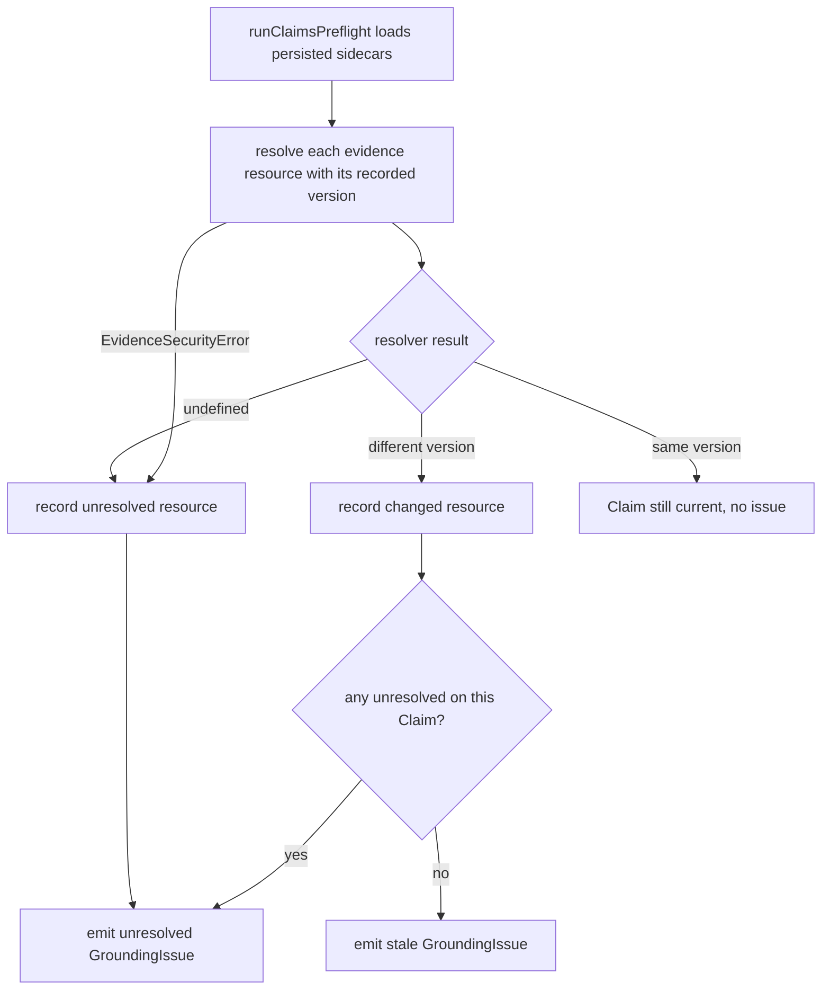
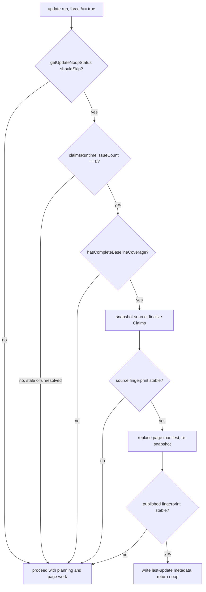
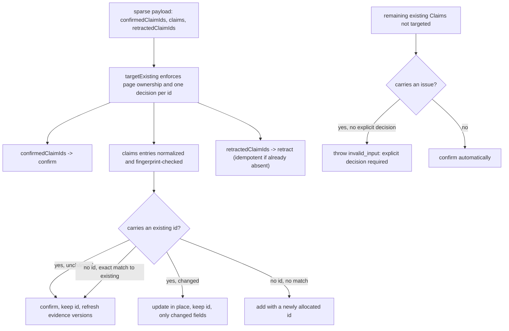
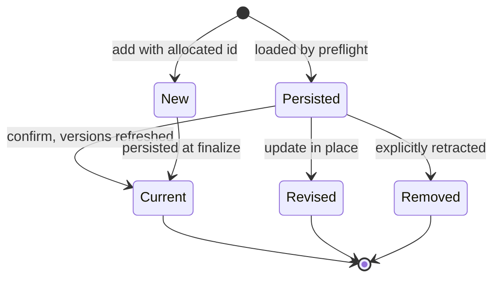

# Claims Reconciliation on Update

An OpenWiki update run does not blindly regenerate pages. Before the model is
invoked it first proves that the persisted [Claims](../concepts/grounded-claims.md)
still match current repository evidence, and when a page is (re)written it
reconciles the worker's **sparse Claim decisions** against the page's persisted
Claims rather than replacing them wholesale. Reconciliation is what lets
unchanged, issue-free propositions keep their stable identifiers and merely
refresh their code-owned evidence versions, while genuinely changed, new, or
removed propositions are updated, created, or retracted — and it forces every
stale or unresolved Claim to receive one explicit decision.

This page explains two connected mechanisms:

1. **Update no-op detection**, and how stale or unresolved Claims override an
   otherwise skippable run.
2. **Per-page Claim reconciliation**, the sparse decision payload the worker
   submits, and the confirm / update / add / retract rules
   `reconcilePageClaims` derives from it.

## Where evidence versions come from

Every persisted Claim carries one or more `evidence` records, each pairing a
canonical `resource` identity with an opaque, resolver-owned `version` token
observed when the Claim was established. Persisted sidecars validate both fields
as canonical non-empty strings, and each page sidecar also stores a
`pageVersion` hash of the Markdown it grounds.

The version token is deliberately opaque: reconciliation compares tokens for
equality but never interprets them. When source changes, the resolver returns a
different token for the same resource, which is how staleness is detected.

## Preflight: checking persisted evidence before any work

Update and resumed-init runs begin by running `runClaimsPreflight`, which loads
every persisted page sidecar and, for each Claim's evidence, resolves the
`resource` against the recorded `version` exactly once per preflight. Each
resource yields one of three outcomes:

- The resolver returns `undefined` — the evidence no longer resolves — and the
  resource is recorded as **unresolved**.
- The resolver returns a **different** version token — the source changed — and
  the resource is recorded as **stale** (`changed`).
- The resolver returns the **same** version token — the Claim is still current
  and produces no issue.

A Claim with any unresolved resource emits an `unresolved` `GroundingIssue`; a
Claim with only changed resources emits a `stale` issue. Resolution _errors_
propagate rather than being swallowed, so a transient failure is never mistaken
for deleted evidence — with one deliberate exception. A containment refusal
(`EvidenceSecurityError`) is permanent for the cited resource rather than
operational, so preflight catches it and records the resource as **unresolved**
instead of aborting the run. The resolver raises `EvidenceSecurityError` when an
evidence path traverses a symbolic link or filesystem alias outside the
repository root, so a Claim whose evidence crosses a symlink is reported as
unresolved and routed to the page worker for reconciliation rather than crashing
the whole update. Preflight also inventories orphan sidecars whose generated
Markdown pages no longer exist. Its issues are sorted deterministically by page,
kind, and claim id.

Preflight classifies each persisted Claim as current, stale, or unresolved; a
symlinked-evidence containment refusal is folded into the unresolved
classification so the worker can reconcile it.

## No-op detection and how stale Claims override it

Independently of Claims, `getUpdateNoopStatus` decides whether an update can skip
its model invocation. It refuses to skip when there is no previous update git
head, when the previous run was recorded as `interrupted`, when the requested
output language's primary subtag differs from the persisted wiki language's
primary subtag, when the working tree has meaningful changes, or when committed
changes since the last update touch source outside `openwiki/` and outside the
`openWikiIgnore` boundary. Changes that only touch generated wiki state or
ignored paths do not count as meaningful.

Because the CLI and `begin` reject unrecognized languages at the entry point,
`getUpdateNoopStatus` only ever receives a resolved-or-absent language. It still
runs the request through `requireResolvedLanguage` as a defensive boundary
check — which throws if an unrecognized value somehow slipped past an entry
point — before comparing primary subtags via `getPrimaryLanguageSubtag`. The
comparison is deliberately on the primary subtag (`zh` vs `zh-CN`), so a script
or region variant that keeps the same primary language is not treated as a
meaningful change, while a change of primary language is.

The repository run wires these signals together, and **Claims validation
precedes update no-op detection**. Before the no-op is even considered, the run
seeds the page manifest from the last successful git baseline and fast-forwards
coverage for unchanged pages, then computes `hasCompleteBaselineCoverage` —
true only when every initial page already has a manifest entry. A run is skipped
only when all three hold: the Git-based preflight says `shouldSkip`, the Claims
runtime reports `issueCount === 0`, **and** baseline coverage is complete. A
`force` request bypasses the whole gate and always proceeds to planning.

A clean Git status therefore cannot hide stale or unresolved grounding state —
if preflight found any stale or unresolved Claim, the run proceeds even on an
otherwise unchanged tree. The same is true of incomplete baseline coverage: a
legacy page lacking a manifest entry is routed to full review rather than
promoted by the no-op.

When all three conditions hold, the no-op path still proves its own stability
before returning. It snapshots the current source, finalizes Claims (refreshing
sidecars), and snapshots the source again; only if the fingerprint is unchanged
does it replace the page manifest with the stable checkpoint and snapshot once
more. Only if that published fingerprint still matches does it rewrite the
last-update metadata and return a `noop` result. Any concurrent source drift
falls out of the no-op and the run proceeds to planning instead.

Stale or unresolved Claims, and incomplete baseline coverage, override an
otherwise skippable update.

## Turning issues into required page jobs

When a run does proceed, unresolved and stale issues become mandatory work.
During plan normalization, `addRequiredClaimIssueJobs` groups outstanding
grounding issues by page and, for any page the planner did not already schedule
(and did not delete), inserts a pending page job. Its seed paths are derived from
the issue resources — each evidence URI is stripped of its `repo://` scheme and
`#Lx-Ly` fragment — so the worker rereads exactly the sources whose evidence
moved. A stale or unresolved marker is thus treated as a requirement to recheck
current source, not as an instruction to retract the affected Claim
automatically.

## The page-worker assignment: what the worker is told

Each page job is dispatched through `nextRepositoryPage`, which finds the first
pending job without reserving or mutating it and enriches it with compact
Claims context. Beyond the page path, title, purpose, seed paths, related pages,
and instructions, the pending job carries:

- `mode` (`init` or `update`) and `existing` (whether the Markdown page already
  exists on disk),
- `existingClaimCount` — the number of persisted Claims currently owned by the
  page, and
- `claimsRequiringAttention` — the page's Claims that carry a stale or
  unresolved issue, projected without opaque evidence versions.

The page-worker prompt renders the last two directly: it states how many Claims
the page currently owns and lists the issue-bearing Claims that require an
explicit decision in this job. Issue-free Claims are **not** repeated in the
assignment; the worker is told they exist and will be retained automatically.

When a worker needs the stable ids of otherwise-current issue-free Claims — for
example, to intentionally revise or remove a Claim whose prose it is editing —
it calls the on-demand `inspect_claims` tool, backed by
`inspectRepositoryPageClaims`. That function returns the complete compact Claim
set (statements and evidence resources, without opaque versions) for the
current pending page only, and throws `invalid_state` if the requested job is
not the current pending one. Ordinary focused updates that leave issue-free
Claims untouched should not call it.

## Per-page reconciliation: the sparse decision payload

When a page worker submits its finished page, it calls the `submit_page` tool,
whose schema (`ClaimReconciliationSchema`) accepts three optional sparse fields
that together form a `ProposedPageClaimReconciliation`:

- `confirmedClaimIds` — existing Claims explicitly rechecked and retained
  without content edits,
- `claims` — revised existing Claims (carrying an `id`) and genuinely new
  Claims (without an `id`), and
- `retractedClaimIds` — existing Claims explicitly removed from the page.

The worker declares only the sparse decisions its edits require; it does not
repeat issue-free Claims. The repository run validates the page's front matter
(repairing it deterministically first), then calls `reconcilePageClaims` with
that sparse payload. `reconcilePageClaims` diffs the payload against the page's
inspected Claims and derives the confirm, update, add, and retract operations.
After applying them through the session it persists the page's dirty Claim state
via `finalize` and proves durability with `assertPageClaimsDurable` before the
job is recorded complete and the queue advances; any failure in that block is
wrapped in a `RepositoryRunError` with `invalid_input`.

The per-page `finalize` call excludes the pages still owned by **other pending
jobs** (`otherPendingPages`). A concurrent worker may be mid-edit on those
pages, so projecting a verification stamp into their front matter or rehashing
their sidecar here would record transient bytes; their own `submit_page` (or the
final `finish`) finalizes them. Only the submitted page is durably proved at
this point; the strict whole-run proof waits until every job is complete.

The shared rules the worker must follow — stale or unresolved markers require an
explicit decision, omitted issue-free Claims are retained, the final page body
and reconciled Claim set must agree — are codified in
`CLAIMS_RECONCILIATION_GUIDANCE`, the model-facing standard embedded in both the
native agent page-worker prompt and the MCP host instructions.

### How a proposal is normalized and matched

`reconcilePageClaims` inspects the page's current Claims and builds an id index.
It then processes each sparse field in turn through one `targetExisting` helper
that enforces cross-field ownership and single-decision discipline:

- Every `confirmedClaimId` resolves to an existing page Claim and becomes a
  `confirm` operation.
- Each entry in `claims` is normalized by `normalizeProposedClaim`: the
  statement is trimmed, and each evidence `resource` is trimmed, deduplicated,
  and sorted so evidence is compared as an order-independent set. A proposal
  whose statement-plus-evidence fingerprint collides with an earlier proposal
  in the same payload is rejected as a duplicate.
- Each `retractedClaimId` resolves to an existing page Claim and becomes a
  `retract` operation.

`targetExisting` looks up the id in the page's existing Claims and throws
`invalid_input` when the id is not owned by the page. It also records every id
it hands out in a `targetedExistingIds` set and throws `invalid_input` when the
same id is targeted a second time across any field — so a Claim cannot receive
both a confirm and a retract, nor appear twice in `claims`.

Retraction is delete-like and idempotent: a `retractedClaimId` that the page no
longer owns (and that no page in the session owns) is silently skipped, so a
retry after the first submission reached durable persistence but failed later
checkpointing remains safe. Unknown confirm and update ids remain strict.

### The reconciliation rules

Once the explicit fields are processed, `reconcilePageClaims` walks every
existing page Claim not yet targeted:

- If the Claim carries an issue (stale or unresolved) and was not given an
  explicit decision, the call throws `invalid_input` — every issue-bearing Claim
  shown in the job must receive exactly one explicit confirm, update, or
  retract.
- Otherwise the Claim is **confirmed automatically** and added to the operation
  list. This is how omitted issue-free Claims are retained without the model
  repeating them.

Mapping each explicit field to its operation:

- **Confirm.** A `confirmedClaimId`, a `claims` entry that reuses an existing id
  with unchanged statement and evidence, or an id-less `claims` entry whose
  content exactly matches an existing Claim becomes a `confirm`. The Claim keeps
  its stable id, and confirming re-resolves its evidence so the persisted version
  tokens are refreshed to current source.
- **Update in place.** A `claims` entry that reuses an existing id but changed
  its statement, evidence, or both becomes an `update` carrying only the fields
  that actually changed. The id is preserved.
- **Add.** A `claims` entry with no id and no exact existing match becomes an
  `add`; OpenWiki allocates a fresh, globally unique identifier for it.
- **Retract.** A `retractedClaimId` (or the final fallback for an unmatched
  Claim that received no other decision) becomes a `retract`. Explicitly naming a
  Claim in `retractedClaimIds` is how it is removed; omitting an issue-free
  Claim does **not** retract it.

Before applying, `reconcilePageClaims` enforces a non-empty-result guard: a
completed factual page must retain or establish at least one material Claim, so
retracting every existing Claim while adding none is rejected. It then forwards
the derived operations to the session's `resolveClaims`.

How `reconcilePageClaims` maps a sparse decision payload onto confirm, update, add, and retract, and auto-confirms omitted issue-free Claims.

### Behavior confirmed by tests

The reconciliation contract is pinned by focused tests in
`test/generation/page-jobs.test.ts`: one call that omits one issue-free Claim,
revises another by id, adds a third without an id, and retracts an omitted one
produces exactly that outcome with stable ids preserved; an empty payload
preserves every current statement without model round-tripping; a worker cannot
paraphrase an omitted unchanged Claim while adding another; a stale Claim
omitted from the payload is rejected until it receives an explicit decision;
duplicate sparse proposals are rejected; conflicting decisions on the same id
are rejected; a factual page left with zero final Claims is rejected; an
already-absent retraction is an idempotent retry; fingerprint delimiters
(`\u0000`) do not conflate distinct Claims; a proposal or retraction naming
another page's id is rejected; and a mid-batch evidence resolution failure
leaves session state unchanged.

## Applying operations atomically

`reconcilePageClaims` forwards its derived operations to the session, which routes
them through `applyClaimOperations` — the generic, all-or-nothing mutation
boundary. It validates every operation first, rejects unknown ids and any id
targeted more than once in a batch, and resolves all evidence for `add`, `update`
(evidence change), and `confirm`/`update`-retained evidence _before_ touching a
cloned working set. `confirm` and `update`-without-evidence re-resolve the
Claim's current resources, which is precisely what refreshes their version
tokens. Because mutations run against a clone and are only returned on success,
a resolution failure mid-batch leaves session state unchanged.

Lifecycle of a page Claim across one reconciliation pass. Only an explicit retract removes a Claim; omitting an issue-free Claim confirms it.

## Durability at page completion

Durability is enforced at two points. When a page worker submits its finished
page, the run calls `finalize` with the run's `startedAt` timestamp and then
`assertPageClaimsDurable` for that page before recording the job complete and
advancing the queue. When the whole queue is finished, `finishRepositoryRun`
calls `finalize` and `assertRepositoryClaimsDurable` once more for the
whole-run proof.

`finishRepositoryRun` guards the finish path with a **skipped-snapshot
validation**: before any work, it requires exactly one page snapshot for every
skipped page job, matched by job id and path, and throws an `invalid_state`
error if a skipped job lacks its original snapshot. The skipped page paths form
the `skippedPages` set that flows into both `finalize` and
`assertRepositoryClaimsDurable`.

### Snapshot restore precedes claims finalization

The finish path runs its steps in a deliberate order:

1. Apply abandoned-page deletions, planned deletions, and deleted-claim-page
   reconciliation.
2. `finalizeWikiArtifacts` — the deterministic index/concept wiring using the
   session's current evidence map.
3. **Restore each skipped page's Markdown** from its snapshot — reverting
   skipped pages to their pre-run content.
4. `finalize` and `assertRepositoryClaimsDurable` with `skippedPages` — the
   Claims persistence and whole-run durability proof run **after** the snapshot
   restore, so skipped pages are excluded from persistence but their restored
   Markdown is already in place when the durability proof reads the working
   tree.
5. **Restamp the page manifest** — only pages the current run actually
   regenerated are restamped with this run's source checkpoint; skipped and
   untouched pages retain their prior checkpoint (see below).

This ordering matters because `assertRepositoryClaimsDurable` discovers current
pages from the working tree: by restoring skipped-page Markdown first, the
durability proof does not mistake a skipped page's absent Markdown for a
missing page and fail the run.

`finalize` accepts an `excludedPages` set (empty by default) and skips every
page it names across all of its work, so callers can exclude pages whose
Markdown was not regenerated. The per-page submit path omits it. The finish
path passes the set of skipped page paths as `excludedPages`, and passes the
same set to `assertRepositoryClaimsDurable`, so skipped pages are excluded from
both final Claims persistence and the whole-run durability proof.

### Restamping only regenerated pages

The manifest restamp at the end of `finishRepositoryRun` no longer stamps every
surviving page with the current run's source checkpoint. Before restamping, the
finish path computes a `producerActorsByPage` map by reading the existing page
manifest and keeping only entries whose `completedRunId` equals the current
run's id — that is, exactly the pages this run actually regenerated (each
recorded by `recordRepositoryPageCompletion` with `run.state.runId`). The
regenerated-page set becomes the only set restamped with
`getRepositoryRunSourceCheckpoint(run.state)`.

Every other tracked page falls into a `preserveSourcePages` set and keeps its
prior checkpoint through `replaceRepositoryPageManifest`'s
`preserveSourcePages` branch: a page this run did not (re)complete — formally
skipped, left untouched because it was outside this run's plan, or already
durable from an earlier run — retains its previous `gitHead` and
`sourceFingerprint`, and its `completedBy`/`completedRunId` provenance is carried
forward unchanged. Because deterministic finalization (`finalizeWikiArtifacts`)
may still rewrite code-owned metadata on such a page, the restamp re-proves the
final Markdown/Claims pair and compares the resulting `pageVersion` against the
prior entry; only if the page bytes actually changed is a refreshed entry
written, otherwise the exact prior entry is retained. A page with no prior
coverage is best-effort seeded from its current durable state, and a seeding
failure is swallowed so a page the run never touched cannot fail the whole run.

Within a regenerated page, finalization persists only pages whose Claim state
actually changed (`dirty`), refuses to persist a page that still carries
unresolved evidence debt, and rechecks every dirty page's evidence against
current source and re-hashes its Markdown before writing the sidecar. Orphan
and deleted-page sidecars are removed in the same pass. This is the point at
which refreshed evidence versions become durable, so a subsequent update's
preflight sees current tokens and can correctly report the page as no longer
stale. A run that finishes with skipped pages (or any detected source drift)
records itself as `interrupted` rather than `complete`, so the next update
resumes rather than no-ops.

## Related pages

- [Grounded Claims](../concepts/grounded-claims.md) — the Claim model, evidence
  resolution, and the store/session/runtime split.
- [Repository Generation](./repository-generation.md) — the init/update
  lifecycle that hosts planning, page workers, and finalization.
- [Source Map](../architecture/source-map.md) — where these modules live in the
  codebase.
