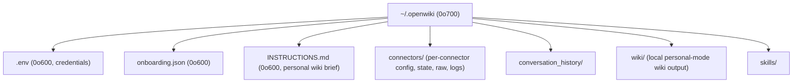
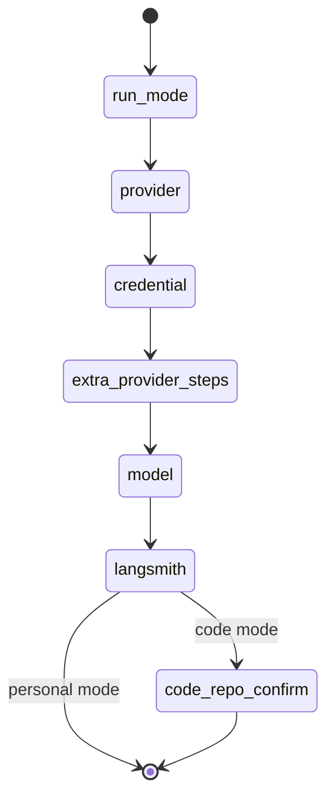

# Onboarding and Setup

OpenWiki's first run walks the operator through a short wizard that resolves a
model provider, collects the credentials that provider needs, chooses between the
two run modes (Personal vs. Code), captures a wiki brief, and — for code mode —
bootstraps the target repository. All non-secret onboarding state and all secret
credentials live under a single per-user state directory (`~/.openwiki` by
default). This page documents the setup flow, its persisted artifacts, and the
directory's contents and permission model.

Related concepts: [Model Providers](../concepts/model-providers.md),
[Two Modes](../concepts/two-modes.md). Related operations:
[CLI Reference](../operations/cli-reference.md),
[Configuration](../operations/configuration.md).

## The `~/.openwiki` state directory

The state directory root is resolved once at process start. By default it is
`~/.openwiki`, but the `OPENWIKI_CONFIG_DIR` environment variable overrides it;
the override supports a leading `~` (expanded to the home directory) that several
environments leave literal. When the override is unset the display path is shown
as the literal `~/.openwiki`, otherwise the resolved absolute path is shown.

`ensureOpenWikiHome()` creates the directory tree and enforces its permissions on
every access: the home directory and each managed subdirectory are created with
mode `0o700`, the home directory is `chmod`ed to `0o700` if it already existed,
and `restrictDirToCurrentUser` applies the Windows ACL equivalent so the
directory is owner-only on every platform.

The managed layout is:

Layout of the `~/.openwiki` state directory and the mode of each managed entry.

`connectors/<id>` is created per connector by `ensureConnectorHome`, which also
validates the connector id against `^[a-z][a-z0-9-]{0,63}$` and creates `raw/`
and `logs/` subdirectories at `0o700`. Reads from a connector's `raw/` directory
are constrained by `resolveConnectorRawPath`, which rejects any relative path that
would escape the connector's raw directory.

## Credentials and the `.env` file

Provider credentials and model configuration are written to `~/.openwiki/.env`
(the env directory is the home directory itself). `saveOpenWikiEnv` merges an
update map into the existing file and persists it with the following invariants:

- Writes are serialized through an internal queue so concurrent saves cannot
  interleave, and a failed save resets the queue so later saves are not blocked
  behind a rejected promise.
- The file is written to a temp file in the same directory (`0o600`) and then
  atomically `rename`d into place, so a crash mid-write cannot truncate the
  existing credential file and lose saved tokens/keys.
- Empty values are dropped rather than persisted as `KEY=""`, so skipping an
  optional key (e.g. LangSmith) leaves it genuinely unset; this also self-heals
  empty values left by earlier writes.
- A key exported in the launch shell wins at runtime, so `saveOpenWikiEnv` does
  not mask a shell export in `process.env`; the saved value is only the fallback
  used when the shell variable is unset.

The wizard's persistence layer is split: `buildCredentialEnvUpdates` is a pure
function that computes which env keys to write from the values the wizard
collected (provider, primary credential, base URL, secret key, region, GCP
project/location, model id, reasoning effort, and LangSmith key), performing no
IO; the caller persists the result via `saveOpenWikiEnv`. The provider key is
written only when it differs from the current environment, so re-running setup
with the same provider does not churn the file. A LangSmith key toggles tracing:
a non-empty key also sets `LANGCHAIN_PROJECT=openwiki` and
`LANGCHAIN_TRACING_V2=true`, while a blank input sets `LANGCHAIN_TRACING_V2=false`
so tracing is explicitly disabled rather than silently left on.

## Setup wizard steps

The setup UI is a thin composition root (`InitSetup`) that renders a view driven
by a controller state machine. The steps that apply to a given provider and run
mode, in walk order, are produced by `orderedSetupSteps`: an optional run-mode
chooser, the provider selection, the provider's primary credential step, any
provider-specific steps (secret key, GCP project/location, base URL, region),
then the model step, the LangSmith step, and finally — only in code mode — a
`code-repo-confirm` step.

The primary credential step is chosen per provider by `credentialStep`: OAuth
providers use `oauth-login`, AWS-SDK providers have no in-wizard step (they are
handled via AWS credentials), external-CLI providers use `external-cli-auth`,
API-key providers use `api-key`, and keyless providers that require a GCP project
use `gcp-project`.

Ordered setup steps for code vs. personal mode as returned by orderedSetupSteps.

Two functions distinguish "which step to jump to" from "which steps exist".
`getInitialStep` is a skip-based waterfall that lands on the first unsatisfied
step (unless `walkAll`/`--init` forces starting at the top and walking every
applicable step even when already configured), whereas `orderedSetupSteps` and
`nextSetupStep` drive sequential forward navigation that can reach and re-edit an
already-satisfied step. `needsCredentialSetup` decides whether the wizard is
required at all: it returns true when the provider is invalid or missing any
credential/model/LangSmith input, and otherwise defers to whether onboarding is
complete for the mode.

## Onboarding config format and completion

Non-secret onboarding state is persisted as JSON at
`~/.openwiki/onboarding.json` (`OpenWikiOnboardingConfig`, `version: 1`). It
records `completedAt`, the run mode (`modeId`/`modeName`), configured source
instances, an ingestion schedule, optional macOS power-management settings, and
template metadata. `saveOpenWikiOnboardingConfig` writes it at mode `0o600` and
re-`chmod`s it to `0o600`. Reads go through `normalizeOnboardingConfig`, which
tolerates and repairs partial or legacy shapes: it accepts legacy `templateId`/
`templateName` as fallbacks for `modeId`/`modeName`, drops unknown connector ids,
migrates the legacy `sources` map into `sourceInstances`, lifts a per-source
schedule up to the top-level `ingestionSchedule`, and re-derives the legacy
`sources` map from the normalized instances.

The wiki brief (`wikiGoal`) is stored **outside** `onboarding.json`. On save the
config's `wikiGoal` is stripped from the JSON and written to a separate
`INSTRUCTIONS.md` file at `0o600`; on read it is re-attached by reading that file
back. Where `INSTRUCTIONS.md` lives depends on the mode (see below).

`isOnboardingComplete` treats onboarding as finished only when there is a
`completedAt`, a non-empty `wikiGoal`, and either the config is code mode or an
ingestion schedule is present. Synchronous variants read the state without async
IO: `isOpenWikiOnboardingCompleteSync` reads the personal-mode brief from
`~/.openwiki/INSTRUCTIONS.md`, while `isRepositoryCodeOnboardingCompleteSync`
first requires the config to be code mode and reads the brief from the target
repository instead.

## Code-mode repository bootstrap

In code mode the wiki brief is not stored in the home directory. When setup
completes for code mode, `saveRepositoryWikiInstructions` writes the brief to
`<repo>/openwiki/INSTRUCTIONS.md` (mode `0o644`, since it is committed alongside
the repo), and `onboarding.json` is saved with `wikiGoal` cleared. The target
repository defaults to the nearest ancestor of the working directory containing a
`.git` directory (`findNearestGitRepoRoot`), falling back to the current
directory when none is found.

Repository setup for a code-mode run is performed by `ensureCodeModeRepoSetup`,
invoked before both interactive/`--print` runs (in the CLI runner) and durable
repository runs (`beginRepositoryRun`). It:

- Refreshes the managed agent-instruction snippets in `AGENTS.md` and
  `CLAUDE.md`. Each file is created when missing and, when present, only the
  region between the `<!-- OPENWIKI:START -->` / `<!-- OPENWIKI:END -->` markers
  is replaced, so operator content outside the markers survives. Both files are
  prepared and validated before either is written, and malformed or duplicated
  markers abort the update with the file left unchanged. By default the
  `CLAUDE.md` managed block is deliberately minimal and just points to
  `AGENTS.md` via the `@AGENTS.md` import, so `AGENTS.md` stays the single
  canonical source of agent instructions.
- **Import-only CLAUDE.md preservation.** Two branches keep a forwarding
  `CLAUDE.md` intact. First, a `CLAUDE.md` whose trimmed content is exactly
  `@AGENTS.md` (the `CLAUDE_AGENTS_IMPORT` sentinel) is left entirely unchanged —
  `prepareCodeModeAgentSnippet` returns `nextContent: undefined`, so the file is
  neither created nor rewritten. This recognizes the common pattern of a
  `CLAUDE.md` that only forwards to `AGENTS.md` and keeps it as the operator
  wrote it. Second, `writeCodeModeAgentSnippets` calls `resolvesToSameFile` to
  detect when `CLAUDE.md` and `AGENTS.md` resolve to the same file on disk
  (e.g. `CLAUDE.md` is a symlink to `AGENTS.md`, sharing inode and device). In
  that case the `@AGENTS.md` import would point the file at itself, so the
  `CLAUDE.md` snippet instead carries the full instructions inline — the same
  snippet written into `AGENTS.md` — rather than the minimal pointer. A
  `CLAUDE.md` that is neither the bare import nor the same file as `AGENTS.md`,
  but contains marker regions or any other content, is refreshed in place like
  `AGENTS.md`.
- Creates the scheduled-update GitHub Actions workflow
  (`.github/workflows/openwiki-update.yml`) **only** when `createWorkflow` is set,
  which is the case only for the `init` command. `--update` and chat runs leave
  an existing workflow alone, and even under `init` the workflow is written only
  when it does not already exist, so operator customizations (fork guards, pinned
  actions, custom steps) are never silently overwritten.

Before `beginRepositoryRun` touches the repository it also validates the
requested `--language` value: an unrecognized tag is rejected up front (via
`resolveLanguage`) rather than silently defaulted to English. This matters for
setup because a wrong language would be persisted in durable run state, and a
later resume refuses to change a started run's language — so the typo could not
be corrected without deleting OpenWiki's own state files.

The generated workflow (`createCodeModeWorkflow`) emits a `workflow_dispatch`-
plus-scheduled GitHub Actions job whose `name:` is `OpenWiki Update`, gated by
`permissions: contents: write` and `pull-requests: write`. It runs `openwiki code
--update --print` on a cron schedule (default `0 8 * * *`), then opens a pull
request scoped to `openwiki`, `AGENTS.md`, `CLAUDE.md`, and the workflow file
itself. Key invariants of the emitted template:

- **Pinned actions.** All third-party actions are pinned to commit SHAs (with a
  `# vN` version comment): `actions/checkout@34e1148…` (v4),
  `actions/setup-node@49933ea…` (v4, Node 22), and
  `peter-evans/create-pull-request@22a90890…` (v7), so a re-run is reproducible
  even if a tag is moved. The OpenWiki binary itself is installed as
  `openwiki@${OPENWIKI_VERSION}`, the version baked in at build time.
- **Full-history checkout.** `actions/checkout` is called with `fetch-depth: 0`
  so the update can diff `HEAD` against the commit it last documented; a shallow
  clone would hide that commit and run against an empty change summary.
- **Mermaid/jsdom install note.** The install step runs
  `npm install --global openwiki@${OPENWIKI_VERSION} mermaid@11.16.0 jsdom@29.1.1`
  and carries an inline comment noting that `mermaid` + `jsdom` are optional and
  add high-fidelity Mermaid diagram validation, and may be removed for repos with
  no diagrams.
- **Provider env injection.** The `Run OpenWiki` step's `env:` block is the
  derived provider block from `createWorkflowProviderEnv` (below) plus the
  `OPENWIKI_LANGSMITH_API_KEY` (for the LangSmith code-mode pull, with a comment
  pointing to `OPENWIKI_LANGSMITH_API_KEY_2/_3` for extra workspaces) and the
  optional `LANGSMITH_API_KEY`/`LANGCHAIN_PROJECT`/`LANGCHAIN_TRACING_V2`
  tracing triple.
- **Transient-state cleanup and PR-before-failure.** The OpenWiki step sets
  `continue-on-error: true` so a page-level failure does not abort the job. A
  `Remove transient OpenWiki run state` step (`if: !cancelled()`) deletes
  `openwiki/.run.json`, and the `Create OpenWiki update pull request` step (also
  `if: !cancelled()`) always opens the PR, preserving the pages completed before
  a failure as the baseline for the next run. A final `Propagate OpenWiki
  failure` step (`if: steps.openwiki.outcome == 'failure'`, `run: exit 1`) then
  turns the job red so the failed run is visible, while the PR with partial
  progress still goes through.

The provider `env:` block is derived from the provider the operator configured
during setup (`createWorkflowProviderEnv`): the `OPENWIKI_PROVIDER` line names
it, secrets are wired through `${{ secrets.* }}`, non-sensitive settings (base
URL, GCP project, region) through `${{ vars.* }}`, and OAuth providers emit a
comment noting that browser login has no unattended equivalent instead of
pinning a short-lived, rotated token. The model id is quoted (some IDs, e.g.
Cloudflare Workers AI's leading `@`, are not plain YAML scalars), defaulting to
the operator's choice or the provider's first suggested model; an opted-in
`OPENAI_COMPATIBLE_STREAMING` transport override is propagated so a SSE-only
gateway does not commit a blank wiki unattended.

Repository content the doc agent must not read or edit is governed by a
gitignore-style `.openwikiignore` file loaded via `OpenWikiIgnore.load`. Rules
are applied in file order with last-match-wins semantics (a later `!` rule can
re-include an excluded path), and matching is case-insensitive so an
alternate-cased spelling cannot bypass an exclusion on case-insensitive
filesystems.

## Non-interactive credential gate

For non-interactive runs (`--print` or no TTY) OpenWiki cannot open the wizard,
so `resolveStartupCommand` fails fast with an actionable error when the
configured provider is missing a required credential, telling the operator to run
in an interactive terminal to save credentials. Interactive chat likewise
requires a TTY. One exception exists: a clean `update --print` run that would be a
no-op can skip the credential requirement, because there is nothing to generate.
