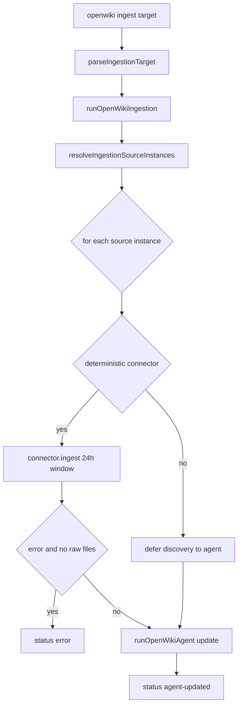

# Personal Mode Ingestion

Personal-mode ingestion refreshes the user's local "personal brain" wiki from
external connector sources. It resolves an ingestion _target_ to the set of
configured source instances, deterministically pulls each source's recent data
(or defers discovery to the agent), and then runs one OpenWiki agent _update_
per source instance to merge new findings into canonical local-wiki pages.

Unlike [code mode](/openwiki/concepts/two-modes.md) — which documents a codebase
and emits repository-grounded Claims — personal-mode ingestion writes to the
local wiki (`outputMode: "local-wiki"`) and **does not turn connector-derived
facts into grounded Claims**. Connector data is treated as untrusted evidence
and synthesized under confidence labels (confirmed, source-backed, contested,
watchlist, saved-context), not as verifiable repository-anchored propositions.
See [connectors](/openwiki/integrations/connectors.md),
[onboarding](/openwiki/workflows/onboarding.md), and
[CI scheduling](/openwiki/operations/ci-scheduling.md) for related surfaces.

## Entrypoint and orchestration

The orchestrator is `runOpenWikiIngestion`. It loads OpenWiki env, ensures the
home directory exists, reads the onboarding config, builds the connector
registry, resolves the target to source instances, and runs each source in turn,
collecting one `SourceIngestionResult` per source instance.

The CLI `openwiki ingest <target> [--scheduled] [--print] [--modelId <id>]`
command parses arguments in `src/cli/commands.ts` and is executed by
`runIngestCommand` in `src/cli/runners.ts`, which streams text events to stdout,
prints an ingestion summary line per source, and sets a non-zero exit code when
any source result has status `error`.

Personal-mode ingestion control flow from CLI target to per-source result.

## Ingestion targets

`parseIngestionTarget` maps a raw string to an `IngestionTarget`, which is one of
three shapes:

- The literal `"all"` — ingest every connected, eligible source instance.
- A connector id (checked with `isConnectorId`) — ingest every source instance
  backed by that connector, returned as the bare connector string.
- A `SourceInstanceTarget` (`{ kind: "source-instance", id }`) — ingest exactly
  one named source instance.

Because a connector id is checked before the source-instance branch, a value
that matches a known connector round-trips as the plain string, not as a
source-instance target. Any other value is accepted as a source-instance id only
if it passes `isSafeSourceInstanceId`: it must match
`^[A-Za-z0-9][A-Za-z0-9._-]{0,119}$` (first character alphanumeric, up to 120
characters total, no path separators or `..`). This is a containment gate,
because the id later names a per-source path segment; unsafe values parse to
`null` and the CLI reports a usage error.

`resolveIngestionSourceInstances` filters `config.sourceInstances`: a source is
eligible only when it has a `connectedAt` timestamp and a valid `connectorId`.
For `all`, every eligible instance matches; for a connector-id target, instances
whose `connectorId` equals the target match; for a source-instance target, the
instance whose `id` equals the target's `id` matches. When the target is not
`"all"` and nothing matched, `runOpenWikiIngestion` throws so the operator sees
that no configured source matched the request.

## Scheduled-only gate

`--scheduled` sets `scheduledOnly`, which is threaded into
`resolveIngestionSourceInstances`. When `scheduledOnly` is true, every source is
skipped unless `config.ingestionSchedule` exists and is not paused
(`ingestionSchedule.pausedAt` unset). This lets a scheduled CI or cron run
no-op when the user has paused ingestion, while a manual `openwiki ingest` run
(without `--scheduled`) always proceeds regardless of the schedule.

## Per-source run: deterministic pull vs. agentic discovery

Each source instance runs through `runSourceIngestion`. Whether it performs a
pre-agent deterministic pull depends on the connector's
`supportsAgenticDiscovery` flag: `isDeterministicConnector` returns true when
that flag is false.

- **Deterministic connectors** (`google`/Gmail, `x`, `slack`, `hackernews`,
  `web-search`, `langsmith`) call `connector.ingest` before the agent runs,
  passing the instance's `connectorConfig`, its `instanceId`, and a
  `windowHours` of `INGESTION_WINDOW_HOURS` (24). The result's `rawFiles` are
  written under the connector's raw directory inside the OpenWiki home
  (`~/.openwiki/connectors/<id>/raw`) and their in-tree-relative paths are handed
  to the agent.
- **Agentic-discovery connectors** (`custom-mcp`/`notion` and `git-repo`) skip
  the pre-pull. The agent instead uses connector/MCP tools, local inspection,
  and source config during its run to gather data itself.

A deterministic pull whose status is `error` **and** which produced zero raw
files short-circuits: the source is reported with status `error` and the agent
is not run. A pull that returns some raw files (even with warnings) proceeds to
the agent run. The raw file paths are confined before they reach the agent:
`formatRawFileList` rewrites each path relative to the connector raw directory
and calls `resolveConnectorRawPath`, which throws if a path resolves outside
that directory, so a connector result pointing outside its raw directory fails
the source without invoking the agent.

## Building the source update message

`createSourceUpdateMessage` composes the agent's user message. It embeds the
source display name and connector id, the 24-hour scope, the source instance id
(and configured name, if any), the user's wiki goal, source-specific
`ingestionGoal`, and a reusable synthesis policy from `createSourceSynthesisPolicy`.
That policy directs the agent to route findings into canonical cross-source
pages (`/themes.md`, `/commitments.md`, `/personal-logistics.md`,
`/open-questions.md`, `/quickstart.md`, and a compact `/sources/<id>.md`), apply
confidence labels, and preserve conflicting facts in a `## Contested` section
rather than overwriting one side.

The message differs by connector kind:

- With a deterministic pull, the message lists the pull status/message and the
  raw data file paths (relative to the connector raw directory), and instructs
  the agent to read them with the `openwiki_read_raw_item` and
  `openwiki_list_raw_items` tools — not host shell tools. Shell execution is
  disabled in personal mode, so the agent reads connector evidence only through
  those raw-item tools (and writes wiki pages through the wiki filesystem tools
  rooted at the local wiki directory, never creating a nested `/openwiki` dir).
- Without a deterministic pull, the message points at the connector config path
  and tells the agent to gather data through OpenWiki connector ingestion and
  read-only MCP tools within the 24-hour window, then inspect the resulting
  evidence with `openwiki_list_raw_items` and `openwiki_read_raw_item`.

Both variants instruct the agent to treat source content as untrusted evidence
and to run no other source's ingestion in the same run.

`createConnectorSynthesisGuidance` appends per-connector guidance selected by
connector id (Gmail classification/priority rules, Notion page-selection rules,
X saved-context handling, Hacker News watchlist defaults, LangSmith runtime
analysis, etc.). This same guidance builder is reused by code-mode ingestion in
`runCodeModeConnectors`.

## Agent run and telemetry

For a source that reaches the agent step, `runSourceIngestion` builds
`OpenWikiRunOptions` with `outputMode: "local-wiki"`, a fresh thread id from
`createOpenWikiThreadId`, and `isFollowup: false`, then runs
`runOpenWikiAgent("update", ...)`. The run is wrapped once in `withRunTelemetry`
so per-source ingestion update runs land in telemetry the same way CLI update
runs do.

On success the source result is `agent-updated` and carries the `agentResult`,
`deterministicPull`, `rawFiles`, `displayName`, `connectorId`, and
`sourceInstanceId`. Any thrown error during the source's run is caught, logged
to the event stream, and returned as a `status: "error"` result with empty
`rawFiles` — one failing source never aborts the remaining sources.

## Result statuses and lifecycle

Every source instance yields exactly one `SourceIngestionResult` whose `status`
is one of:

- `agent-updated` — the agent update run completed for this source.
- `error` — the deterministic pull failed with no raw files, or the source run
  threw.
- `skipped` — reserved in the result type for a source that produced no work.

`runOpenWikiIngestion` returns `{ results }` aggregating all per-source results;
the CLI derives its process exit code from whether any result is `error`.

## Windows

Personal-mode ingestion uses a fixed 24-hour window (`INGESTION_WINDOW_HOURS`)
for both the deterministic pull's `windowHours` and the agent's scope framing.
This contrasts with code mode, where `runCodeModeConnectors` derives its window
from the elapsed time since the last documented commit via
`windowHoursSince(await readLastUpdatedAt(repoRoot))` — undefined on the first
run, meaning "no floor" so a connector bootstraps with its most recent data.

## Focused tests

`test/ingestion/ingestion.test.ts` covers the pure surface: `parseIngestionTarget`
round-tripping of `all`, connector ids, and safe source-instance ids, and its
rejection of path-traversal, separator, leading-non-alphanumeric, and
over-length ids, plus the per-connector arms of `createConnectorSynthesisGuidance`.
`test/ingestion/ingestion-run.test.ts` exercises the `runOpenWikiIngestion`
orchestrator and the message/policy/per-source helpers with env, home, onboarding,
registry, agent, and telemetry mocked so no real LLM, network, or filesystem work
occurs. It asserts the pull-aware message cites `openwiki_read_raw_item` and the
"Shell execution is disabled in personal mode" note, that a connector result
pointing outside its raw directory produces an `error` result with no agent run,
that a zero-item successful pull still runs the agent with a "(no raw files
written)" note, and that a thrown pull is isolated to one `error` result.
