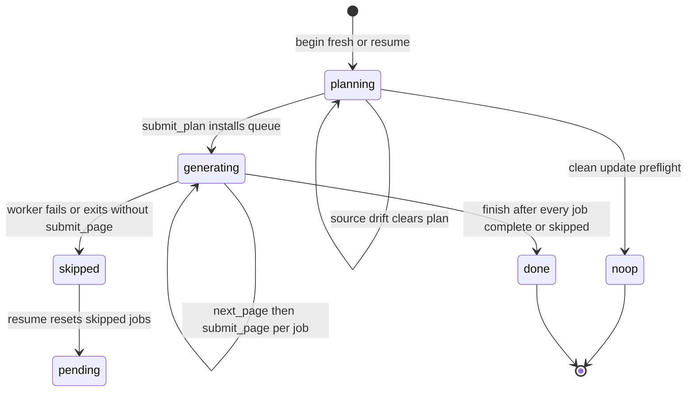

# Repository Generation Lifecycle

Repository generation is a resumable, checkpointed workflow that turns a Git
repository into a grounded OpenWiki. It is expressed as a small transport-neutral
core in `src/generation/` that owns durable state, and two thin drivers — a
native agent runner and a host/MCP adapter — that call the same six operations.
The core is the source of truth for ordering, durability, and failure semantics;
the drivers only supply models, prompts, and transport.

## The six-operation lifecycle

The whole workflow is six operations, each a function in
`src/generation/repository-run.ts`:

- `beginRepositoryRun` — start a fresh durable run or reconstruct an interrupted
  one, or prove that a clean update needs no work.
- `submitRepositoryPlan` — validate, normalize, and durably install the ordered
  page queue, moving the run from `planning` to `generating`.
- `nextRepositoryPage` — read the first pending job without reserving or mutating
  it, or report queue completion.
- `inspectRepositoryPageClaims` — on-demand, return the current pending page's
  complete Claim set without opaque evidence versions. This is the only
  non-mutating lifecycle operation; normal focused updates do not need it because
  `next_page` already surfaces issue Claims and issue-free Claims are retained
  automatically. A worker calls it only before intentionally revising or removing
  otherwise-current content, so it can reuse the owning Claim ids.
- `submitRepositoryPage` — repair the page's front matter, reconcile the page's
  sparse Claim decisions, persist and prove the page's Claims durable, then mark
  that job complete.
- `finishRepositoryRun` — run deterministic deletion, indexing, provenance,
  Claims finalization, and metadata persistence, then remove the checkpoint.

The host adapter surfaces these under stable protocol names
(`openwiki_begin`, `openwiki_submit_plan`, `openwiki_next_page`,
`openwiki_inspect_page_claims`, `openwiki_submit_page`, `openwiki_finish`).
`inspectRepositoryPageClaims` is restricted to the current pending job: any other
job id is rejected with `invalid_state`, so a worker can never inspect a page it
does not own.

Lifecycle phases and per-job status transitions of one repository-generation run.
A `skipped` job is not a terminal run state — resume resets it to `pending`.
Source drift during finish finalizes the wiki and records a later update due rather than resetting to planning.
`inspect_page_claims` is an on-demand read inside `generating` and does not
appear here because it changes no phase or job status.

## Durable run state: openwiki/.run.json

A run's entire resumable state lives in a single JSON checkpoint,
`openwiki/.run.json`, whose basename and schema version are fixed constants. The
checkpoint carries the run's identity (`runId`, `mode`, `phase`), resolved
language, the pre-run page inventory (`initialPages`), the source fingerprint,
planning context, the stable actor, prior successful metadata, a pre-run content
snapshot, serialized wiki-preparation state, and — once installed — the ordered
`plan`.

The checkpoint is loaded and schema-validated on read; a malformed checkpoint
raises `invalid_state` rather than being silently discarded, so resumable work is
never thrown away by accident. Writes are atomic: state is written to a
per-process temporary file with an exclusive-create flag and then renamed over
the target. The checkpoint is removed idempotently only after successful
completion or an init rollback.

The in-memory `ActiveRepositoryRun` is only advanced after the next durable state
is written; every mutating operation writes `openwiki/.run.json` first and
replaces `run.state` afterward, so a crash never leaves memory ahead of disk.

## The durable ordered page queue

`submitRepositoryPlan` turns a proposed plan into a normalized `RepositoryRunPlan`
via `createRepositoryPlan`. Normalization canonicalizes and deduplicates page
paths, rejects reserved working pages, forbids a page being both generated and
deleted, and enforces mode-specific shape rules — init plans may not delete pages
and must include `/openwiki/quickstart.md`, and `/openwiki/quickstart.md` can
never be deleted. Each page becomes a `PageJob` with a fresh UUID `id` and
`status: "pending"`.

For update runs, the plan is augmented with jobs the planner omitted:
`addRequiredClaimIssueJobs` inserts reconciliation jobs for pages with unresolved
grounding issues, and `addRequiredRewriteJobs` inserts rewrite jobs for pages that
must change language. The queue is then deterministically sorted by code-unit
path order, with `/openwiki/quickstart.md` placed last so the navigation page is
generated after the domain pages it routes to.

The installed plan is the run's persisted ordered queue: jobs are consumed in
order, and completion is tracked per job. A duplicated `submit_plan` is tolerated
only if it describes the same semantic plan (compared while ignoring generated
job IDs and progress); a different plan against an already-installed queue is
rejected with `invalid_state`.

## Page completion is the durability boundary

`nextRepositoryPage` returns the first `pending` job enriched with the context a
worker needs to decide its work, but it does not reserve or mutate anything, so
it is safe to call repeatedly. The job carries `mode`, `existing` (whether the
target page already exists on disk), `existingClaimCount` (the page's current
Claim count), and `claimsRequiringAttention` — only the Claims that currently
carry a grounding issue. Issue-free Claims are intentionally _not_ returned here;
they are retained deterministically on submit, so a focused update never needs to
repeat them. When a worker must see the full set (to revise or remove
otherwise-current content), it calls `inspectRepositoryPageClaims` on demand. A
queue whose only remaining jobs are `complete` or `skipped` reports
`status: "complete"`.

`submitRepositoryPage` is where a page becomes durable, and it is strict about
ordering: only the current pending job may be submitted, an already-complete job
is idempotently acknowledged, and an unknown job id is `not_found`. Before
recording completion it requires the page's Markdown to be present and readable,
then deterministically repairs its front matter via `repairPersistedFile` (using
the run's resolved concept-type label) and rejects with `invalid_input` if the
repair cannot produce valid front matter. It then reconciles the page's sparse
Claim decisions into the process-local Claims session via `reconcilePageClaims`,
finalizes (persists) that Claim state, proves durability via
`assertPageClaimsDurable`, records the page completion in the manifest, and only
then writes a new checkpoint marking the job `complete`. Persisting the page's
Claims _before_ marking the job complete is what makes each page a self-contained
durability unit: a checkpoint whose job is `complete` is sufficient proof that the
page's Markdown and Claim sidecar agree.

`assertPageClaimsDurable` checks that a sidecar was persisted, that its page
version matches the current Markdown bytes, that a verification event was
projected into the page front matter, and that every expected Claim's statement
and evidence set match exactly. Because per-job completion is persisted, page
completion is the workflow's durability boundary and recovery unit: once the run
state is durable, already-completed pages are the recovery mechanism. An
interrupted run resumes by simply replaying `next_page`/`submit_page` for the
remaining pending jobs rather than restarting the whole wiki.

## Sparse Claim reconciliation on submit

`reconcilePageClaims` treats the worker's payload as **sparse** Claim decisions,
not a complete replacement set. Existing issue-free Claims omitted from every
field are confirmed automatically — the model never repeats their statements or
evidence. The three explicit fields are:

- `confirmedClaimIds` — existing Claims rechecked and retained without content
  edits.
- `claims` — revised existing Claims (carrying their `id`) and genuinely new
  Claims (without an `id`). A proposal whose `id` matches an existing Claim
  updates it when content changed, or confirms it when statement and evidence are
  unchanged. A proposal without an `id` that exactly matches an existing Claim
  confirms that Claim; otherwise it is added.
- `retractedClaimIds` — existing Claims explicitly removed.

A Claim that currently carries a stale or unresolved issue _must_ be named by one
of the three fields; if it is omitted, reconciliation rejects with
`invalid_input` so required grounding work cannot be skipped silently. Duplicate
proposed Claims, ids not owned by the page, conflicting decisions on the same id,
and proposals lacking evidence resources are all rejected as `invalid_input`.
Retraction is delete-like and idempotent: retraction of an id that is already
absent (for example, after a retry whose first submission reached durable
persistence) is tolerated, while unknown update/confirm ids remain strict. A
completed factual page must retain or establish at least one material Claim, so a
payload that would empty the page is rejected. This is why callers should reuse
ids for unchanged or revised Claims and omit ids only for genuinely new ones.

## Skipped pages: failing workers without losing progress

Not every page worker succeeds. A worker may throw a recoverable error, or it may
exit cleanly without ever calling `submit_page` (for example, because the model
stopped early). The lifecycle never lets such a worker leave partial Markdown or
Claims behind, and it never blocks the run from finishing — instead it marks the
job `skipped` and restores the page, deferring that page to a future run.

### Per-job status and when a worker is skipped

A `PageJobStatus` is one of `pending`, `skipped`, or `complete`. `skipped` is a
third durable per-job status, distinct from `complete`, that records "this page
was attempted, failed or abandoned, and was rolled back to its pre-worker state."

The native runner handles four failure modes inside `runPageAgent`, each of
which preserves the per-job durability guarantee differently:

1. **Non-fatal pre-submit error** — the worker throws a recoverable error before
   calling `submit_page`. The catch block calls `skipRepositoryPage` with the
   pre-worker snapshot, restoring the page and marking the job `skipped`.
2. **Exit without submit** — the worker returns cleanly without ever calling
   `submit_page` (for example, because the model stopped early). The post-loop
   guard calls `skipRepositoryPage` with the snapshot, same as above.
3. **Fatal pre-submit error** — a fatal submission failure (an error from
   `submitRepositoryPage` that is not a correctable `invalid_input`) is rethrown
   rather than skipped, because it signals a durable-invariant violation the
   worker cannot correct. `submit_page` rejections with `invalid_input` are by
   design returned to the worker as failed tool results so its loop stays active;
   only a non-`invalid_input` failure triggers a rethrow.
4. **Post-submit failure (durability guarantee)** — a worker that throws after
   `submit_page` succeeds does NOT get rolled back. The `submitted` flag is set
   before `submitRepositoryPage` returns, so the catch block checks
   `if (submitted) return null;` and the post-loop guard does the same — neither
   calls `skipRepositoryPage`, and the page stays durably complete. The page is
   already a self-contained durability unit: its Claims were persisted and proven
   durable by `assertPageClaimsDurable` before the job was marked `complete`, so a
   later failure cannot undo that durability. The test "keeps a durably
   completed page after a later worker failure" (the `pageWorkerPostSubmitFailures`
   harness field) verifies that `restoreCalls` stays zero and the page's status
   remains `complete`.

### Snapshot capture, skip, and restore

Before any model-owned work runs, the runner captures a `RepositoryPageSnapshot`
via `captureRepositoryPageSnapshot`, which records the current pending job id, the
page path, the pre-worker Markdown (or `null` if the page does not yet exist),
and the page's existing Claims sidecar (or `null`). Snapshotting is itself
strict: only the current pending job may be snapshotted, and the page must be
text (a snapshot of a non-text page rejects with `invalid_state`).

When a worker must be skipped, the runner calls `skipRepositoryPage` with that
snapshot. `skipRepositoryPage` verifies the caller still owns the current pending
job, then restores the page exactly: `restoreRepositoryPageMarkdown` writes back
the snapshot Markdown, or deletes the page if the snapshot had none, so the
worker's partial writes are discarded. The Claims sidecar is likewise restored —
written back if the snapshot had Claims, deleted otherwise. A fresh process-local
Claims runtime is rebuilt from durable state, `interrupted` last-update metadata
is written, and a new checkpoint marks the job `skipped` without advancing the
queue. `nextRepositoryPage` then sees the next `pending` job, so the run
continues with the remaining pages.

### Tolerant not-found handling on restore and deletion

Rollback and planned deletion tolerate a "not found" backend error so a missing
page never aborts the run. `restoreRepositoryPageMarkdown` deletes the page when
the snapshot Markdown is `null`; if the backend reports that the file is already
absent, that error is swallowed rather than thrown. `isNotFoundBackendError`
recognizes both the canonical `"file_not_found"` error code and the
human-readable `"Error: File '...' not found"` string that DeepAgents filesystem
backends return (issue #765), so rolling back a worker that never wrote its page
succeeds. The same tolerance applies to `applyAbandonedGeneratedPageDeletions`
(pages left over by a superseded plan) and `applyPlannedDeletions` (explicit
deletions in the plan): a not-found error during either deletion is ignored,
while any other backend error rejects with `invalid_state`.

### finish with skipped pages

`finishRepositoryRun` refuses to run while any job is `pending` (a `skipped` job
is allowed). The native runner collects every `RepositoryPageSnapshot` produced by
its page loop and passes them to `finishRepositoryRun` as `skippedPageSnapshots`.
Finish validates that the snapshots exactly cover the `skipped` jobs — the counts
must match and every snapshot's path must match its job's path — and rejects with
`invalid_state` otherwise.

After deleting abandoned pages, applying planned deletions, reconciling sidecars,
and finalizing wiki artifacts, finish restores each skipped page's Markdown from
its snapshot, so the finalized wiki reflects the pre-worker page rather than
partial worker output. It then finalizes Claims while excluding the skipped page
set and runs the whole-repository durability proof excluding those pages, so a
skipped page is never required to have durable Claims. If at least one page was
skipped or source changed during the finish window, finish writes `interrupted`
metadata instead of `complete` metadata, and then removes `openwiki/.run.json`
last as usual. The run therefore completes deterministically, but the persisted
`interrupted` status tells a later `begin` that work remains.

### Restamping only pages the run regenerated

Finish does not restamp every surviving page with the run's own source checkpoint.
Before finalization it reads the page manifest and builds `producerActorsByPage`
keyed by the pages whose manifest entry records `completedRunId === run.state.runId`
— that is, only the pages this run actually (re)completed. After Claims finalization
and the whole-run durability proof, finish partitions the surviving page inventory
into three sets:

- **Regenerated pages** (`producerActorsByPage` keys) are restamped with this run's
  source checkpoint — they earned new coverage by completing a job.
- **Skipped pages** are restored from their snapshots and, like other excluded
  pages, are not required to carry durable Claims; they keep their prior coverage.
- **Untouched pages** — pages outside this run's plan, or already durable from an
  earlier run — keep their prior source checkpoint via `preserveSourcePages`, so a
  disjoint run that touched an unrelated page never advances a neighbor's baseline.

`replaceRepositoryPageManifest` receives the run checkpoint for regenerated pages,
the `skippedPages` set, and the `preserveSourcePages` set. For a preserved-source
page it re-proves the final Markdown/Claims pair: if deterministic finalization
rewrote code-owned metadata (for example, repaired a broken internal link) the entry
refreshes its `pageVersion` to match the final durable bytes while keeping the prior
`gitHead` and `sourceFingerprint`; if nothing changed the exact prior entry is
retained. This is why a later `begin` sees the correct per-page update window: a
page a run did not regenerate is not advanced to this run's baseline, so a
subsequent update only re-evaluates it against its own prior checkpoint.

### Resume resets skipped jobs to pending

Because `skipped` is not terminal, resume treats it as work to retry. When
`begin` resumes a run whose plan contains any `skipped` job, it resets every
`skipped` job back to `pending` (`resetSkippedPages`) before reconstructing the
run. The reset is persisted as part of resume's state write, so a crash between
resume and the first `next_page` still leaves the job retryable. The next
`nextRepositoryPage` then returns that job as the current pending work, and the
runner re-runs a fresh worker for it.

## begin: fresh run, resume, and clean-update no-op

`beginRepositoryRun` resolves the requested language via `resolveLanguage`
_before anything else_, and an unrecognized language (a malformed tag or a
recognized-but-unregistered one such as `Korean`) is rejected with an
`invalid_input` `RepositoryRunError` before the repository is touched or any run
state is created. This happens first because falling back to English would
persist the wrong language in run state, and resume refuses to change a started
run's language — so a typo could never be corrected without deleting OpenWiki's
own state files. Both the native runner and the host adapter reach `begin` with
an unvalidated language string, so this gate is the single point that protects
both entry points.

After the language gate, `begin` ensures code-mode repository setup, then reads
`openwiki/.run.json`. If a checkpoint exists, it resumes; otherwise it starts
fresh.

For a fresh **update**, Claims preflight runs before Git-status no-op detection:
`begin` returns a `noop` view only when the working tree is clean, there are
zero grounding issues, _and_ every existing page has complete baseline coverage
in the page manifest — so a clean Git status alone cannot hide stale grounding
state or partial prior-run page coverage.

For a fresh **init**, the existing wiki is first replaced with a blank target via
a recoverable transaction that backs up `openwiki/`, preserves user-owned
`INSTRUCTIONS.md`, and installs SIGINT/SIGTERM handlers that restore the backup on
cancellation. Writing the checkpoint and the `interrupted` metadata is the
durability point; only after both are durable is the init backup committed, so
from then on partial pages — not the backup — are the recovery mechanism. If the
fresh path fails before commit, an init rollback removes any written state and
restores the previous wiki, while a failed update never deletes a successfully
written checkpoint.

Resume validates that the caller owns the durable run: a mode mismatch raises
`conflict`, and a requested language change is refused with `conflict` by
`requireResolvedLanguage`, which compares the resolved language against the
checkpoint's `state.language`. A different producer actor is _not_ a conflict —
resume carries the new actor forward along with the caller's current
`metadataModel` and planning context, so work can continue across producers
(everything except the original producer identity is updated). Because the
language gate ran first, an unrecognized resume language is already rejected at
the top of `begin`, so the interrupted run is never mutated by a typo.

## Resume on the same checkout and source-fingerprint invalidation

`createRepositorySourceSnapshot` (wrapped by `createRepositorySourceFingerprint`)
hashes every model-visible repository source input for the active plan — Git
HEAD, tracked and untracked source files, and porcelain status — while
excluding generated OpenWiki state and ignored paths. Git, stat, symlink, and
read failures reject, because the fingerprint is a correctness gate rather than
a hint.

The fingerprint makes resume safe only on the same checkout. When `begin` resumes
and the current fingerprint differs from the checkpoint's, the whole plan is
invalidated: the phase is reset to `planning`, the new fingerprint is stored, and
`plan` is deleted from the state. Plan absence — not fingerprint equality — is the
durable signal that new planning context may replace the prior context. Skipped
jobs are reset to pending before this drift check, but a source change always
wins: when source has drifted the plan is deleted regardless of skipped status.

`finishRepositoryRun` guards the same drift at both ends of its deterministic
window: it re-checks the fingerprint before doing any finalization and again
after Claims are finalized, closing the check/use race so source cannot change
midway. When source has drifted, finish does **not** raise a conflict or reset
the plan. It persists `interrupted` metadata (so a later `begin` sees work
remains), removes `openwiki/.run.json`, and returns `sourceChanged: true` so the
caller can inform the user that a later update reconciles the drift.

## finish: deterministic finalization

`finishRepositoryRun` refuses to run while any job is still `pending` (skipped
jobs are permitted and handled as above). Once the queue has no pending work, it
checks the source fingerprint before and after finalization to close the
check/use race. It then deletes pages abandoned by a superseded plan (never
touching `initialPages`), applies the plan's explicit deletions, reconciles
Claims sidecars for deleted pages, finalizes wiki artifacts (indexes and
provenance), restores any skipped pages, finalizes Claims (excluding skipped
pages), and proves the whole repository has no orphaned or partially durable
Claims via `assertRepositoryClaimsDurable` (also excluding skipped pages). It
then rebuilds the page manifest so that only pages this run actually regenerated
are restamped with this run's source checkpoint, while skipped and untouched
pages retain their prior checkpoint via `preserveSourcePages` (a
deterministic-finalization rewrite still refreshes `pageVersion`). It
then persists completion metadata — `interrupted` when any page was skipped or
source changed during the finish window, otherwise `complete` — and, last of
all, removes `openwiki/.run.json`. The checkpoint is deleted last on purpose:
every earlier failure leaves the run resumable so `begin` can reconstruct and
retry.

## One lifecycle, two drivers

Both entrypoints drive the identical durable core.

The **native runner** (`runNativeRepositoryGeneration`) begins the run with a
stable OpenWiki producer actor, then loops: it runs a bounded planning agent
when the phase is `planning`, runs one fresh non-delegating page worker per
pending job (each bounded to writing only its assigned page and calling
`submit_page`, with `inspect_claims` available on demand), and then calls
`finish`. The page loop collects a `RepositoryPageSnapshot` for every worker it
skips and passes them all to `finishRepositoryRun`. When `finish` reports
`sourceChanged: true`, the runner emits a user-facing message explaining that the
wiki was finalized without advancing the source checkpoint and a later
`--update` will reconcile the drift. Workers reuse the supplied model but keep no
repository-generation state beyond the durable core. The native runner captures
the snapshot _before_ each worker and restores it on non-fatal failure, so a
worker can never leave partial page content behind.

The **host integration** (`HostSessionManager`) exposes the same six operations
as the OpenWiki MCP tools, including `openwiki_inspect_page_claims`. It holds one
active `ActiveRepositoryRun`, requires the caller's `runId` to match before every
operation, serializes operations with a single-operation guard, and maps
lifecycle `RepositoryRunError` codes onto stable host-integration errors.
Because both drivers call `beginRepositoryRun`, `submitRepositoryPlan`,
`nextRepositoryPage`, `inspectRepositoryPageClaims`, `submitRepositoryPage`, and
`finishRepositoryRun`, they share the exact same ordering, durability boundary,
and source-fingerprint invalidation semantics. The host adapter does not, however,
participate in skipped-page handling: it calls `finishRepositoryRun` without
`skippedPageSnapshots`, so a skipped job in a host-driven run makes finish report
the missing-snapshot `invalid_state` unless the host supplies snapshots itself.

## Planner and worker prompts

The native runner bounds the planning agent with `createRepositoryPlannerPrompt`,
which builds the complete planner system prompt from the durable begin/resume
view and any user/connector planning context. The prompt instructs the planner
that its only output action is `submit_plan`: it must not write documentation,
delegate work, or emit narrative or conversational text, and must invoke
`submit_plan` directly. It directs the planner to explore the repository first —
manifests, major directories, entrypoints, and public surfaces — then trace
representative end-to-end flows and inspect focused tests before submitting the
smallest complete information architecture. Update-specific context appends the
committed per-page update windows and Claims requiring attention, so the planner
can decide which pages actually need work. The page-worker prompt
(`createRepositoryPagePrompt`) bounds each worker to exactly its assigned page,
injects the sparse-Claim reconciliation guidance, and requires
`submit_page` with canonical `repo://` evidence resources.

## Failure semantics

Lifecycle failures are reported with stable `RepositoryRunError` codes —
`invalid_input`, `invalid_state`, `conflict`, and `not_found` — that the host
adapter maps to protocol errors and the native runner uses to drive worker
retries. Correctable input rejections (bad plan or bad Claim payload) are
returned to workers as failed tool results so their loop stays active, while
`invalid_state` and `conflict` protect the durable invariants: submit in phase
order, submit only the current pending job, never finish with pending jobs or
without covering skipped-job snapshots, and never resume a run with a
mismatched mode or a requested language change. Source drift detected at finish time is
not a failure: the wiki is finalized, `interrupted` metadata is persisted, and
`sourceChanged: true` tells the caller a later update is due.
