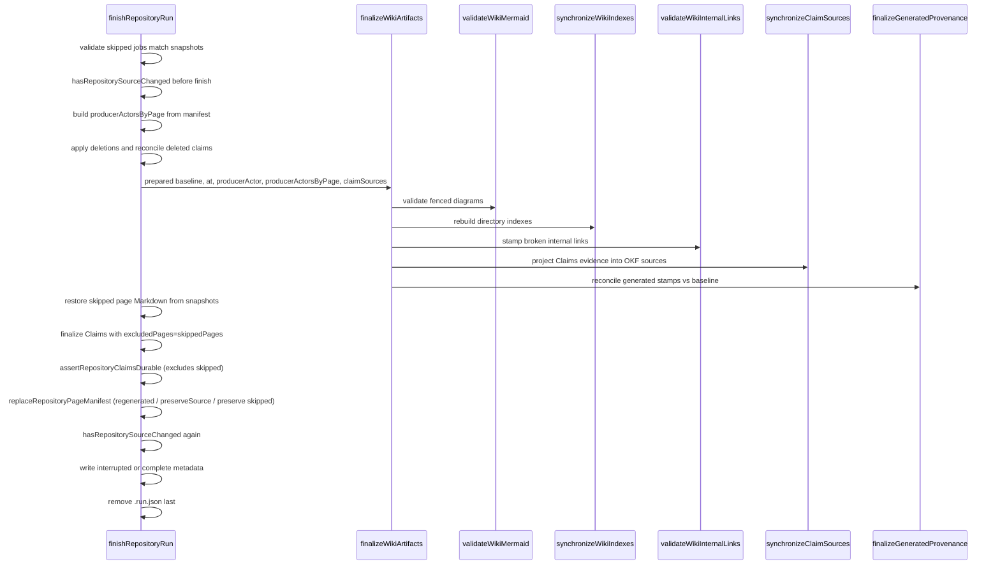

# Wiki Finalization and Link Integrity

Finalization is the deterministic, code-owned phase that runs _after_ the agent
has authored page bodies. It never asks the model to make decisions: every
output it writes — directory indexes, OKF `sources`, the `generated` provenance
stamp, broken-link stamps — is derived mechanically from the current wiki bytes
and a snapshot captured before authoring. Its job is to make the wiki internally
consistent and to prove the run is durable before any run state is discarded.

Two functions bracket a run. `prepareWikiForAuthoring` migrates existing
concepts to OKF and captures a pre-authoring baseline; `finalizeWikiArtifacts`
runs the post-authoring pipeline against that baseline. Both live in
`src/agent/wiki-finalizer.ts` and accept an optional `runOperation` wrapper so
callers can attach telemetry to each named step.

## Preparation: migrate, then snapshot

`prepareWikiForAuthoring` runs two ordered operations, `"migrate"` then
`"provenance_snapshot"`. Migration (`migrateWikiToOkf`) normalizes every concept
page's OKF front matter up front, so the agent reads and enriches an
already-conformant wiki instead of a mix of legacy and OKF pages. The snapshot
(`snapshotGeneratedProvenance`) records, for every concept present before the
run, a SHA-256 hash of its Markdown body (front matter excluded) and any valid
prior `generated` producer event. Only hashes and prior events are retained, so
the baseline stays bounded and no temporary files appear beside the
documentation.

The baseline is `PreparedWikiState`. It is serialized into `.run.json` via
`serializePreparedWikiState` (entries sorted by page path for determinism) and
rehydrated with `deserializePreparedWikiState` after a process restart, so a
resumed run finalizes against the same pre-authoring bytes it started with.

## Finalization pipeline

`finalizeWikiArtifacts` first rejects an empty producer actor, then runs its
operations in a fixed internal order: `"mermaid"`, `"index_sync"`,
`"link_validation"`, an optional `"claims_sources"`, and finally
`"generated_provenance"`.

Whole-run finish sequence. `finalizeWikiArtifacts` runs the five ordered
deterministic operations shown in the middle; `finishRepositoryRun` brackets it
with skipped-page validation, Markdown restore, Claims finalization, the
whole-run durability proof, manifest rebuild, and metadata.

The order matters. Mermaid and index synchronization can rewrite page and index
bytes; link validation then runs over the final structure, including the
freshly regenerated indexes. Claims-source projection and generated-provenance
reconciliation both read page bodies, so they run last, after all other body
edits have settled. Because index synchronization may add or change links,
link validation is placed after it so it sees the final set of hrefs.

`"claims_sources"` only runs when the caller passes `claimSources`; the
repository run supplies the session's per-page evidence resources, while a
personal-mode run may omit it.

## What finalization writes deterministically

**Directory indexes.** `synchronizeWikiIndexes` walks every wiki directory and
rebuilds its `index.md` from the directory's entries. Each file link uses the
page's front-matter `title` (falling back to the basename) and `description`;
subdirectory links point at the child directory. Links are sorted by href and an
index is only rewritten when its rendered content actually changed. Only the
bundle-root index carries the `okf_version: "0.2"` marker. `index.md`, `log.md`,
and `INSTRUCTIONS.md` are reserved and never treated as concepts.

**OKF `sources`.** `synchronizeClaimSources` projects each page's Claims
evidence files into that page's OKF `sources` front matter. Precise line ranges
are collapsed to whole-file repository resources, and each projected entry gets a
deterministic id (`openwiki-source-` + a truncated SHA-256 of the resource).
Producer-authored source entries are preserved; only OpenWiki-owned entries
(identified by that id prefix) are replaced, so a later reconciliation touches
only its own projection. Pages without Claims state are left untouched, and a
page is skipped if its resource set is already equal.

**Generated provenance.** `finalizeGeneratedProvenance` compares each concept's
current body hash against the pre-authoring baseline. A new page, or one whose
body changed in any way, receives the run stamp — `generated: {by, at}` with the
producer actor and the shared run timestamp — and its `timestamp` field is
removed. An unchanged body keeps its prior stamp: if the agent rewrote or dropped
the `generated` field on a body it did not otherwise change, the pre-run event is
restored (or removed if the page was previously unstamped) so provenance never
advances for a no-op edit. Body hashing excludes front matter and retains
whitespace, so any real prose change advances the stamp.

For a multi-session run, `finishRepositoryRun` builds a per-page producer-actor
map (`producerActorsByPage`) from the page manifest, recording the actor that
actually completed each page in this run. `finalizeGeneratedProvenance` uses that
map to stamp each changed page with its completing actor, falling back to the
run-level `producerActor` when no page-specific override exists.

Provenance finalization is best-effort: if a page cannot be read during the pass,
the rest of the finalized wiki is preserved rather than failing the complete run,
since generated provenance is optional trust metadata. For changed pages, only
terminal line endings are canonicalized; prose wrapping, indentation, and every
other producer-authored Markdown choice remain untouched.

## Link-validation invariants

`validateWikiInternalLinks` (`src/agent/wiki-link-validator.ts`) checks relative
internal links and GitHub-style heading anchors. It does not fail the run on a
broken link; instead it stamps each break in place with an HTML comment
(`<!-- openwiki: broken internal link ... -->`) directly above the offending
line, so a later update run can find and repair it inline. Prior stamps are
stripped before each pass, so a fixed link leaves no residual comment and stamps
never accumulate across runs.

The validator enforces these invariants on generated pages:

- **External and empty links are ignored.** Any href with a URI scheme or a
  protocol-relative `//` prefix, and any empty href, is skipped.
- **Targets are checked against the whole repository, not just the wiki.** A
  wiki page may legitimately link to a repo file (a design doc, a source file);
  a link is broken only when its target genuinely does not exist. Paths are
  resolved leading-slash-absolute from the virtual filesystem root or relative
  to the source file, then normalized and required to stay under the repo root.
- **Heading anchors are validated only against Markdown targets.** Same-page
  anchors are checked against the source's own headings; cross-file anchors are
  checked against the target's headings only when the target is a `.md` file.
  Anchors on directories and GitHub line anchors on source files (e.g. `#L10`)
  are out of scope and never flagged.
- **Anchor slugs mirror GitHub exactly.** Slugs are lowercased with punctuation
  removed, each whitespace character replaced by a single hyphen (not collapsed),
  duplicates suffixed `-1`, `-2`, …, and Unicode letters, numbers, and combining
  marks kept — matching `github-slugger` so non-English and decomposed-accent
  anchors resolve.

Reserved control files (`index.md`, `log.md`, `INSTRUCTIONS.md`) and dotfiles
are excluded from scanning. A `WikiLinkReport` records files scanned, links
checked, issues found, and which files were stamped.

## The whole-run proof before .run.json is removed

Finalization is invoked from `finishRepositoryRun`
(`src/generation/repository-run.ts`), which wraps it in a strict durability
proof. Each `submit_page` already persists and proves that one page's Claims
match its Markdown bytes (`assertPageClaimsDurable`), but the strict whole-run
proof deliberately waits until every page job is complete — every job is
`complete` or `skipped`, with none left `pending` — before running once more
across the whole wiki.

At finish, the sequence is:

1. **Refuse without a plan or with pending jobs.** `finishRepositoryRun` throws
   if no plan was submitted or if any page job is still `pending`.
2. **Validate the skipped-page-snapshot contract.** A page job may be `skipped`
   (via `skipRepositoryPage`, which rolls a failed worker back from its
   `RepositoryPageSnapshot` and writes `"interrupted"` metadata). `finish`
   accepts an optional `skippedPageSnapshots` list and requires that the skipped
   jobs and the supplied snapshots agree exactly — one snapshot per skipped job,
   each snapshot's `jobId` and `path` matching the job. Mismatched counts or
   paths fail the run with *"Every skipped OpenWiki page job requires its
   original page snapshot before finish."* before any wiki bytes are touched.
   The snapshot carries the page's pre-worker Markdown (or `null` when it did not
   exist) and its pre-worker Claims sidecar.
3. **Record the pre-finish source state and build per-page producers.**
   `hasRepositorySourceChanged` recomputes the model-visible repository source
   fingerprint and compares it against the planned fingerprint, capturing
   `sourceChangedBeforeFinish` before any finalization runs. This is a *recording*
   check, not a gate: it never throws. `finishRepositoryRun` then reads the page
   manifest and builds `producerActorsByPage`, mapping each page completed in this
   run to the actor that completed it, so provenance stamps record the actual
   completing session.
4. **Apply deletions and reconcile deleted Claims.** Abandoned generated pages
   and the plan's explicit `deletePages` are removed, and
   `reconcileDeletedClaimPages` records deletions for any sidecar whose Markdown
   page no longer exists. All three deletion paths tolerate a not-found backend
   error via `isNotFoundBackendError` (which matches both the `"file_not_found"`
   code and the human-readable `"not found"` string), so deleting a page that no
   longer exists on disk does not abort finalization.
5. **Run `finalizeWikiArtifacts`** against the rehydrated pre-authoring
   baseline, the run timestamp, the producer actor, the per-page producer-actor
   map, and the session's per-page evidence resources.
6. **Restore skipped page Markdown.** After finalization, each skipped job's
   snapshot is replayed through `restoreRepositoryPageMarkdown`, writing the
   original bytes back (or deleting the file when the snapshot Markdown is
   `null`; a missing file on that delete is tolerated via
   `isNotFoundBackendError`, so a page already removed by a deletion step does
   not abort the restore). This runs _after_
   `finalizeWikiArtifacts` so index synchronization and provenance stamping see
   the final wiki structure; the skipped pages are then returned to their
   pre-worker state, which is the structure the snapshot contract guaranteed.
   Only the Markdown is restored here — the Claims sidecar was already restored
   by `skipRepositoryPage`, and the Claims runtime is re-prepared to drop the
   skipped pages from the authoritative set.
7. **Finalize the Claims runtime** with `excludedPages` set to the skipped
   pages, so skipped pages are dropped from the authoritative Claim set rather
   than verified against bytes that were just restored.
8. **`assertRepositoryClaimsDurable`** (also excluding the skipped pages) confirms
   no orphaned Claims sidecars remain and that every non-empty Claim set matches
   a durable sidecar and the final Markdown bytes exactly.
9. **Rebuild the page manifest.** After the durability proof,
   `finishRepositoryRun` discovers the surviving factual pages from the Claims
   store (`store.discoverPages()`) and partitions them before calling
   `replaceRepositoryPageManifest`. It computes two sets from that inventory:

   - **`regeneratedPages`** — pages this run actually (re)completed, taken from
     `producerActorsByPage.keys()` (manifest entries whose
     `completedRunId === run.state.runId`). These are the only pages restamped with
     the current run's source checkpoint
     (`getRepositoryRunSourceCheckpoint(run.state)`), so a stale manifest entry can
     never promote a page this run did not re-prove.
   - **`preserveSourcePages`** — every other tracked current page: pages left
     untouched because they were outside this run's plan, plus pages already
     durable from an earlier run, minus the skipped pages. These keep their _prior_
     `gitHead`/`sourceFingerprint` checkpoint rather than being advanced to the
     current run's, but deterministic finalization may have rewritten code-owned
     metadata on their body, so their final Markdown/Claims pair is re-proved and
     `pageVersion` is refreshed only when the final bytes actually changed.

   `skippedPages` is passed as `preservePages`. Inside
   `replaceRepositoryPageManifest`, each surviving page falls into exactly one of
   three branches: a `preservePages` entry is copied verbatim from the previous
   manifest (so a later update can fast-forward a skipped page from its intact
   prior coverage); a `preserveSourcePages` entry re-invokes `buildManifestEntry`
   against the entry's _own_ prior checkpoint (re-hashing the final Markdown and
   re-checking the Claims sidecar) and keeps the previous entry when the refreshed
   `pageVersion` is identical, otherwise writes the refreshed entry — or, if no
   prior coverage exists, attempts to seed a first entry from the current run's
   checkpoint and tolerates a `RepositoryRunError` by leaving the page uncovered for
   full review; every other page is restamped with the current run's source
   checkpoint. The net effect is that untouched pages keep their prior source
   coverage while every retained entry still matches the final durable bytes.
10. **Recompute source drift after finalization.** `hasRepositorySourceChanged`
    runs a second time; the final `sourceChanged` is
    `sourceChangedBeforeFinish || <changed after finalization>`. Source drift
    does **not** fail or re-plan the run — the run still completes, but records
    `"interrupted"` metadata (below) and returns `{ status: "complete",
    sourceChanged: true }` so the native runner can surface a message telling the
    user to run `openwiki --update` to reconcile the drifted source.
11. **Write run metadata.** When any pages were skipped **or** the source
    drifted, `writeLastUpdateMetadata` records `"interrupted"` (no content
    snapshot, so the next update's no-op check will not skip a retry). Otherwise
    `persistRunMetadataIfChanged` records `"complete"` against the pre-run
    content snapshot, clearing any prior interrupted status.
12. **Delete `.run.json` last** (`removeRepositoryRunState`).

The **source fingerprint is checked twice** — before finalization and again
after the durability proof — so a run cannot finalize against one source state
while the model-visible source has since drifted without that drift being
recorded. The run always completes; drift is reported through the return value
and the `"interrupted"` checkpoint rather than by re-planning. Crucially,
`.run.json` is removed only after every gate passes. Any earlier failure leaves
the run state on disk, so `begin()` can reconstruct and retry. This ordering is
what makes finalization crash-safe: the run is never marked complete until the
finalized wiki has been re-proven durable.

## Related

- [Grounded Claims](../concepts/grounded-claims.md) — the Claim model whose
  evidence finalization projects into OKF `sources`.
- [OKF Output](../concepts/okf-output.md) — the front-matter and index format
  finalization writes.
- [Repository Generation](repository-generation.md) — the run lifecycle that
  brackets authoring with preparation and finalization.
